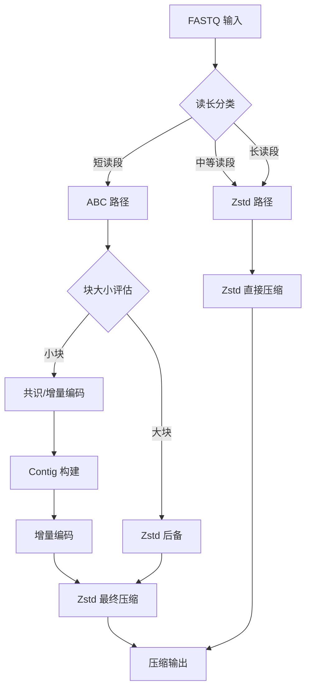
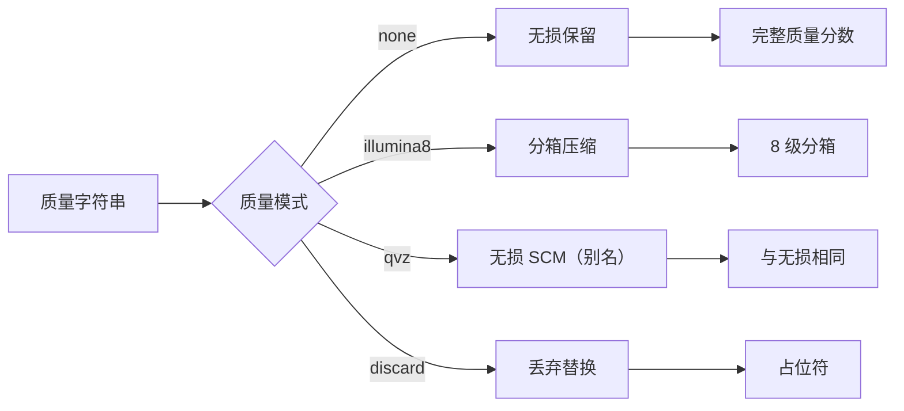
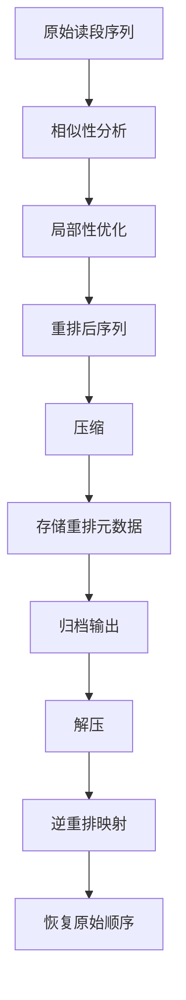
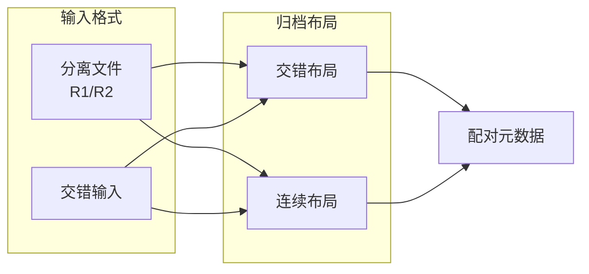

# 算法概述

`fqc` 对不同的 FASTQ 组件和读长类别使用不同的压缩策略。

## 序列路径决策树

- **短读段路径**：`fqc` 对较小的短读段块优先使用 ABC 风格的共识/增量表示，当较大块会使该路径成本过高时回退到 Zstd 支持的块存储。
- **中等和长读段**：序列负载使用 Zstd 支持的路径存储，而非短读段共识模型。

当前实现使用观测到的长度而非单一 CLI 预设来分类读段。

## 质量路径分类

质量字符串与序列分开压缩：

| 模式 | 描述 | 数据保留 |
|------|------|----------|
| `none` | 保持质量分数无损 | 完整保留 |
| `illumina8` | 将质量分箱到 8 个级别 | 有损分箱 |
| `qvz` | 当前为无损 SCM 的别名（真 QVZ 量化尚未实现） | 无损 |
| `discard` | 解码时用占位符替换 | 丢弃 |

## ID 路径

读段 ID 由 `id_compressor` 处理：实现先尝试 tokenize（公共前缀 + 可变字段），模式不稳定则回退 exact + Zstd。CLI **没有** `--id-mode`；`discard` 只存在于内部 `IdMode`，不能从命令行选择。

## 重排管道

对于非流式模式下的短单端归档，`fqc` 可以重排读段以提高局部性和压缩效率：

归档在需要时存储重排元数据，因此仍可按原始顺序解压。

## 双端布局

双端输入可从分离文件或交错输入中获取，并以交错或连续的归档布局元数据存储。
