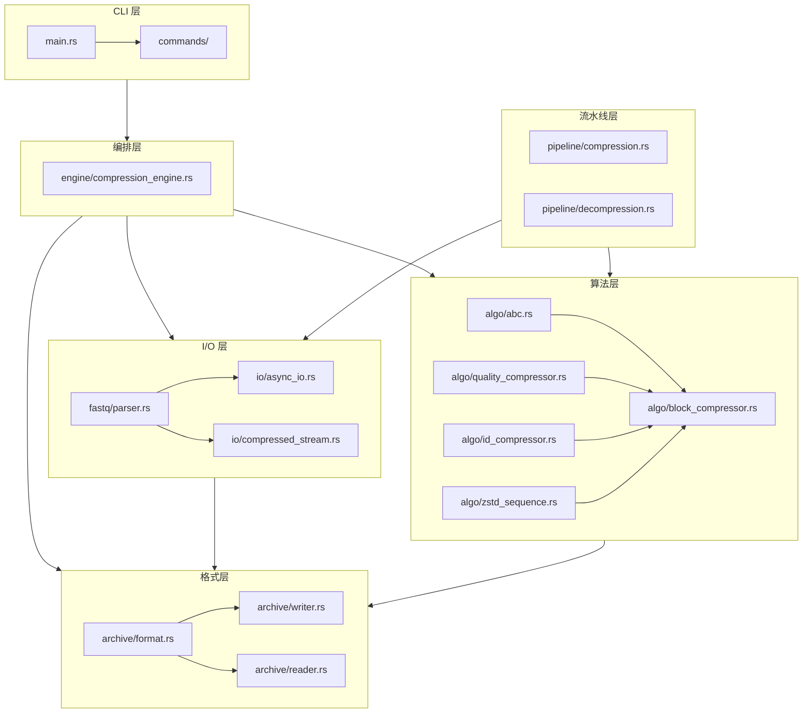
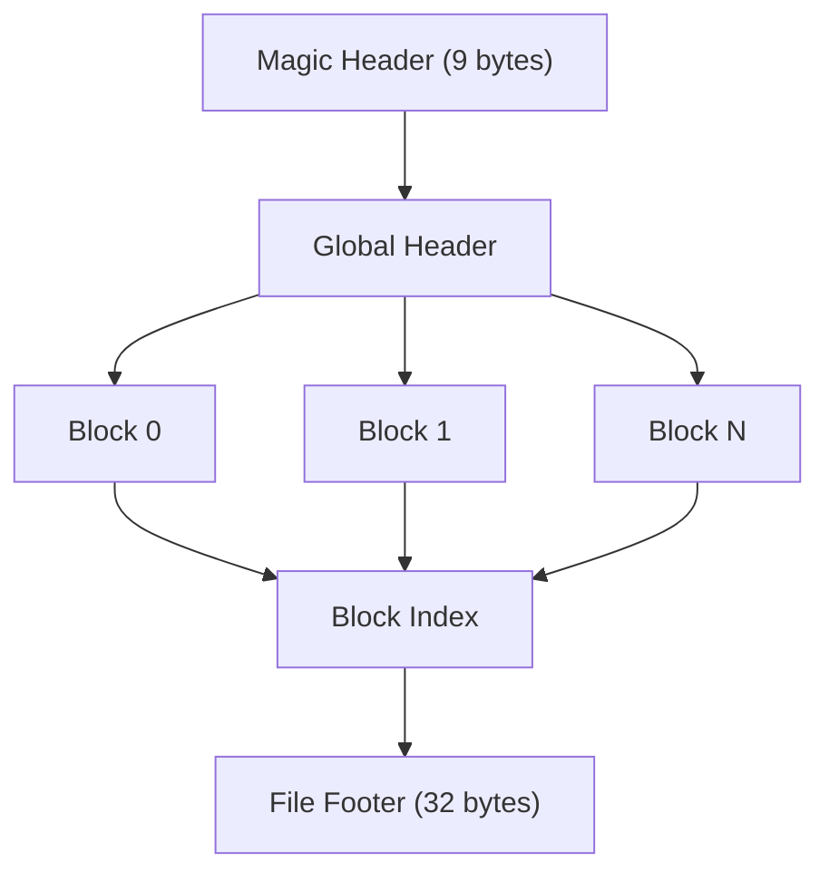

# 架构概述

`fqc` 是一个单一二进制 Rust CLI，具有少量定义清晰的层次。

## 系统架构

## 主要层次

| 层次 | 关键文件 | 职责 |
| --- | --- | --- |
| CLI | `src/main.rs`, `src/commands/*` | 解析参数并分发命令行为 |
| FASTQ I/O | `src/fastq/parser.rs`, `src/io/*` | 读取 FASTQ 输入和压缩流变体 |
| 归档格式 | `src/archive/format.rs`, `src/archive/writer.rs`, `src/archive/reader.rs` | 编码和解码 `.fqc` 容器 |
| 压缩逻辑 | `src/algo/*` | 序列、质量、ID、重排和双端逻辑 |
| 压缩编排 | `src/engine/compression_engine.rs`, `src/engine/compression_request.rs` | 规范请求、路由执行模式并捕获结果 |
| 流水线 | `src/pipeline/*` | 读取器/压缩器/写入器并行流（pipeline 模式） |
| 共享类型 | `src/types.rs`, `src/error.rs` | 公共类型、默认值和退出码映射 |

## 归档模型

`.fqc` 归档包含：

1. 包含模式标志和归档元数据的全局头
2. 一个或多个压缩块
3. 可选的重排映射
4. 文件尾和块索引

这种布局使 `fqc info`、`fqc verify` 和范围解压可以基于归档结构操作，而非将文件视为不透明块。

## 执行模式

压缩操作通过 `CompressionEngine` 路由，选择三种执行模式之一：

- **Archive 模式**（默认）：完整摄入，可选重排和全局分析
- **Streaming 模式**（`--streaming`）：单遍增量处理，禁用重排；严格低内存选项
- **Pipeline 模式**（`--pipeline`）：分段并发读取器/压缩器/写入器执行，块缓冲在途

每种模式保持相同输出格式和 CLI 语义，同时变化内存占用和并发行为。

## 性能路线图

当前瓶颈、优化方向和活跃阶段边界的维护摘要见 [性能路线图](./performance-roadmap.md)。