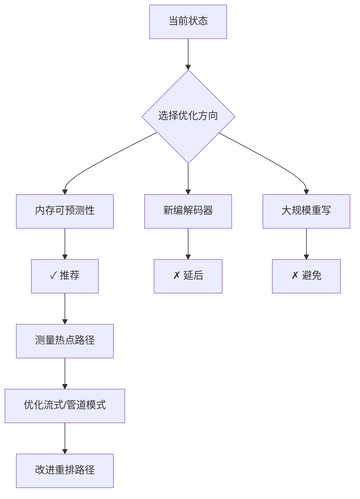
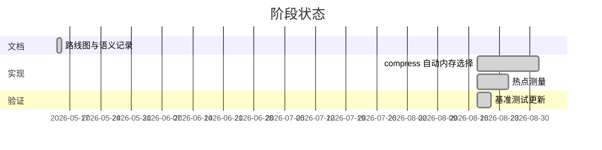
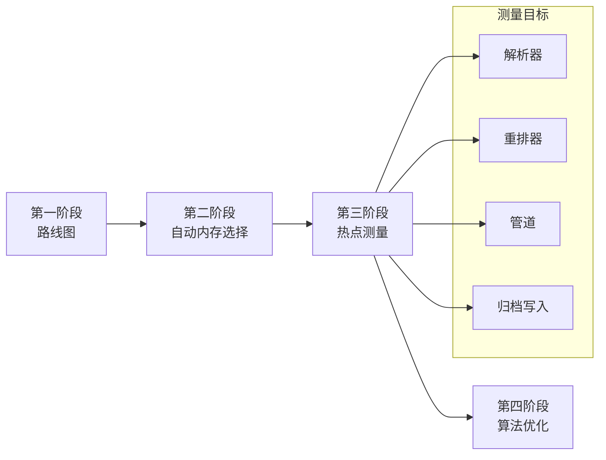

# 性能路线图

本文档是 `fqc` 性能工作的维护摘要，记录当前问题的形态和下一个有边界的开发切片，避免将文档站点变成研究档案。

## 当前瓶颈

- **短读段压缩仍需全局分析遍历。** 主压缩路径在写入块之前可以分析完整数据集，因此重排感知压缩能提高压缩率，但这也将内存和时间压力集中在第一阶段。
- **低内存模式以灵活性换取可预测性。** `--streaming` 避免全局重排，管道模式将工作分散到各阶段，但项目仍需更清晰的指导，说明何时这些模式应作为首选基础。
- **全量摄入模式已有有限预算。** archive 与 pipeline 压缩在读入时估计峰值；超限失败。pipeline 仍先读完全部读段再分阶段压缩，要严格低内存请用 `--streaming`。

## 推荐方向

1. 保持下一个切片专注于内存可预测性和测量的热点路径，而非新编解码器或大规模重写。
2. 将流式和管道流作为后续优化的实用基础，仅在内存行为明确后再改进重排密集路径。

## 第一阶段范围（已完成）

此切片只建立共享方向，不发布运行时性能行为变更：

- 在公开文档中记录维护的路线图
- 写明 `--memory-limit 0` 的**预期**语义，供后续实现对齐

2026-08 已实现：解压/校验与 archive 压缩的 `--memory-limit 0` 均为有限预算。热点测量切片已完成（2026-08-20，见 `docs/hotspot-report.md` 与 `docs/real-corpus.md`），结论：

- **短读：全局重排是纯净亏**。真实 Illumina WXS 切片上 `--reorder true` 比 `false` 慢 5.7× 且输出大 12.2%
  （14.0 MB vs 12.5 MB，磁盘比 4.03× vs 4.52×）。输入 FASTQ 已按基因组位置空间有序，minimizer 贪心重排破坏局部性。
  下一刀：**重排自适应 / 默认关闭**（离线采样判定输入是否已有序，只在无序时启用）。
- **长读：单 block 串行**。ONT 切片（65.36 Mbp）默认 1 个 block，8 线程只用了 1 个；`--max-block-bases` 可显式切块并行。
- 顺手优化：重排/建块改为移动（`mem::take`），输出字节不变、分配减少（不触及上述算法热点）。

## 延后跟进

后续切片可基于此摘要构建：

- archive 压缩自动内存选择已落地；pipeline 全量摄入仍单独处理
- 解析器/重排/管道/归档写入热点已测量（2026-08-20，见 `docs/hotspot-report.md`）：短读热点在全局重排（且负收益），长读热点在单 block 串行
- 下一刀（有数据支撑）：重排自适应 / 默认关闭；长读 `--max-block-bases` 自动切块
- 将任何较大的算法或数据结构变更限定在可单独审查的小切片中
