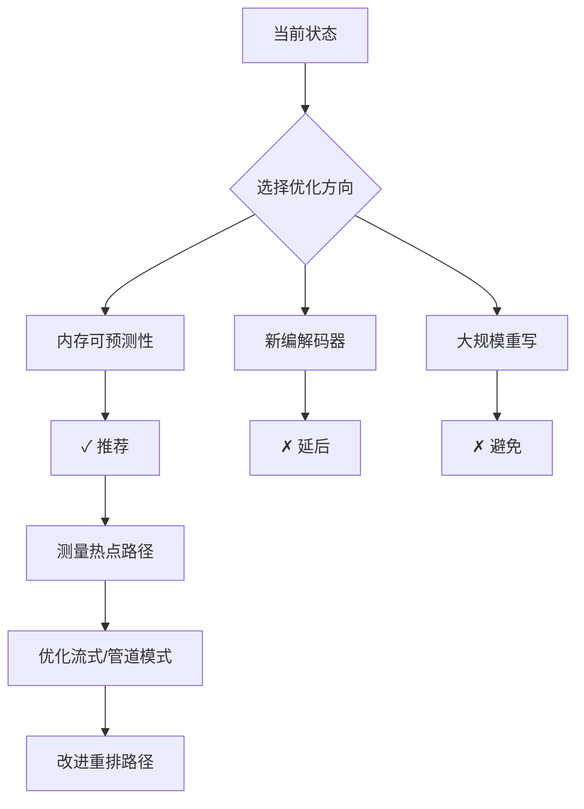
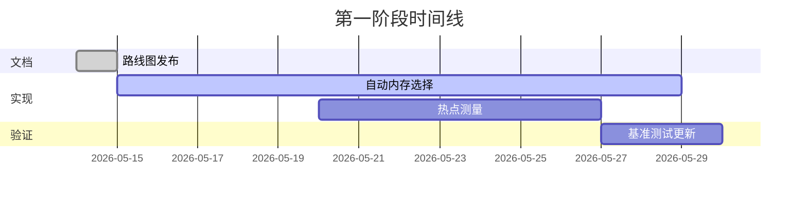
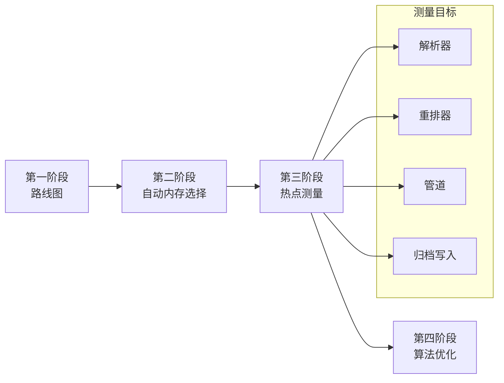

# 性能路线图

本文档是 `fqc` 性能工作的维护摘要，记录当前问题的形态和下一个有边界的开发切片，避免将文档站点变成研究档案。

## 当前瓶颈

- **短读段压缩仍需全局分析遍历。** 主压缩路径在写入块之前可以分析完整数据集，因此重排感知压缩能提高压缩率，但这也将内存和时间压力集中在第一阶段。
- **低内存模式以灵活性换取可预测性。** `--streaming` 避免全局重排，管道模式将工作分散到各阶段，但项目仍需更清晰的指导，说明何时这些模式应作为首选基础。
- **内存语义需要一个明确的契约。** 未来的实现工作应统一 `--memory-limit 0` 表示自动内存选择的语义，使调优和文档描述相同的行为。

## 推荐方向

1. 保持下一个切片专注于内存可预测性和测量的热点路径，而非新编解码器或大规模重写。
2. 将流式和管道流作为后续优化的实用基础，仅在内存行为明确后再改进重排密集路径。

## 第一阶段范围

此切片仅建立共享方向：

- 在公开文档中记录维护的路线图
- 记录预期的 `--memory-limit 0` 语义，供后续实现对齐

第一阶段不发布运行时性能行为变更。

## 延后跟进

后续切片可基于此摘要构建：

- 在 `--memory-limit 0` 后统一实现自动内存选择
- 为解析器、重排、管道和归档写入热点添加针对性测量
- 将任何较大的算法或数据结构变更限定在可单独审查的小切片中
