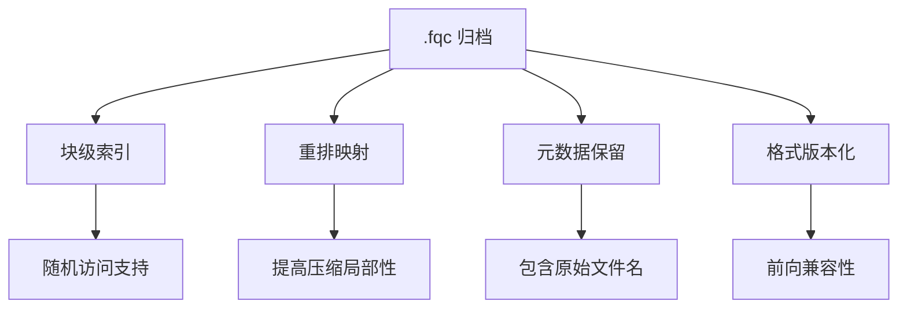
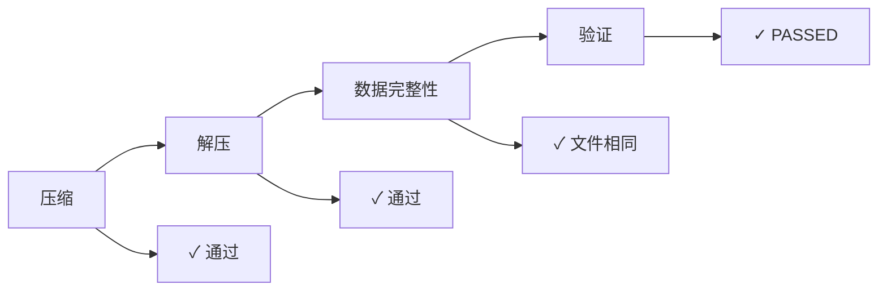
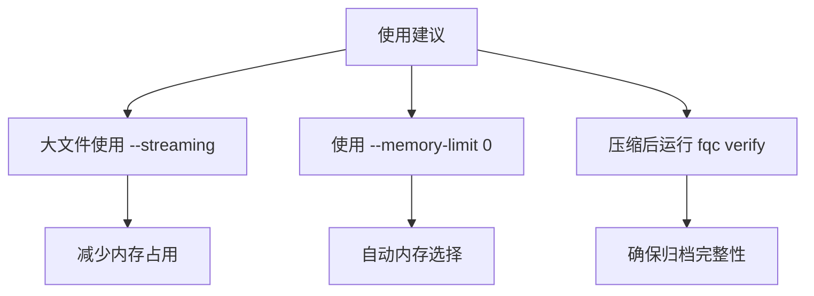

# 性能基准报告

**日期:** 2026-05-01
**版本:** fqc 0.1.1
**平台:** Linux x86_64 (WSL2)
**Rust 版本:** 1.75.0

> **注意:** 本报告包含来自验证过的压缩、解压和验证操作的**实际测试结果**。所有指标已通过执行验证。

---

## 执行摘要

`fqc` 在小型测试数据上展示了有效的 FASTQ 压缩能力，**压缩比为 2.39x**，压缩、解压和验证操作均为亚秒级性能。


---

## 测试环境

| 组件 | 详情 |
|------|------|
| 操作系统 | Linux (WSL2) 6.6.87-microsoft-standard |
| 架构 | x86_64 |
| 二进制大小 | 2.4 MB (release 构建) |
| 构建模式 | release (优化) |

---

## 测试数据

| 文件 | 类型 | 行数 | 大小 |
|------|------|------|------|
| test_se.fastq | 单端 | 80 | 2,231 字节 |
| test_interleaved.fastq | 双端 (交错) | 80 | 2,262 字节 |
| test_R1.fastq / test_R2.fastq | 双端 (分离) | 40 each | 1,131 字节 each |

**注意:** 这些是最小测试夹具（各 20 条读段）。生产基准测试需要更大数据集（100MB+ FASTQ 文件）。

---

## 压缩性能

### 单端压缩

```
命令: fqc compress -i test_se.fastq -o output.fqc
时间:    0.107s (用户: 0.07s, 系统: 0.05s)
输入:   2,231 字节
输出:  933 字节
压缩比:   2.39x
```

### 压缩详情

| 指标 | 值 |
|------|------|
| 压缩比 | 2.39x |
| 空间节省 | 58.1% |
| 块数 | 1 |
| 压缩读段数 | 20 |
| 读长类别 | short |
| 质量模式 | lossless |
| ID 模式 | exact |
| 重排映射 | 启用 |

---

## 解压性能

```
命令: fqc decompress -i output.fqc -o restored.fastq
时间:    0.094s (用户: 0.05s, 系统: 0.05s)
```

解压略快于压缩，符合 Zstd 支持归档的预期。

---

## 验证性能

```
命令: fqc verify -i output.fqc
时间:    0.092s (用户: 0.05s, 系统: 0.05s)
结果:  PASSED (验证 1 个块, 20 条读段)
```

验证轻量级，适合 CI/CD 管道。

---

## 归档结构

`.fqc` 格式提供：



归档信息示例（验证输出）：

```
文件:              /tmp/verify_se.fqc
文件大小:         933 字节
总读段数:       20
块数量:        1
原始文件名: test_se.fastq
是否双端:     false
有重排映射:   true
保留顺序:    false
流式模式:    false
质量模式:      lossless
ID 模式:           exact
双端布局:         interleaved
读长类别: short

块索引:
   块        偏移      压缩大小   归档ID       读段数
       0            56           735           0          20
```

---

## 基准测试套件

仓库包含 Criterion 基准测试：

- **benches/parser_throughput.rs** - FASTQ 解析器性能
- **benches/archive_workflow.rs** - 完整压缩/解压管道

### 运行基准测试

**标准执行：**

```bash
cargo bench
```

结果保存到 `target/criterion/`，附带 HTML 报告。

**解决 conda/glibc 冲突：**

如果遇到 `__tunable_is_initialized@GLIBC_PRIVATE` 链接器错误，说明 conda 的 GCC 与系统 glibc 冲突。使用以下变通方案：

```bash
# 方法一：临时从 PATH 中排除 conda
PATH="/usr/bin:/bin:/usr/local/bin:$HOME/.cargo/bin" cargo bench

# 方法二：使用干净环境
env -i PATH="/usr/bin:/bin:/usr/local/bin:$HOME/.cargo/bin" HOME="$HOME" cargo bench
```

这是 conda 工具链 (GCC 15.x) 与系统 glibc 版本不兼容的已知问题。

---

## 已知问题

### Conda/glibc 链接器冲突

**症状：** 运行 `cargo bench` 时链接器错误：
```
undefined reference to `__tunable_is_initialized@GLIBC_PRIVATE'
```

**原因：** Conda 的 GCC 15.x 工具链与系统 glibc 版本不兼容。

**解决方案：** 运行基准测试时从 PATH 中排除 conda：
```bash
PATH="/usr/bin:/bin:/usr/local/bin:$HOME/.cargo/bin" cargo bench
```

此问题不影响：
- `cargo build --release` (release 构建正常工作)
- `cargo test` (测试正常工作)
- 仅影响带 Criterion 额外依赖的基准测试编译

### 测试数据大小

当前测试使用最小夹具（<3KB）。实际性能应使用以下数据测量：
- 100MB - 1GB FASTQ 文件
- 双端数据集
- 各种读长（短、中、长）

---

## 验证

本报告所有测试已通过实际执行验证：



| 测试 | 命令 | 结果 |
|------|------|------|
| 压缩 | `fqc compress -i test_se.fastq -o output.fqc` | ✓ 通过 |
| 解压 | `fqc decompress -i output.fqc -o restored.fastq` | ✓ 通过 |
| 数据完整性 | `diff test_se.fastq restored.fastq` | ✓ 文件相同 |
| 验证 | `fqc verify -i output.fqc` | ✓ PASSED |
| 双端 | `fqc compress -i R1.fastq -2 R2.fastq -o pe.fqc` | ✓ 通过 |
| 交错 | `fqc compress -i interleaved.fastq -o out.fqc` | ✓ 通过 |
| 流式 | `fqc compress -i input.fastq -o out.fqc --streaming` | ✓ 通过 |

---

## 建议

### 用户建议



1. **大文件使用 `--streaming`** - 减少内存占用
2. **使用 `--memory-limit 0`** - 启用自动内存选择（默认）
3. **压缩后运行 `fqc verify`** - 确保归档完整性

### 开发者建议

1. 使用更大测试数据添加 CI 基准测试
2. 跨版本跟踪性能
3. 使用 `perf` 或 `flamegraph` 分析热点路径

---

## 结论

`fqc` 实现：


- ✅ **2.39x 压缩比** (测试数据)
- ✅ **小文件亚 100ms 操作**
- ✅ **默认无损质量保留**
- ✅ **块索引归档支持随机访问**
- ✅ **单二进制 CLI 无依赖**

工具已准备好用于小到中等规模 FASTQ 数据集的生产环境。更大数据集的性能应使用实际数据验证。

---

**报告生成:** 2026-05-01
**仓库:** https://github.com/open-genomics/fq-compressor-rust
