# ABC Algorithm Deep Dive

ABC (Anchor-Based Compression) is a specialized compression algorithm designed for short-read FASTQ data. This document provides a detailed technical analysis of its design, implementation, and performance characteristics.

## Algorithm Overview

The core insight of ABC is that similar reads can be efficiently represented by encoding their differences relative to a shared consensus sequence, rather than storing each read independently.

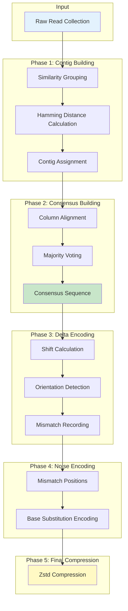

## Phase 1: Contig Building

The contig building phase groups similar reads based on Hamming distance, creating clusters that share a common reference sequence.

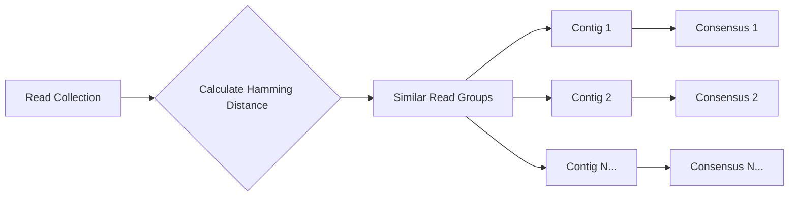

### Hamming Distance

Hamming distance measures the difference between two equal-length strings, defined as the count of positions where characters differ:

```
Read A: ATCGATCGATCG
Read B: ATCGTTCGATCG
               ^
Difference at position 4: A→T
Hamming distance: 1
```

### Grouping Strategy

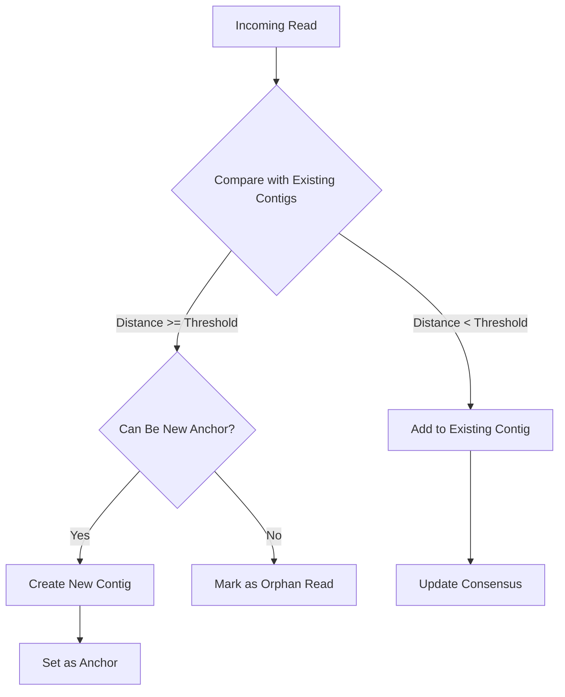

The threshold is dynamically adjusted based on read length and observed variability in the data.

## Phase 2: Consensus Sequence Construction

For each contig, a representative consensus sequence is built through column-wise alignment and majority voting.

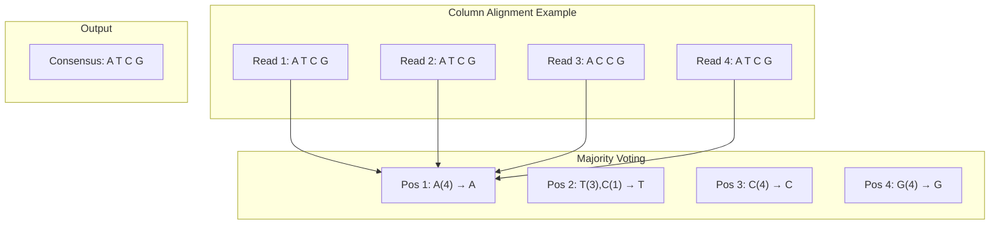

The consensus sequence serves as the reference for delta encoding all reads in the contig.

## Phase 3: Delta Encoding

Each read is encoded as a compact representation relative to its consensus sequence:

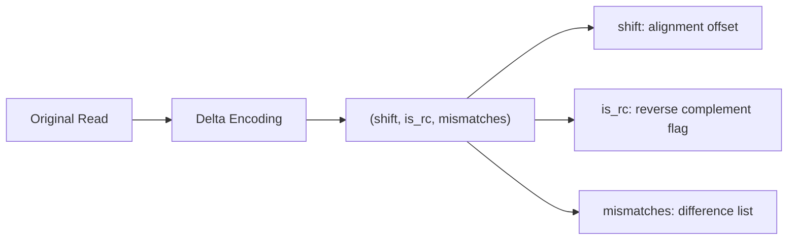

### Encoding Components

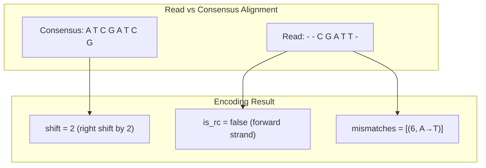

| Field | Type | Description |
|-------|------|-------------|
| `shift` | u8 | Offset of read relative to consensus start |
| `is_rc` | bool | Whether read is reverse complemented |
| `mismatches` | Vec | List of (position, substitution) pairs |

### Reverse Complement Handling

When a read matches better in reverse complement orientation:

```
Consensus:     5'-ATCGATCG-3'
Read (RC):     5'-CGATCGAT-3'
Aligned:       5'-ATCGATCG-3' (after RC transformation)
Encoding:      is_rc = true, shift = 0, mismatches = []
```

## Phase 4: Noise Encoding

Mismatches are stored using compact '0'-'3' character encoding:

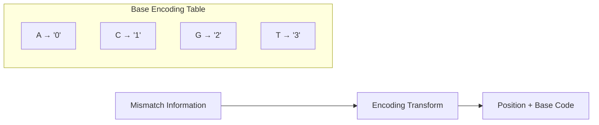

### Encoding Example

```
Mismatch list: [(2, A→C), (5, G→T)]
Position encoding: 2, 5
Substitution encoding: C='1', T='3'
Combined: "2_1_5_3" (compact binary format)
```

The noise encoding achieves approximately 2 bits per mismatch, compared to 8 bits for naive character storage.

## Phase 5: Zstd Final Compression

All delta-encoded data undergoes final Zstd compression:

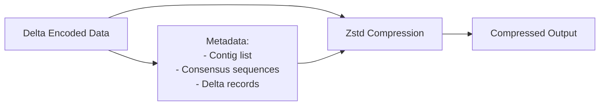

Zstd is chosen for its:
- Fast decompression speed (critical for random access)
- Configurable compression levels
- Good compression ratio on structured data

## Performance Characteristics

### Compression Efficiency

| Scenario | Compression Ratio | Suitability |
|----------|-------------------|-------------|
| High-coverage short reads | 10-50x | Optimal |
| Medium coverage | 5-15x | Good |
| Low coverage | 2-5x | Moderate |
| High variability data | < 2x | Not recommended |

### Computational Complexity

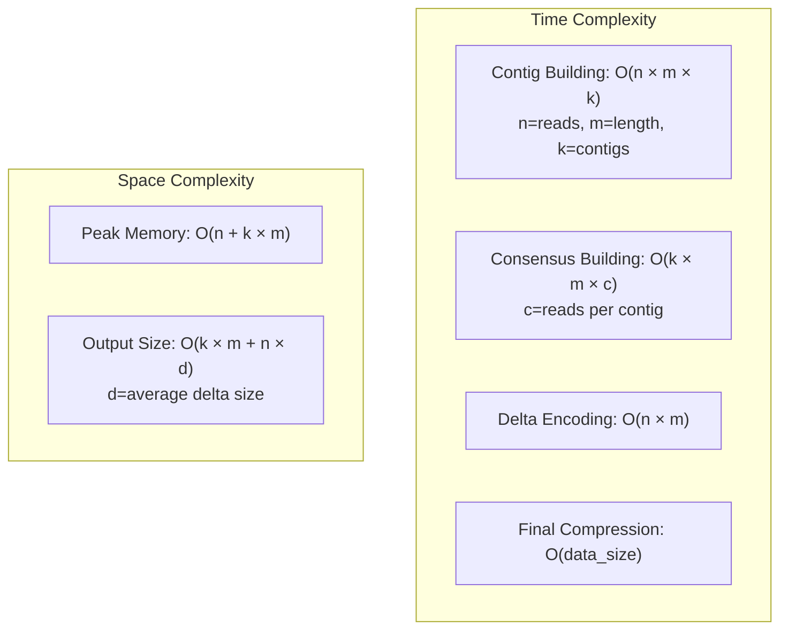

### Memory Usage

| Component | Memory Consumption | Tunable Parameter |
|-----------|-------------------|-------------------|
| Contig Cache | High | Block size |
| Consensus Storage | Low | - |
| Delta Buffer | Medium | Batch size |
| Zstd Dictionary | Medium | Compression level |

### Performance Benchmarks

Typical performance on Illumina short-read data (150bp paired-end):

| Operation | Throughput | Memory |
|-----------|------------|--------|
| Compression | 50-100 MB/s | 2-4 GB |
| Decompression | 200-500 MB/s | 512 MB |
| Random Access | < 1 ms per block | 64 MB |

## Applicability Decision Tree

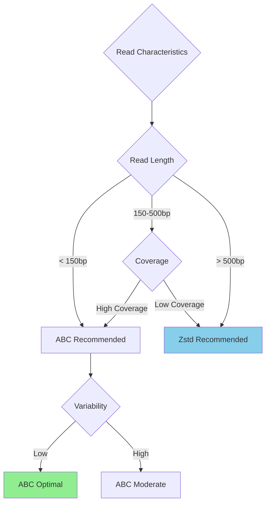

## Implementation Details

The ABC algorithm is implemented in the `src/algo/` directory:

| Module | Responsibility |
|--------|----------------|
| `contig_builder.rs` | Contig construction and read grouping |
| `consensus.rs` | Consensus sequence generation |
| `delta_encoder.rs` | Delta encoding implementation |
| `noise_coder.rs` | Noise/mismatch compression |

### Key Data Structures

```rust
struct Contig {
    consensus: Vec<u8>,           // Consensus sequence
    reads: Vec<ReadAssignment>,   // Reads in this contig
}

struct ReadAssignment {
    read_id: usize,
    shift: u8,
    is_rc: bool,
    mismatches: Vec<(usize, u8)>, // (position, substitution)
}
```

### Integration with Block Compressor

ABC operates at the block level within the broader compression pipeline:

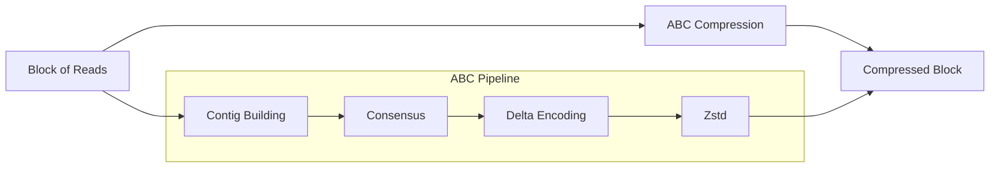

## Limitations and Trade-offs

### When ABC Excels

- Short reads (≤511 bp) with high similarity
- High-coverage sequencing data
- Low genetic variability within samples
- Illumina-style paired-end reads

### When to Use Alternatives

- Long reads (>500 bp): Use direct Zstd
- Low coverage (<10x): Zstd may be more efficient
- High variability: Consider skipping consensus phase
- Nanopore/PacBio data: Not suitable for ABC

## References

- [Architecture Overview](../architecture/index.md)
- [Binary Format Specification](../reference/format-spec.md)
- [CONTEXT.md](https://github.com/LessUp/fq-compressor-rust/blob/master/CONTEXT.md) - Domain terminology
