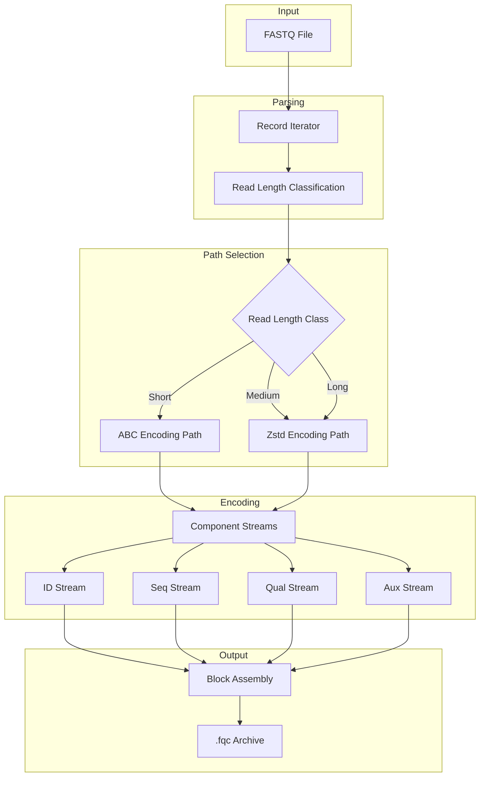
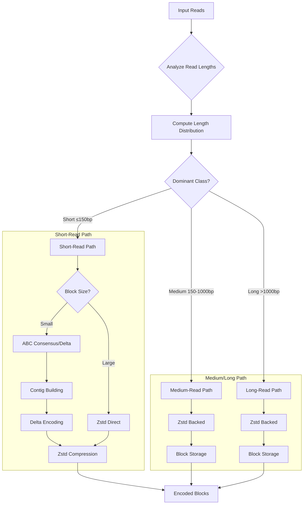
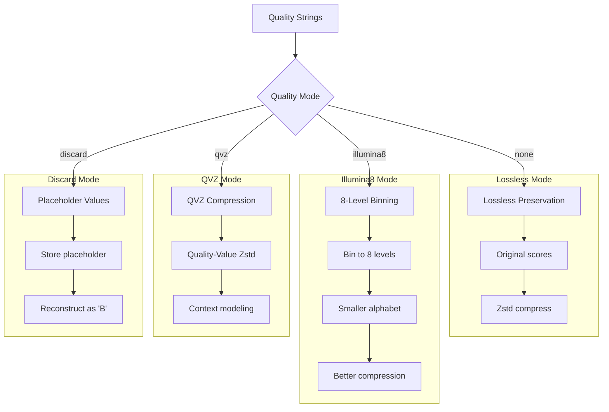
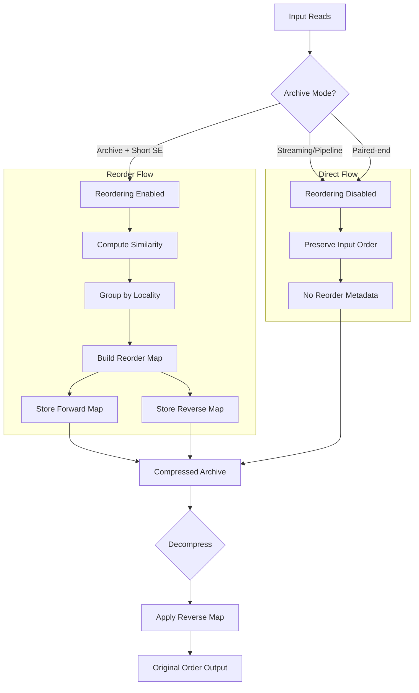
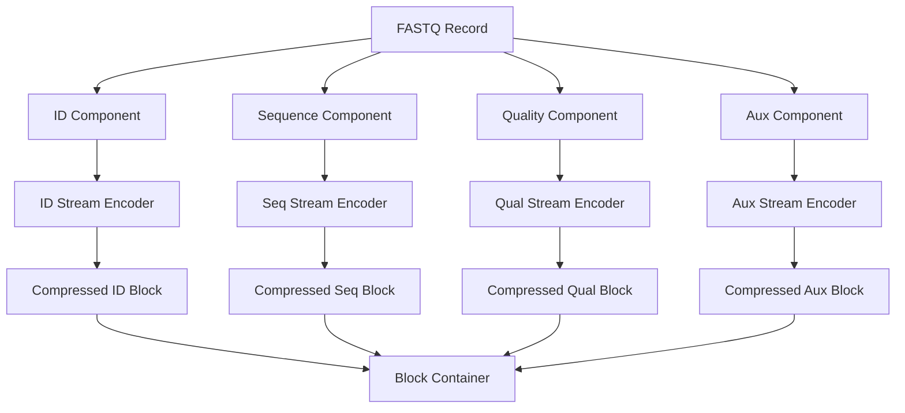

# Algorithms Overview

`fqc` uses different strategies for different FASTQ components and read-length classes.

## Processing Pipeline



## Sequence Path Decision Tree



### Sequence Path Details

- **Short-read path**: `fqc` prefers an ABC-style consensus/delta representation for smaller short-read blocks and falls back to Zstd-backed block storage when larger blocks would make that path too expensive.
- **Medium and long reads**: sequence payloads are stored with a Zstd-backed path instead of the short-read consensus model.

The current implementation classifies reads using observed lengths rather than a single CLI preset.

## Quality Path Classification



Quality strings are compressed separately from sequences:

| Mode | Description | Output |
|------|-------------|--------|
| `none` | Keeps quality scores lossless | Original quality values |
| `illumina8` | Bins qualities to 8 levels | Reduced alphabet, better compression |
| `qvz` | Quality-Value Zstd compression | Context-modeled compression |
| `discard` | Replaces qualities with placeholders | Placeholder 'B' values on decode |

## Reordering Pipeline



For short single-end archives in non-streaming mode, `fqc` can reorder reads to improve locality and compression efficiency. The archive stores reorder metadata when needed so original-order decompression remains possible.

### Reordering Benefits

```mermaid
flowchart LR
    subgraph Before["Before Reordering"]
        A1[Read 1: ACGT...] 
        A2[Read 2: TGCA...]
        A3[Read 3: ACGT...]
        A4[Read 4: GGCC...]
    end
    
    subgraph After["After Reordering"]
        B1[Read 1: ACGT...]
        B2[Read 3: ACGT...]
        B3[Read 2: TGCA...]
        B4[Read 4: GGCC...]
    end
    
    subgraph Benefit["Compression Benefit"]
        C1[Similar reads adjacent]
        C2[Better delta encoding]
        C3[Higher compression ratio]
    end
    
    Before --> After
    After --> Benefit
```



## Paired-End Layout

Paired-end input can be ingested from separate files or interleaved input and stored with either interleaved or consecutive archive layout metadata.

```mermaid
flowchart TB
    A[Paired-End Input] --> B{Input Format}
    B -->|R1 + R2 Files| C[Split Input]
    B -->|Interleaved| D[Single File]
    
    C --> E{Storage Layout}
    D --> E
    
    E -->|Interleaved| F[R1/R2/R1/R2...]
    E -->|Consecutive| G[R1...R1 | R2...R2]
    
    F --> H[Archive with PE Metadata]
    G --> H
```

## Component Stream Overview



Encoding components separately allows:

1. **Optimal codec selection** per component type
2. **Independent compression tuning** for ID vs sequence vs quality
3. **Selective decompression** when only certain components are needed
