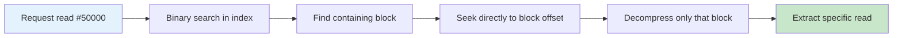
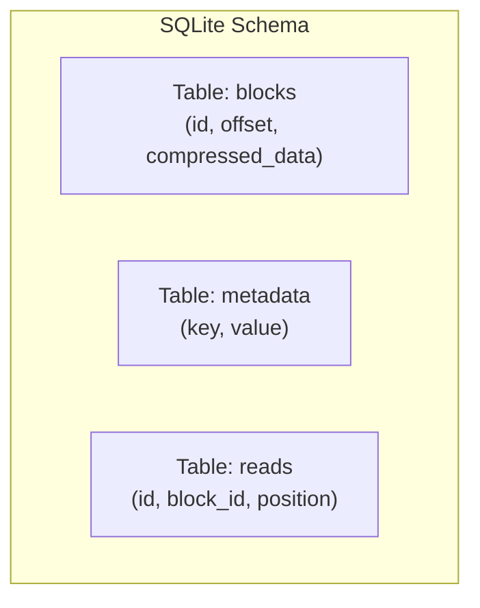
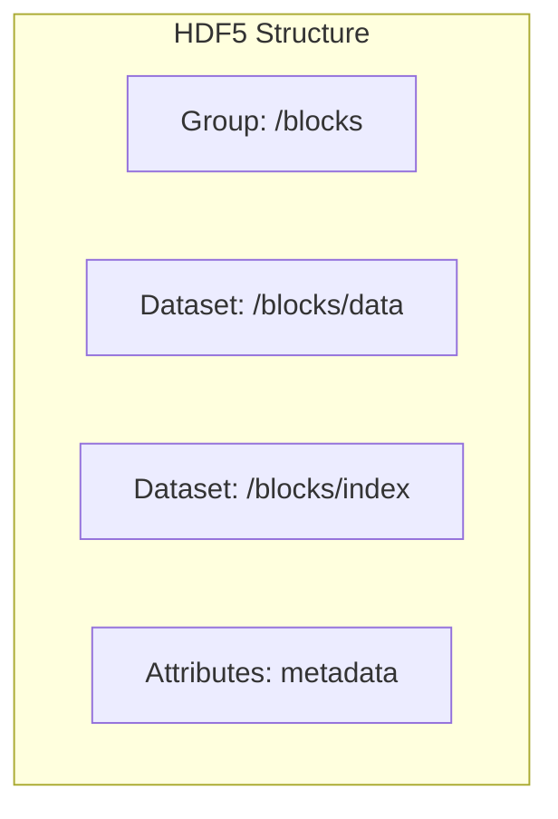
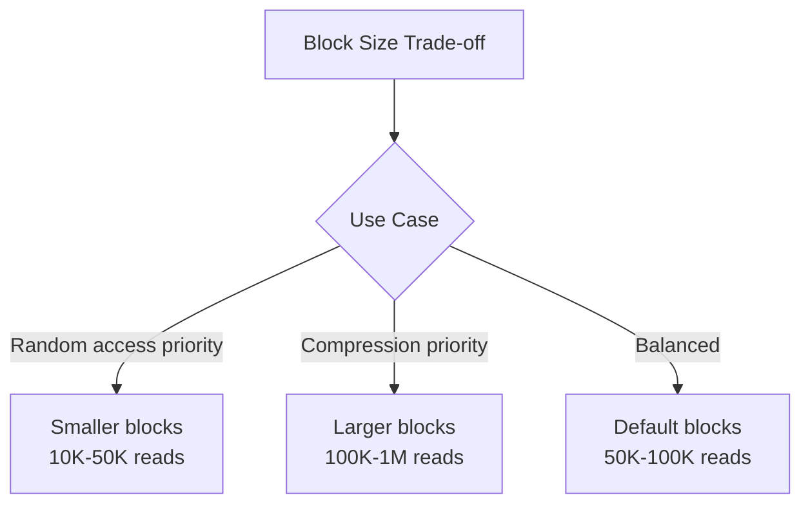
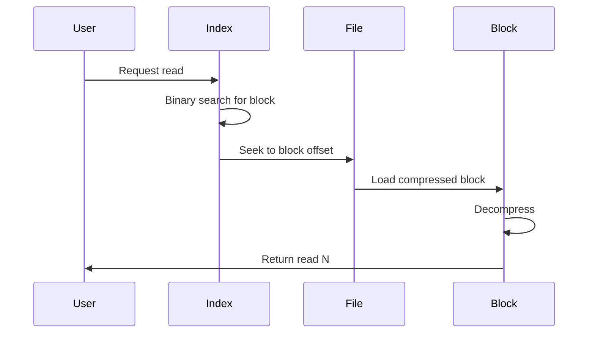

# ADR-001: Block-Indexed Format

## Status

Accepted

## Context

FASTQ files in bioinformatics can range from megabytes to terabytes in size. Users need to:

1. Compress large datasets efficiently
2. Access specific reads without decompressing the entire archive
3. Verify archive integrity without full decompression
4. Process subsets of reads for downstream analysis

The compression format must balance:
- Compression ratio (minimize storage)
- Random access capability (minimize decompression for partial reads)
- Forward compatibility (future format extensions)
- Implementation simplicity (maintainable codebase)

## Decision

We adopt a **block-indexed archive format** with the following characteristics:


### Key Design Elements

1. **Block-based storage**: Reads are grouped into blocks (typically 10,000-100,000 reads)
2. **Block index**: A table of contents at the end enables O(log N) block lookup
3. **Independent block compression**: Each block is independently compressed
4. **Self-contained blocks**: Block headers include all metadata needed for decompression
5. **Footer with index offset**: File footer provides navigation to the index

### Block Index Benefits



## Alternatives Considered

### Alternative 1: Simple Concatenated Streams

```
[Compressed Chunk 1][Compressed Chunk 2]...[Compressed Chunk N]
```

**Pros:**
- Simplicity - minimal format complexity
- Easy to implement streaming compression

**Cons:**
- No random access - must decompress from beginning to reach later reads
- No integrity verification without full decompression
- No metadata about total read count until end of file
- Difficult to resume interrupted decompression

**Rejected because**: Random access is essential for bioinformatics workflows where users frequently need to access specific reads or ranges.

### Alternative 2: SQLite-Based Storage



**Pros:**
- Mature, well-tested library ecosystem
- Built-in indexing and query optimization
- ACID guarantees for data integrity
- Rich metadata storage

**Cons:**
- Heavy dependency - SQLite adds complexity
- Larger file overhead - database structure adds overhead
- Not optimized for sequential read workloads
- Compression ratio suffers - database pages add overhead
- Less portable - requires SQLite library

**Rejected because**: The overhead of SQLite outweighs its benefits for a specialized compression format. Custom indexing provides needed functionality with less overhead.

### Alternative 3: HDF5-Based Storage



**Pros:**
- Designed for scientific data
- Built-in compression filters
- Hierarchical organization
- Widely used in bioinformatics

**Cons:**
- Heavy dependency - libhdf5 is substantial
- Complex C library with Rust bindings
- Overkill for simple FASTQ storage
- Less portable - requires HDF5 installation
- Large file header overhead

**Rejected because**: HDF5 is better suited for complex multidimensional scientific data. FASTQ records are simple and don't require HDF5's hierarchical features.

## Consequences

### Positive

1. **Random access**: Users can extract specific reads in O(log N + block_decompress) time
2. **Partial decompression**: Only needed blocks require decompression
3. **Integrity verification**: Block-level checksums enable incremental verification
4. **Parallel processing**: Independent blocks can be processed in parallel
5. **Simple implementation**: Index is a simple array of (offset, size, id_range) tuples
6. **Memory efficiency**: Large archives don't require loading entire index
7. **Forward compatibility**: Reserved fields allow format extensions

### Negative

1. **Slight compression ratio reduction**: Independent block compression prevents cross-block references
2. **Index overhead**: Block index adds ~28 bytes per block
3. **Block size tuning required**: Users may need to tune block size for their use case
4. **Write complexity**: Must track block offsets during compression

### Mitigations



## Implementation Notes

### Block Size Selection

| Block Size | Random Access | Compression | Memory |
|------------|---------------|-------------|--------|
| 10K reads | Excellent | Good | Low |
| 100K reads | Good | Better | Medium |
| 1M reads | Fair | Best | High |

### Index Lookup Algorithm



## References

- [Format Specification](../../reference/format-spec.md) - Detailed binary format
- [Performance Roadmap](../performance-roadmap.md) - Performance considerations
