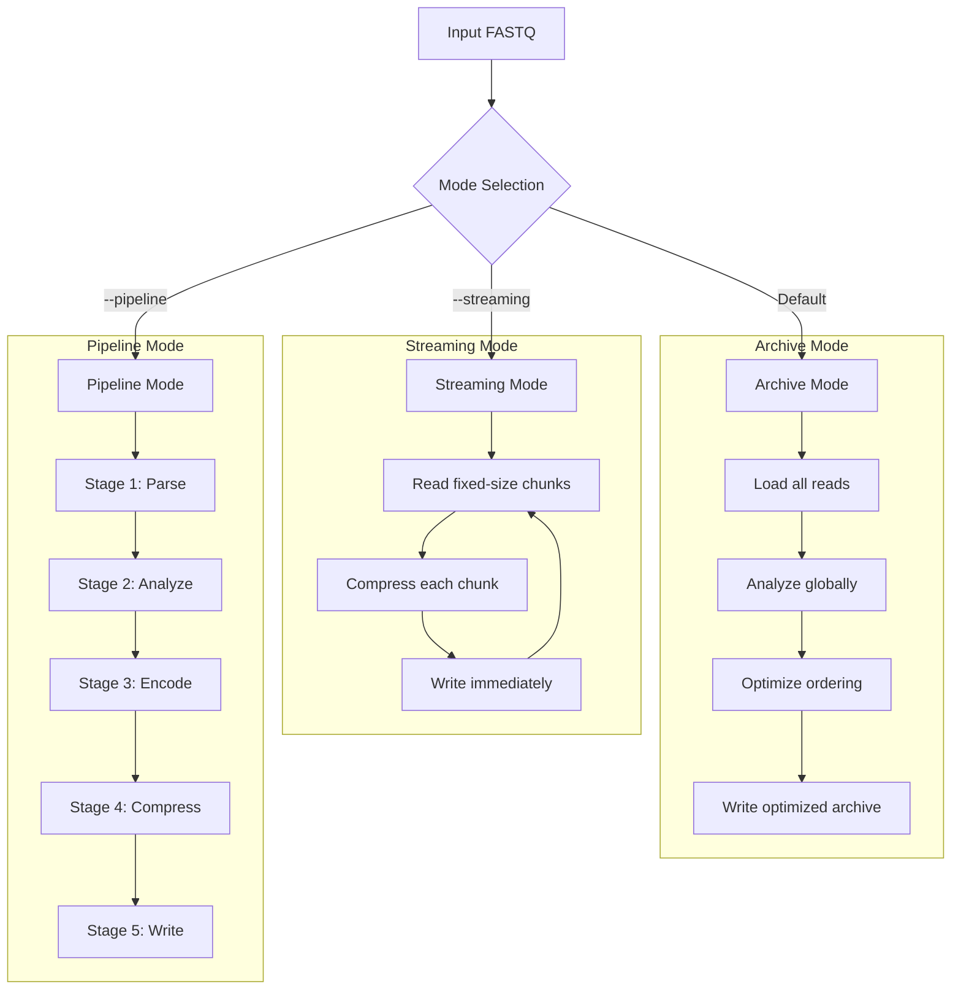
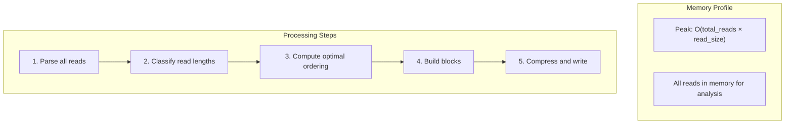
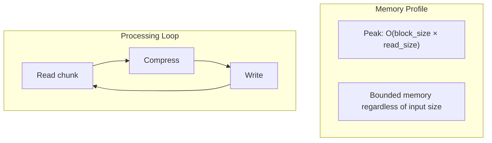
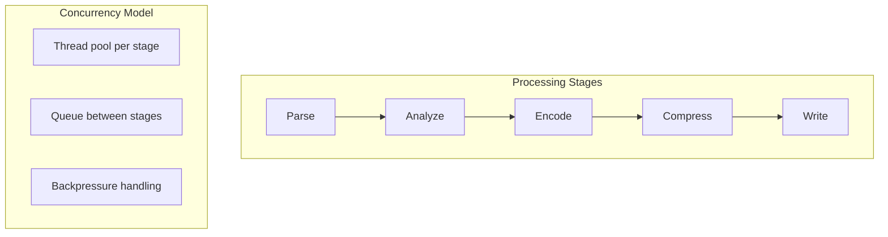
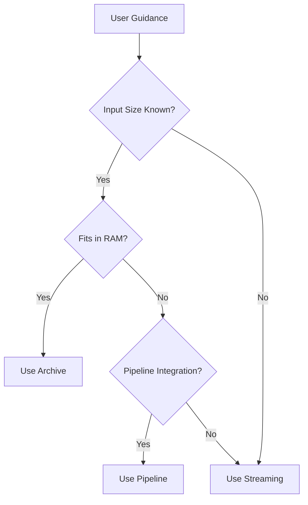
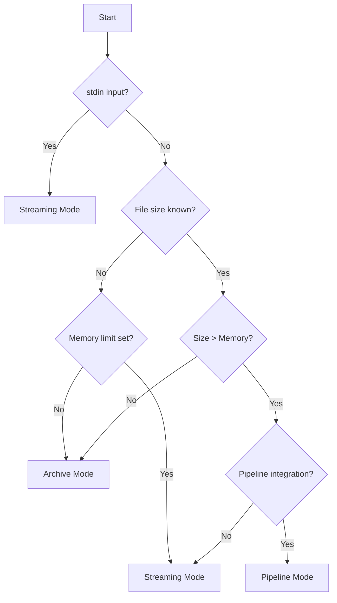

# ADR-002: Three Execution Modes

## Status

Accepted

## Context

FASTQ compression tools serve diverse use cases:

1. **Small-scale analysis**: Researchers compress small datasets (< 1GB) on workstations
2. **Large-scale processing**: Bioinformatics pipelines process terabytes of sequencing data
3. **Streaming workflows**: Data arrives via stdin from upstream tools
4. **Memory-constrained environments**: Limited RAM on HPC nodes or cloud instances

A single mode cannot optimally serve all these scenarios. Memory-intensive optimization strategies that improve compression for small files may fail or degrade performance for large files.

## Decision

We implement **three distinct execution modes** with different memory and performance trade-offs:



### Mode Characteristics

| Mode | Memory Usage | Compression Ratio | Reordering | Use Case |
|------|--------------|-------------------|------------|----------|
| Archive | High (full dataset) | Best | Full optimization | Small/medium files |
| Streaming | Low (bounded buffer) | Good | Disabled | Large files, stdin |
| Pipeline | Medium (staged) | Good | Partial | Integration workflows |

## Mode Details

### Archive Mode (Default)



**Characteristics:**
- Reads entire dataset into memory
- Enables global optimizations (reordering, block sizing)
- Best compression ratio
- Single-pass after initial load

**When to use:**
- Files fit comfortably in available RAM
- Maximum compression is desired
- Dataset size is known and manageable

### Streaming Mode



**Characteristics:**
- Processes fixed-size chunks
- Memory usage bounded and predictable
- No global reordering
- Can handle unlimited input size
- Works with stdin/stdout pipelines

**When to use:**
- Large files exceeding available RAM
- Streaming from upstream tools
- Memory-constrained environments
- Unknown or unlimited dataset size

### Pipeline Mode



**Characteristics:**
- Multi-stage processing with queues
- Parallel stage execution
- Balanced memory usage
- Integrates with pipeline workflows

**When to use:**
- Integration with bioinformatics pipelines
- Multi-core utilization desired
- Balanced memory/performance needs

## Alternatives Considered

### Alternative 1: Single Adaptive Mode

Automatically switch between strategies based on detected input size.

**Pros:**
- Simpler user experience - no mode selection needed
- Automatic optimization

**Cons:**
- Unpredictable memory usage - users can't anticipate resource needs
- Hard to tune - one size doesn't fit all
- Unclear semantics - users don't know what to expect

**Rejected because**: Explicit modes provide clear resource guarantees and let users make informed decisions.

### Alternative 2: Memory Limit Parameter Only

Use `--memory-limit N` to control behavior without explicit modes.

**Pros:**
- Single parameter to understand
- Gradual memory adaptation

**Cons:**
- Complex implementation - must handle all memory tiers
- Unclear behavior changes - what changes at each limit?
- No clear guidance - users don't know appropriate values

**Rejected because**: Named modes provide clearer semantics than numeric thresholds.

### Alternative 3: Hybrid with Auto-Selection

Provide modes but also an `--auto` flag that selects based on system resources.

**Pros:**
- Best of both - expert control + novice simplicity
- Automatic for common cases

**Cons:**
- Two ways to do things - confusing documentation
- Auto-selection may be wrong - system RAM ≠ available RAM
- Hides important decisions - users lose control

**Rejected because**: Explicit modes encourage users to understand trade-offs.

## Consequences

### Positive

1. **Clear resource guarantees**: Users know memory bounds for each mode
2. **Appropriate optimization**: Each mode optimizes for its use case
3. **Predictable behavior**: No surprise memory spikes or crashes
4. **Pipeline compatibility**: Streaming mode integrates with Unix pipelines
5. **Documentation clarity**: Each mode has clear guidelines

### Negative

1. **User decision required**: Users must understand modes to choose appropriately
2. **Mode-specific bugs**: Issues may only appear in certain modes
3. **Testing complexity**: Must test all modes for changes

### Mitigations



**Default recommendation**: Start with Archive mode; switch to Streaming if memory issues occur.

## CLI Usage

```bash
# Archive mode (default)
fqc compress -i input.fastq -o output.fqc

# Streaming mode
fqc compress -i large.fastq -o output.fqc --streaming

# Pipeline mode
fqc compress -i input.fastq -o output.fqc --pipeline

# Combined with memory tuning
fqc compress -i input.fastq -o output.fqc --streaming --memory-limit 1G
```

## Mode Selection Flowchart



## References

- [Performance Roadmap](../performance-roadmap.md) - Performance characteristics
- [CLI Reference](../../guide/cli.md) - Command-line options
