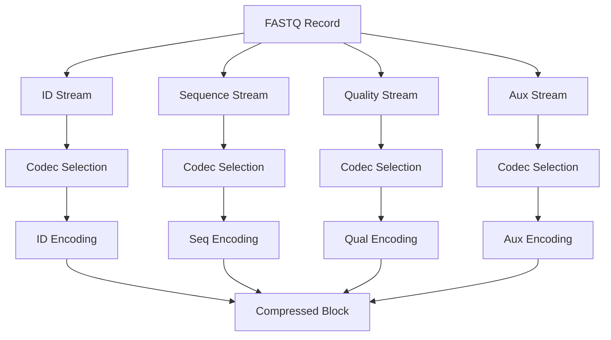
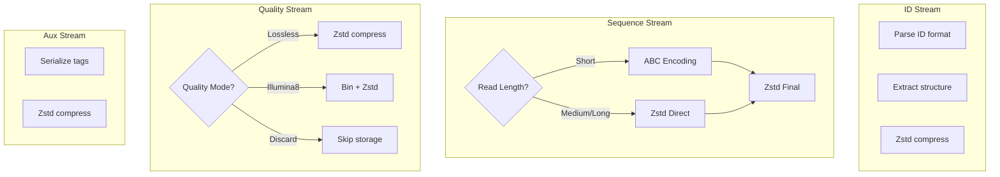
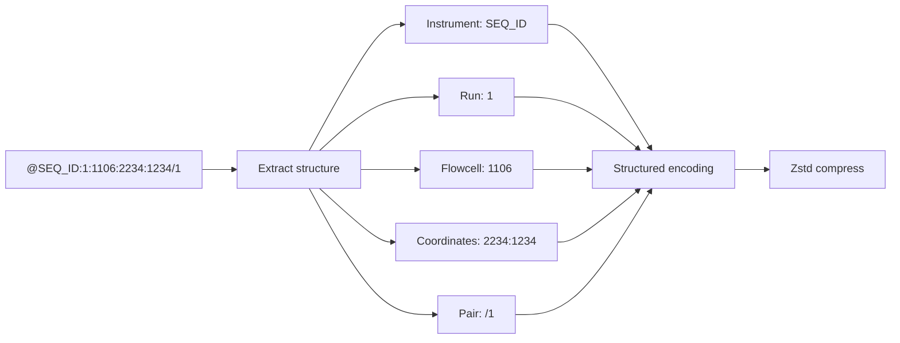
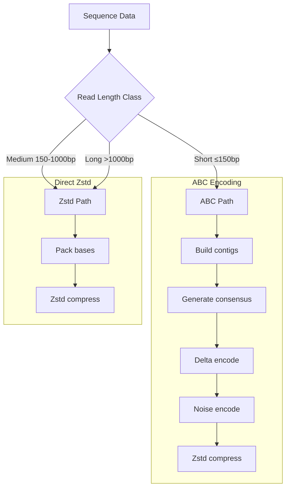
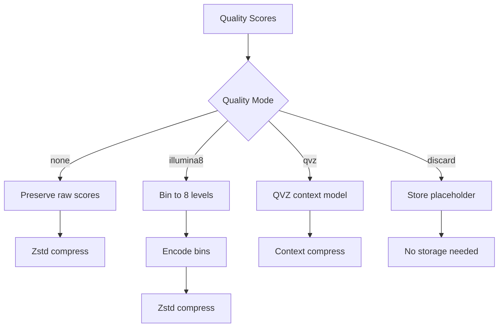
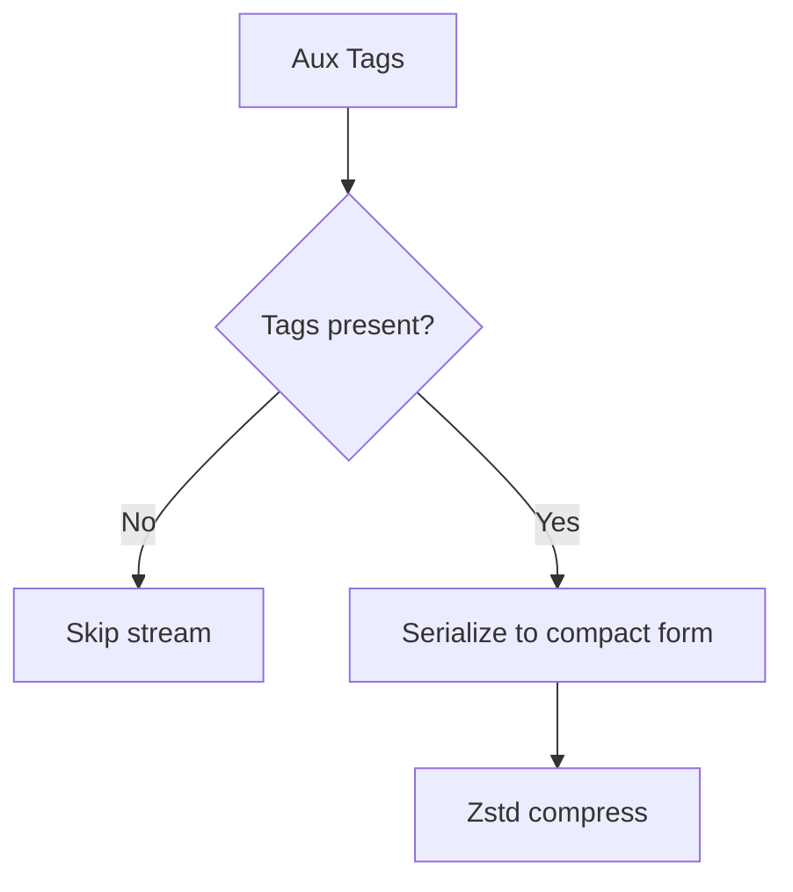
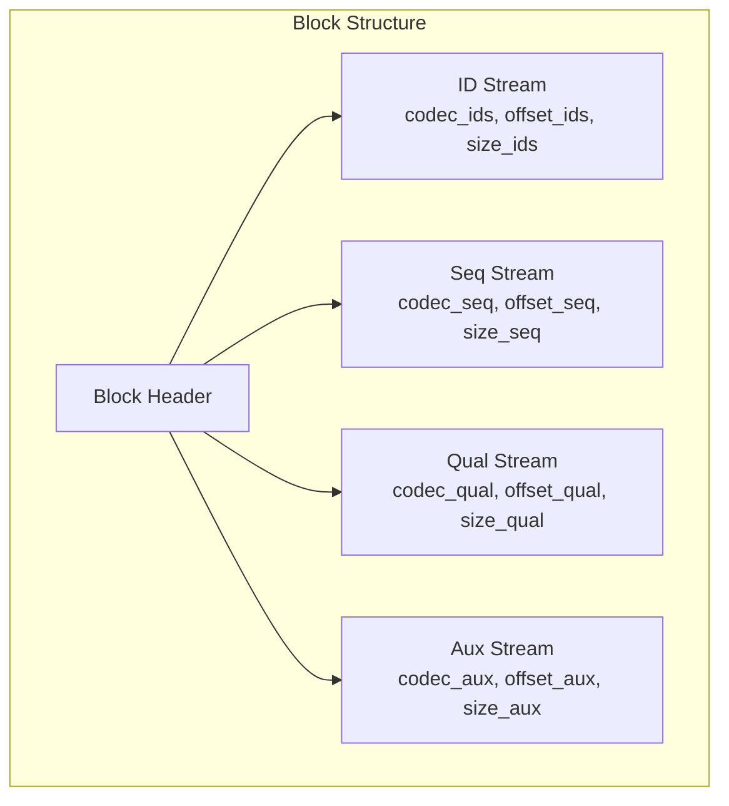
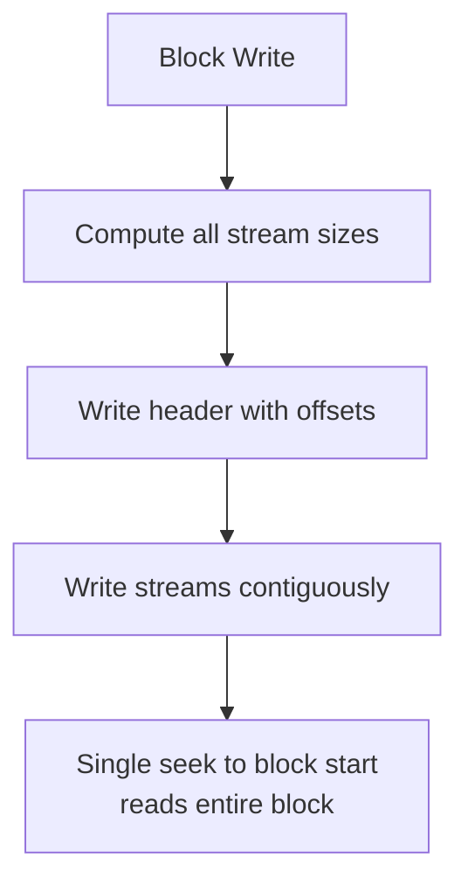
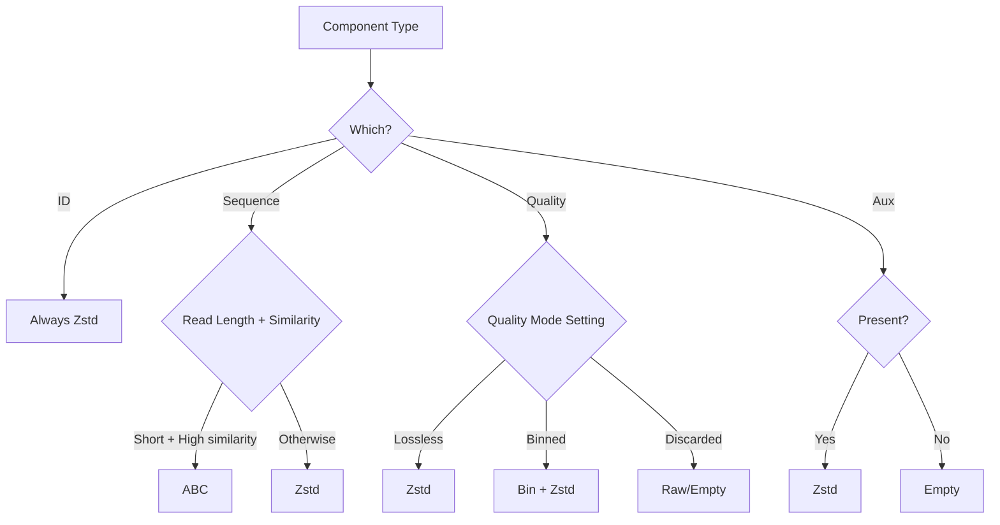

# ADR-003: Component Encoding

## Status

Accepted

## Context

FASTQ records contain four distinct components:

1. **Identifier (ID)**: Read name, often with instrument/run/flowcell information
2. **Sequence (Seq)**: DNA/RNA bases (A, C, G, T, N)
3. **Quality (Qual)**: Phred scores for each base
4. **Auxiliary (Aux)**: Optional metadata tags

Each component has different characteristics:

| Component | Alphabet | Pattern | Typical Size |
|-----------|----------|---------|--------------|
| ID | ASCII | Instrument-specific format | 20-100 bytes |
| Sequence | A, C, G, T, N | Biological patterns | 50-30,000 bytes |
| Quality | ASCII 33-126 | Instrument error model | Same as sequence |
| Aux | ASCII | Key:value pairs | 0-200 bytes |

A unified compression strategy cannot optimally handle all these different data types.

## Decision

We encode each component in **separate, independent streams** with component-specific codecs:



### Stream-Specific Codecs



## Component-Specific Strategies

### ID Stream Encoding



**Strategy**: Extract common prefixes and patterns, encode structure, compress with Zstd.

### Sequence Stream Encoding



**Strategy**: Use ABC for short reads with high similarity; direct Zstd for others.

### Quality Stream Encoding



**Strategy**: Default to lossless; offer binning for size reduction; discard when quality unused.

### Aux Stream Encoding



**Strategy**: Optional stream; only present when auxiliary data exists.

## Block Structure

Each block contains the four streams independently:



## Alternatives Considered

### Alternative 1: Unified Record Encoding

Compress complete FASTQ records as single units.


**Pros:**
- Simpler implementation
- Single compression operation
- Natural text-like structure

**Cons:**
- Suboptimal compression - each component's patterns are mixed
- No component-level optimization
- No selective decompression
- Quality and sequence treated identically despite different alphabets

**Rejected because**: Component patterns are fundamentally different and benefit from specialized handling.

### Alternative 2: Column-Based Storage

Store all IDs, then all sequences, then all qualities.

```
[ID1][ID2]...[IDN][SEQ1][SEQ2]...[SEQN][QUAL1][QUAL2]...[QUALN]
```

**Pros:**
- Excellent compression - similar data adjacent
- Clear separation of concerns
- Simple structure

**Cons:**
- Poor random access - must seek across multiple regions
- Complex decompression - need to gather from multiple locations
- Memory overhead - must read all columns to reconstruct records

**Rejected because**: Random access is a key requirement for the block-indexed format.

### Alternative 3: Interleaved with Shared Dictionary

Store records interleaved but with a shared compression dictionary.


**Pros:**
- Better compression than naive interleaving
- Preserves record structure
- Standard Zstd feature

**Cons:**
- Dictionary training is expensive
- Dictionary must be stored with archive
- Still treats all components uniformly
- Less effective for heterogeneous data

**Rejected because**: Component-specific encoding provides better compression than shared dictionaries.

## Consequences

### Positive

1. **Optimal compression per component**: Each stream uses the best codec for its data type
2. **Independent tuning**: Compression parameters can be adjusted per stream
3. **Selective decompression**: Can decompress only needed components
4. **Clear codec reporting**: Users can see which codec was used for each stream
5. **Extensible**: New codecs can be added per component without affecting others

### Negative

1. **More complex block structure**: Four streams to manage per block
2. **Additional header fields**: Block header must specify four codecs and offsets
3. **Potential fragmentation**: Four separate streams may have access pattern implications

### Mitigations



**Access pattern**: Blocks are written contiguously; single seek + read retrieves all streams.

## Codec Selection Logic



## Stream Metadata in Block Header

| Field | Description | Usage |
|-------|-------------|-------|
| `codec_ids` | ID stream codec | Decoder selection |
| `codec_seq` | Sequence stream codec | Decoder selection |
| `codec_qual` | Quality stream codec | Decoder selection |
| `codec_aux` | Aux stream codec | Decoder selection |
| `offset_ids` | ID stream offset in block | Seek position |
| `offset_seq` | Seq stream offset in block | Seek position |
| `offset_qual` | Qual stream offset in block | Seek position |
| `offset_aux` | Aux stream offset in block | Seek position |
| `size_ids` | ID stream compressed size | Read length |
| `size_seq` | Seq stream compressed size | Read length |
| `size_qual` | Qual stream compressed size | Read length |
| `size_aux` | Aux stream compressed size | Read length |

## References

- [Format Specification](../../reference/format-spec.md) - Block header details
- [ABC Algorithm](../../algorithms/abc-deep-dive.md) - Sequence encoding details
- [Algorithms Overview](../../algorithms/index.md) - Quality modes
