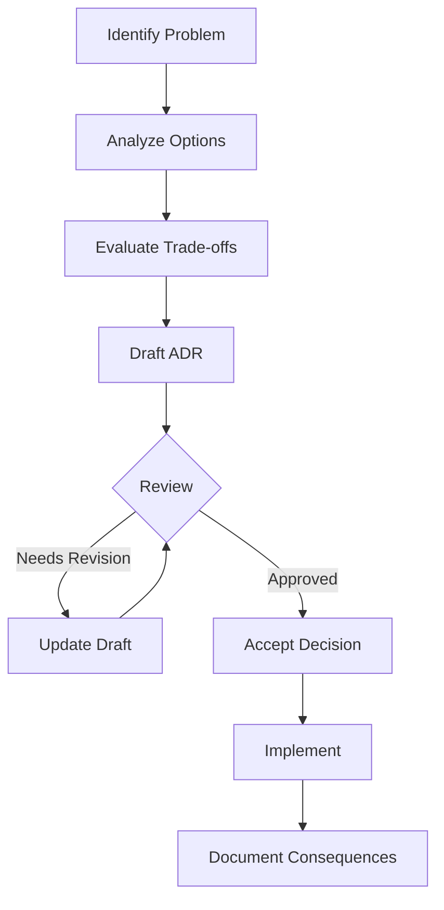

# Architecture Decision Records

This directory contains Architecture Decision Records (ADRs) for the fq-compressor-rust project.

## What is an ADR?

An ADR is a document that captures an important architectural decision made along with its context and consequences. Each ADR describes:

- The decision being made
- The context and problem statement
- The considered alternatives
- The rationale for the chosen solution
- The consequences of the decision

## ADR Index

| Number | Title | Status | Description |
|--------|-------|--------|-------------|
| [ADR-001](001-block-indexed-format.md) | Block-Indexed Format | Accepted | Archive structure enabling random access |
| [ADR-002](002-three-execution-modes.md) | Three Execution Modes | Accepted | Archive, Streaming, and Pipeline modes |
| [ADR-003](003-component-encoding.md) | Component Encoding | Accepted | Separate ID/Seq/Qual/Aux stream encoding |

## Decision Process



## ADR Template

New ADRs should follow this structure:

```markdown
# ADR-NNN: Title

## Status

[Proposed | Accepted | Deprecated | Superseded]

## Context

[Description of the problem and context]

## Decision

[The decision that was made]

## Alternatives Considered

[List of alternatives that were considered]

## Consequences

[Positive and negative effects of the decision]
```

## Related Documentation

- [Performance Roadmap](../performance-roadmap.md) - Performance optimization strategy
- [Format Specification](../../reference/format-spec.md) - Binary format details
- [Algorithms Overview](../../algorithms/index.md) - Compression algorithms
