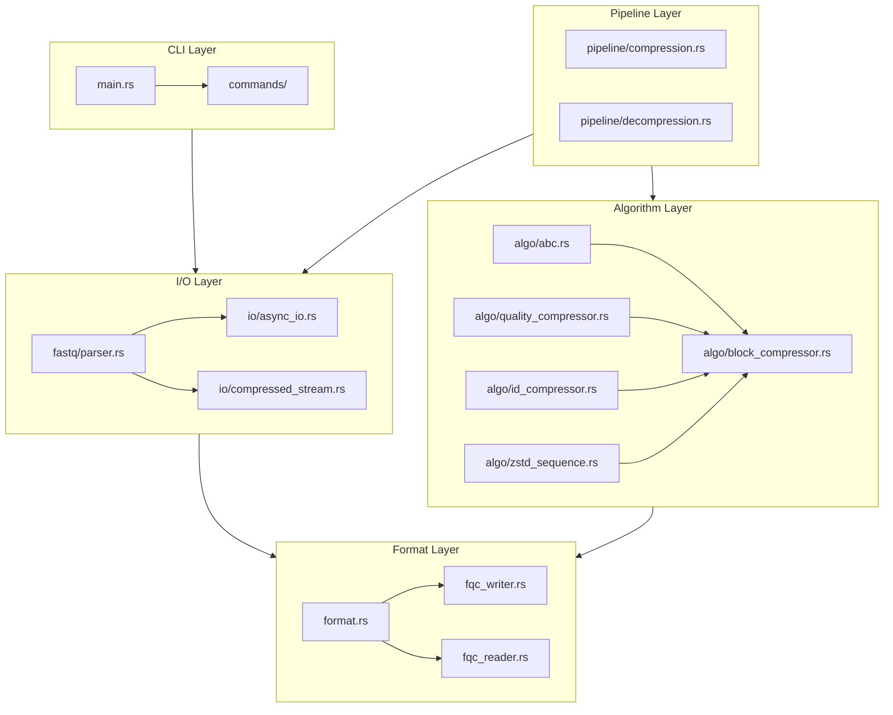
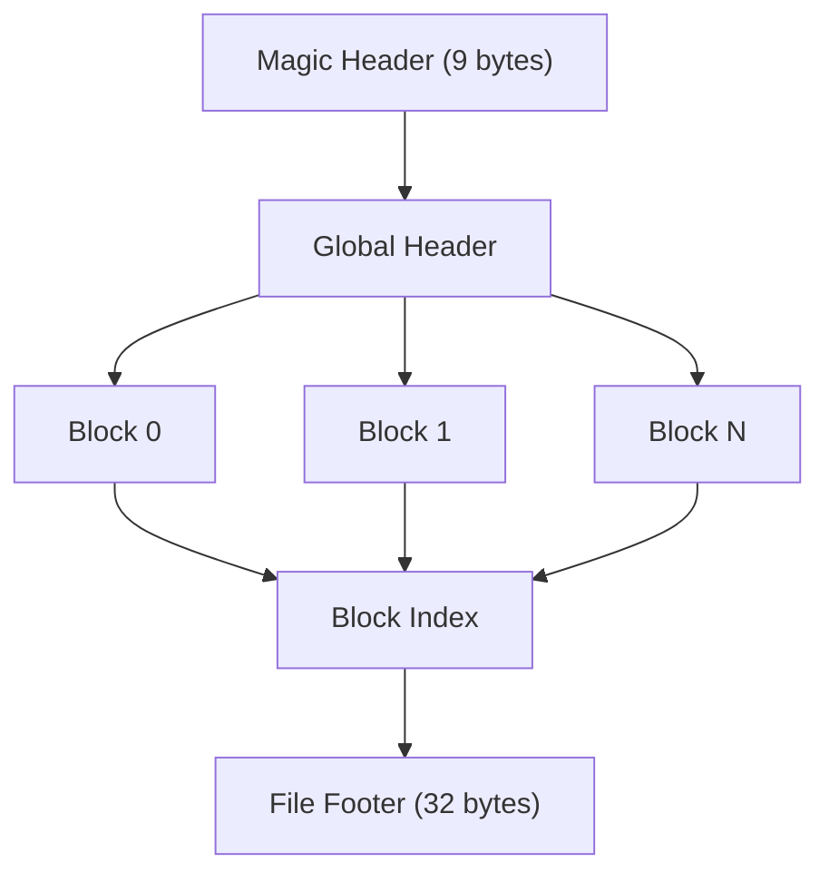

# Architecture Overview

`fqc` is a single-binary Rust CLI with a small number of well-defined layers.

## System Architecture

## Main Layers

| Layer | Key files | Responsibility |
| --- | --- | --- |
| CLI | `src/main.rs`, `src/commands/*` | Parse arguments and dispatch command behavior |
| FASTQ I/O | `src/fastq/parser.rs`, `src/io/*` | Read FASTQ input and compressed stream variants |
| Archive format | `src/format.rs`, `src/fqc_writer.rs`, `src/fqc_reader.rs` | Encode and decode the `.fqc` container |
| Compression logic | `src/algo/*` | Sequence, quality, ID, reorder, and paired-end logic |
| Compression orchestration | `src/commands/compression_engine.rs`, `src/commands/compression_request.rs` | Normalize requests, route execution modes, and capture outcomes |
| Pipelines | `src/pipeline/*` | Reader/compressor/writer parallel flow for pipeline mode |
| Shared types | `src/types.rs`, `src/error.rs` | Public types, defaults, and exit-code mapping |

## Archive Model

An `.fqc` archive contains:

1. a global header with mode flags and archive metadata
2. one or more compressed blocks
3. an optional reorder map
4. a footer and block index

This layout is why `fqc info`, `fqc verify`, and range-based decompression can operate on archive structure rather than treating the file as an opaque blob.

## Execution Modes

Compression operations route through `CompressionEngine`, which selects one of three distinct execution modes:

- **Archive mode** (default): full ingest with optional reordering and global analysis
- **Streaming mode** (`--streaming`): single-pass incremental processing with reordering disabled; strict low-memory option
- **Pipeline mode** (`--pipeline`): staged concurrent reader/compressor/writer execution with in-flight block buffering

Each mode preserves the same output format and CLI semantics while varying memory footprint and concurrency behavior.

## Performance Roadmap

For the maintained summary of current bottlenecks, the preferred optimization direction, and the active phase boundary, see [Performance roadmap](./performance-roadmap.md).