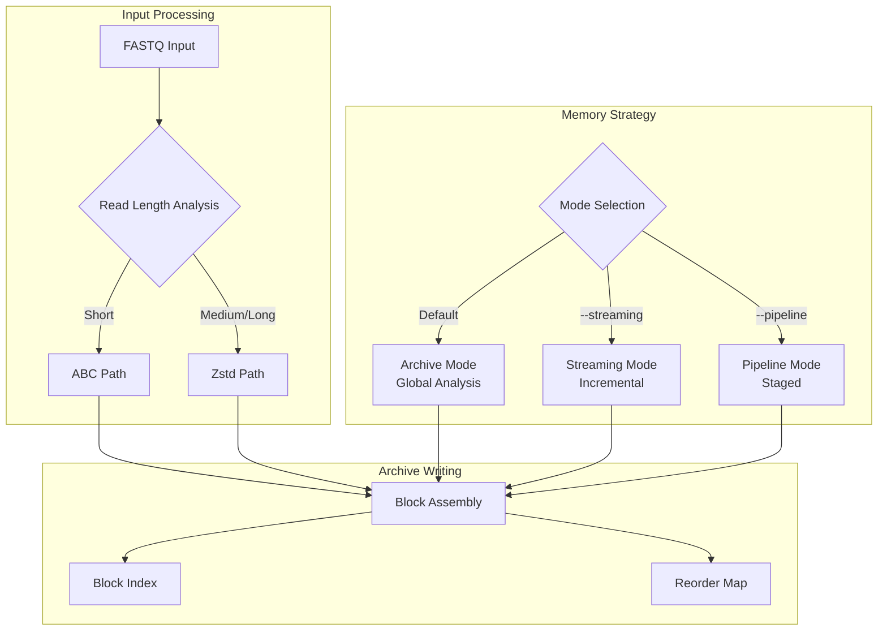
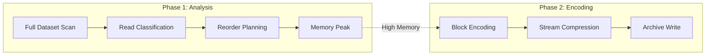
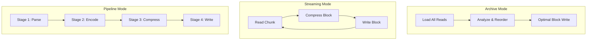
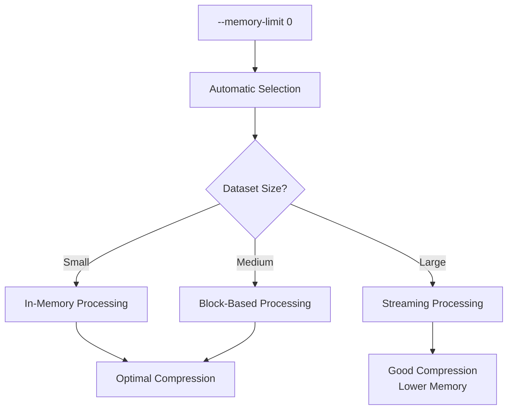
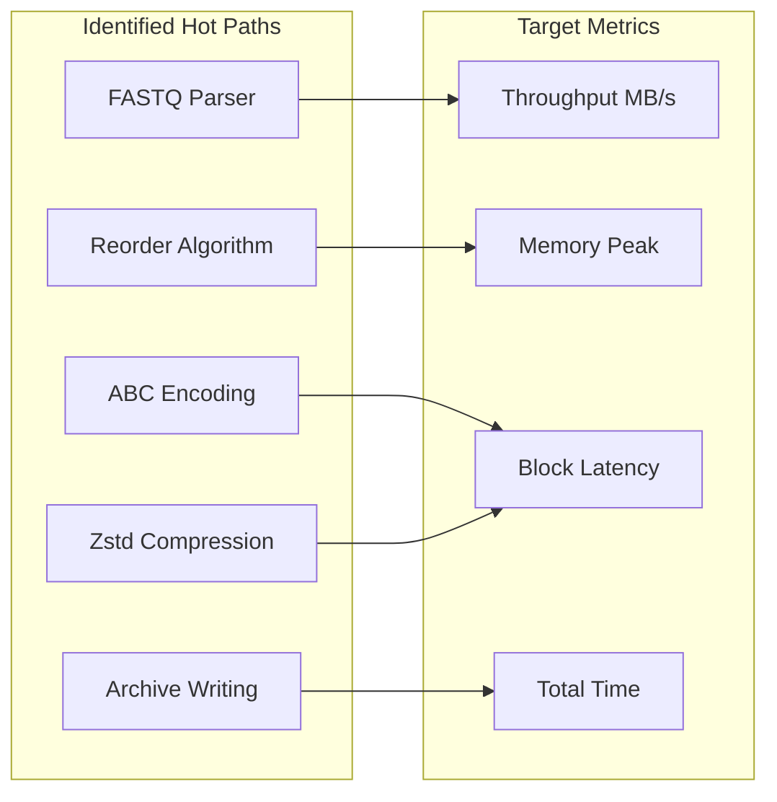

# Performance Roadmap

This page is the maintained summary for `fqc` performance work. It captures the current shape of the problem and the next bounded slice without turning the docs site into a research archive.

## Architecture Overview

## Current Bottlenecks

### Memory Pressure Analysis

- **Short-read compression still pays for a global analysis pass.** The main compression path can analyze the full dataset before writing blocks so reorder-aware compression improves ratio, but that also concentrates memory and wall-clock pressure in phase 1.
- **Lower-memory modes trade flexibility for predictability.** `--streaming` avoids global reordering and pipeline mode spreads work across stages, but the project still needs clearer guidance on when those modes are the preferred foundation.
- **Memory semantics need one explicit contract.** Future implementation work should align on `--memory-limit 0` meaning automatic memory selection so tuning and docs describe the same behavior.

## Execution Mode Comparison

| Feature | Archive Mode | Streaming Mode | Pipeline Mode |
|---------|--------------|----------------|---------------|
| Memory Usage | High (full dataset) | Low (incremental) | Medium (staged) |
| Reordering | Full optimization | Disabled | Partial |
| Compression Ratio | Best | Good | Good |
| Use Case | Small/medium files | Large files | Pipeline integration |

## Recommended Direction

1. Keep the next slices focused on memory predictability and measured hot paths rather than new codecs or broad rewrites.
2. Treat streaming and pipeline flows as the practical foundation for follow-up optimization, with reorder-heavy paths improved only after memory behavior is explicit.

## Phase 1 Scope

This slice only establishes shared direction:

- capture the maintained roadmap in public docs
- record the intended `--memory-limit 0` semantics for later implementation alignment

No runtime performance behavior changes ship in phase 1.

## Memory Limit Semantics

### Future Contract

| Flag | Current Behavior | Target Behavior |
|------|------------------|-----------------|
| `--memory-limit 0` | Unspecified | Automatic selection based on dataset |
| `--memory-limit N` | Hint only | Hard limit with fallback strategies |

## Deferred Follow-up

Later slices can build on this summary by:

- implementing automatic memory selection consistently behind `--memory-limit 0`
- adding targeted measurement for parser, reorder, pipeline, and archive-writing hotspots
- narrowing any larger algorithm or data-structure changes to separately reviewable OpenSpec slices

## Performance Measurement Points

