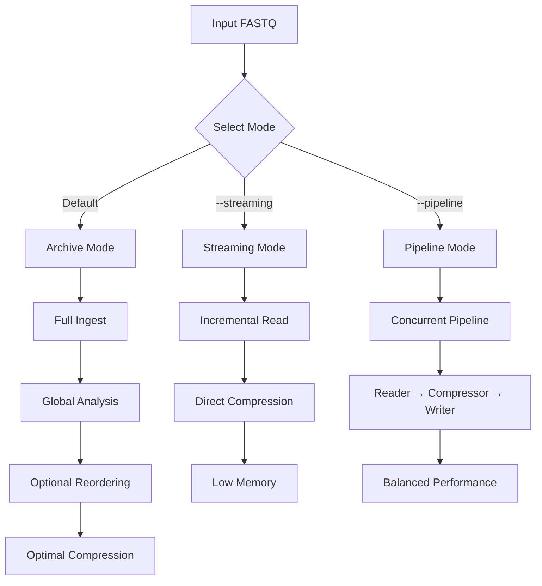
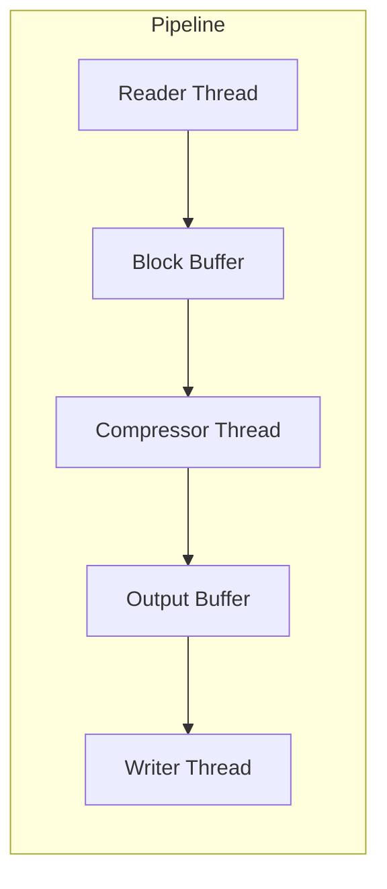

# Compression Modes

`fqc` provides three distinct execution modes for compression, each optimized for different use cases.

## Mode Overview



## Comparison Table

| Feature | Archive | Streaming | Pipeline |
|---------|---------|-----------|----------|
| **Flag** | (default) | `--streaming` | `--pipeline` |
| **Memory Usage** | High | Low | Medium |
| **Reordering** | Yes | No | Limited |
| **Compression Ratio** | Best | Good | Good |
| **Throughput** | Medium | High | Highest |
| **Use Case** | Best ratio | Large files, constrained memory | Concurrent processing |

## Archive Mode (Default)

**Best for**: Maximum compression ratio when memory is not constrained.

```bash
fqc compress -i reads.fastq -o reads.fqc
```

**Characteristics**:
- Full read set loaded into memory
- Global analysis for optimal block boundaries
- Optional read reordering for improved locality
- Best compression ratio

**Memory behavior**:
- Scales with input size
- Use `--memory-limit` to cap memory usage
- `--memory-limit 0` enables automatic memory selection

## Streaming Mode

**Best for**: Large files or memory-constrained environments.

```bash
fqc compress -i reads.fastq -o reads.fqc --streaming
```

**Characteristics**:
- Single-pass incremental processing
- No global reordering
- Strict memory control
- Fast processing

**Memory behavior**:
- Constant memory footprint
- Independent of input size
- Ideal for streaming pipelines

## Pipeline Mode

**Best for**: Concurrent processing with balanced performance.

```bash
fqc compress -i reads.fastq -o reads.fqc --pipeline
```

**Characteristics**:
- Staged concurrent execution
- Reader → Compressor → Writer pipeline
- In-flight block buffering
- High throughput

**Architecture**:



## Memory Limit

All modes respect the `--memory-limit` option:

```bash
# Explicit limit in MB
fqc compress -i reads.fastq -o reads.fqc --memory-limit 1024

# Automatic selection (default)
fqc compress -i reads.fastq -o reads.fqc --memory-limit 0
```

## Recommendations

| Scenario | Recommended Command |
|----------|---------------------|
| Standard compression | `fqc compress -i in.fq -o out.fqc` |
| Large file, limited RAM | `fqc compress -i in.fq -o out.fqc --streaming --memory-limit 1024` |
| Maximum throughput | `fqc compress -i in.fq -o out.fqc --pipeline` |
| Paired-end | `fqc compress -i R1.fq -2 R2.fq -o out.fqc` |
