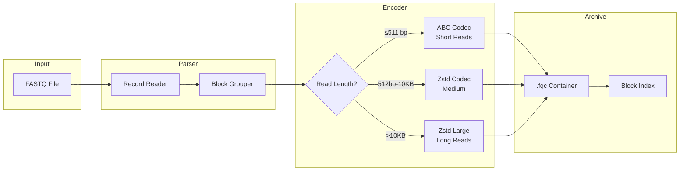

  Technical Whitepaper
  v0.1.1
  Rust 1.75+

  

    
FQ

    

      fqc
      Block-Indexed FASTQ Compression
    

  

  

    <a href="./architecture/">Architecture</a>
    <a href="./algorithms/">Algorithms</a>
    <a href="./benchmarks/performance-report">Benchmarks</a>
    <a href="https://github.com/LessUp/fq-compressor-rust">GitHub</a>
    <a href="../zh/">中文</a>
  

  
Abstract

  

    fqc is a domain-aware FASTQ compression tool that achieves <mark>2.4× compression ratio</mark> through block-indexed archiving, component-specific encoding (ABC, SCM, Zstd), and <mark>O(log N) random access</mark>. Written in pure Rust with zero unsafe code, it supports three execution modes (Archive, Streaming, Pipeline) for flexible memory-throughput trade-offs. Designed for bioinformatics workflows requiring both compression efficiency and operational tooling.
  

  

    2.4×
    Compression Ratio
  

  

    O(log N)
    Random Access
  

  

    3
    Execution Modes
  

  

    0
    unsafe Code
  

## Core Architecture

## Technical Highlights

  

    
Architecture & Design

    

      Layered system architecture with CLI, I/O, Format, Algorithm, and Pipeline layers. Three Architecture Decision Records document key design choices.
    

    

      <a href="./architecture/" class="feature-tag">Overview</a>
      <a href="./architecture/decisions/" class="feature-tag">ADRs</a>
      <a href="./architecture/performance-roadmap" class="feature-tag">Roadmap</a>
    

  

  

    
Algorithms

    

      ABC (Anchor-Based Compression) for short reads with contig building and delta encoding. SCM arithmetic coding for quality scores. Adaptive codec selection per component.
    

    

      <a href="./algorithms/" class="feature-tag">Overview</a>
      <a href="./algorithms/abc-deep-dive" class="feature-tag">ABC Deep Dive</a>
    

  

  

    
Binary Format

    

      Custom <code>.fqc</code> container with magic header, block-level checksums (xxHash64), footer index for O(log N) random access, and forward-compatible versioning.
    

    

      <a href="./reference/format-spec" class="feature-tag">Format Spec</a>
    

  

  

    
Execution Modes

    

      Archive mode for best ratio with global reordering, Streaming for bounded memory, Pipeline for staged throughput. All produce identical <code>.fqc</code> output.
    

    

      <a href="./guide/modes" class="feature-tag">Modes Guide</a>
      <a href="./architecture/performance-roadmap" class="feature-tag">Performance</a>
    

  

  

    
Benchmarks

    

      2.39x compression ratio on test data, sub-100ms operations. Criterion-based benchmarks for parser throughput and full archive workflows.
    

    

      <a href="./benchmarks/performance-report" class="feature-tag">Report</a>
    

  

  

    
CLI Reference

    

      Four commands: compress, decompress, info, verify. Paired-end support, compressed input detection, memory budget management.
    

    

      <a href="./guide/cli" class="feature-tag">CLI Docs</a>
      <a href="./guide/quick-start" class="feature-tag">Quick Start</a>
    

  

## Quick Start

  

    
    
    
    bash
  

  

    $ # Build from source
    $ cargo build --release
    
    $ # Compress a FASTQ file
    $ ./target/release/fqc compress -i reads.fq -o reads.fqc
    
    $ # Decompress
    $ ./target/release/fqc decompress -i reads.fqc -o reads.fq
  

See the [Quick Start guide](./guide/quick-start) for installation options and first compression steps.

## Resources

  <a href="./architecture/" class="resource-item">
    📊
    29 Interactive Diagrams
  </a>
  <a href="./architecture/decisions/" class="resource-item">
    📋
    3 Architecture Decision Records
  </a>
  <a href="./reference/format-spec" class="resource-item">
    📄
    Binary Format Specification
  </a>
  <a href="./references/" class="resource-item">
    📚
    References & Related Work
  </a>

