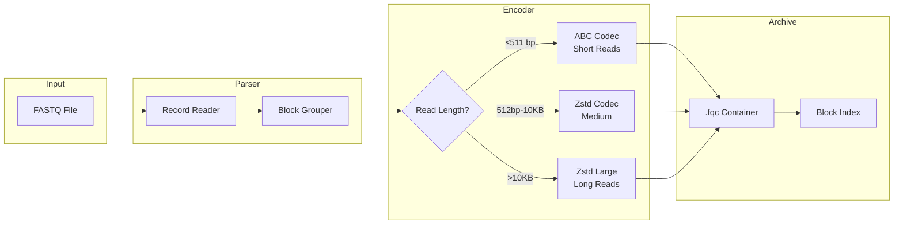

  Technical Whitepaper
  v0.1.1
  Rust 1.75+
  Zero unsafe

  

    
FQ

    

      fqc
      Block-Indexed FASTQ Compression
    

  

  

    <a href="./whitepaper">Whitepaper</a>
    <a href="./architecture/">Architecture</a>
    <a href="./algorithms/">Algorithms</a>
    <a href="./benchmarks/performance-report">Benchmarks</a>
    <a href="https://github.com/LessUp/fq-compressor-rust">GitHub</a>
    <a href="../zh/">中文</a>
  

  
Abstract

  

    <strong>fqc</strong> is a domain-aware FASTQ compression engine that achieves <mark>2.4&times; compression ratio</mark> through block-indexed archiving, component-specific encoding (ABC consensus/delta, SCM quality, Zstd sequence), and <mark>O(log N) random access</mark>. Written in pure Rust with zero unsafe code, it introduces three execution modes &mdash; Archive, Streaming, and Pipeline &mdash; enabling flexible memory-throughput trade-offs without format fragmentation. Designed for bioinformatics workflows requiring both compression efficiency and operational tooling.
  

  

    2.4&times;
    Compression Ratio
  

  

    O(log N)
    Random Access
  

  

    3
    Execution Modes
  

  

    0
    unsafe Code
  

## Core Architecture

## Why fqc?

  

    
Block-Indexed Random Access

    

      Unlike stream-based compressors (gzip, DSRC), fqc's footer-embedded block index enables O(log N) range queries without full archive decompression.
    

    

      <a href="./reference/format-spec" class="feature-tag">Format Spec</a>
      <a href="./architecture/" class="feature-tag">Architecture</a>
    

  

  

    
Component-Specific Encoding

    

      Each FASTQ component (ID, sequence, quality, aux) uses an independently tuned codec. Sequence gets ABC or Zstd; quality gets lossless, Illumina8 binning, QVZ, or discard.
    

    

      <a href="./algorithms/" class="feature-tag">Algorithms</a>
      <a href="./algorithms/abc-deep-dive" class="feature-tag">ABC Deep Dive</a>
    

  

  

    
Three Modes, One Format

    

      Archive, Streaming, and Pipeline modes all produce identical .fqc output. Trade memory for ratio or throughput without creating format fragmentation.
    

    

      <a href="./guide/modes" class="feature-tag">Modes Guide</a>
      <a href="./architecture/decisions/002-three-execution-modes" class="feature-tag">ADR-002</a>
    

  

  

    
Operational Tooling

    

      A single binary provides compress, decompress, info, and verify commands. No sidecar scripts needed. CI/CD friendly with structured exit codes.
    

    

      <a href="./guide/cli" class="feature-tag">CLI Docs</a>
      <a href="./guide/quick-start" class="feature-tag">Quick Start</a>
    

  

  

    
Domain-Aware ABC Algorithm

    

      Anchor-Based Compression exploits short-read similarity through contig building and delta encoding, outperforming generic LZ on biological sequences.
    

    

      <a href="./theory" class="feature-tag">Theory</a>
      <a href="./algorithms/abc-deep-dive" class="feature-tag">Deep Dive</a>
    

  

  

    
Pure Rust, Zero unsafe

    

      Memory-safe by construction. No undefined behavior surface. MSRV 1.75.0. Single static binary with no runtime dependencies beyond libc.
    

    

      <a href="./comparison" class="feature-tag">Comparison</a>
    

  

## Quick Start

  

    
    
    
    bash
  

  

    $ # Build from source
    $ cargo build --release
    
    $ # Compress a FASTQ file
    $ ./target/release/fqc compress -i reads.fq -o reads.fqc
    
    $ # Decompress
    $ ./target/release/fqc decompress -i reads.fqc -o reads.fq
    
    $ # Inspect archive
    $ ./target/release/fqc info -i reads.fqc
  

See the [Quick Start guide](./guide/quick-start) for installation options and first compression steps.

## Research Context

<strong>fqc</strong> is positioned at the intersection of domain-specific compression and modern systems programming. It draws on decades of research in DNA compression (LZ variants, reference-based encoding) while applying contemporary software engineering practices: memory safety, structured concurrency, and format stability.

For a survey of the field and how fqc compares to prior art, see [References & Related Work](./references/) and [Competitive Analysis](./comparison).

## Resources

  <a href="./whitepaper" class="resource-item">
    &#128221;
    Technical Whitepaper
  </a>
  <a href="./architecture/" class="resource-item">
    &#128202;
    Architecture Deep Dive
  </a>
  <a href="./architecture/decisions/" class="resource-item">
    &#128203;
    3 Architecture Decision Records
  </a>
  <a href="./reference/format-spec" class="resource-item">
    &#128196;
    Binary Format Specification
  </a>
  <a href="./theory" class="resource-item">
    &#128300;
    Algorithmic Theory
  </a>
  <a href="./comparison" class="resource-item">
    &#128200;
    Competitive Analysis
  </a>
  <a href="./references/" class="resource-item">
    &#128218;
    References & Related Work
  </a>

