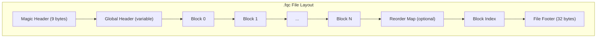
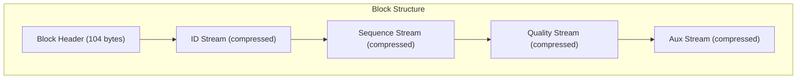
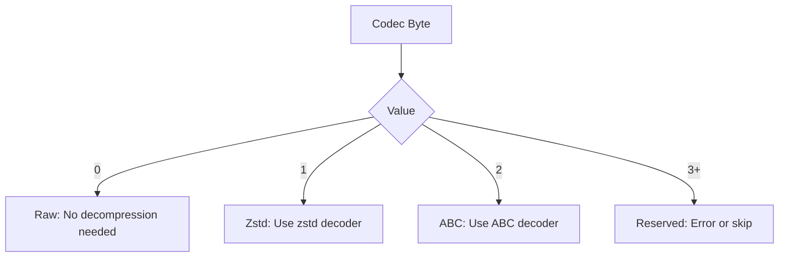
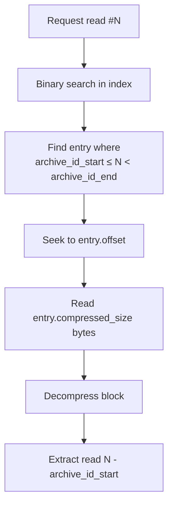
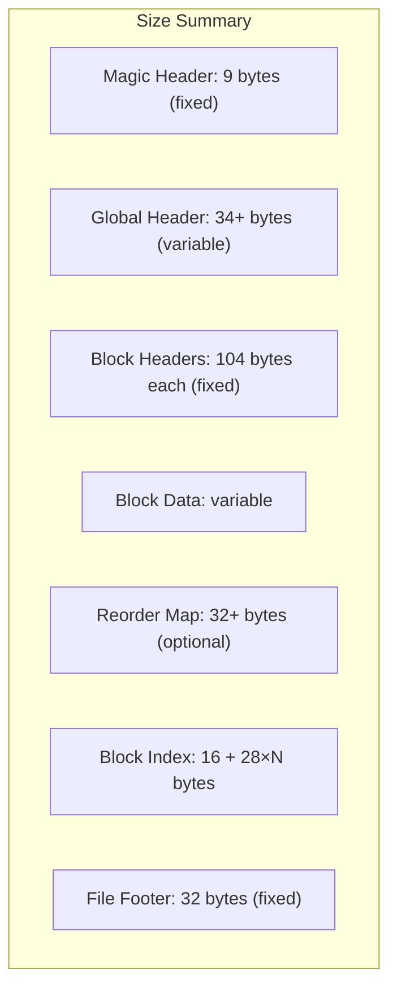
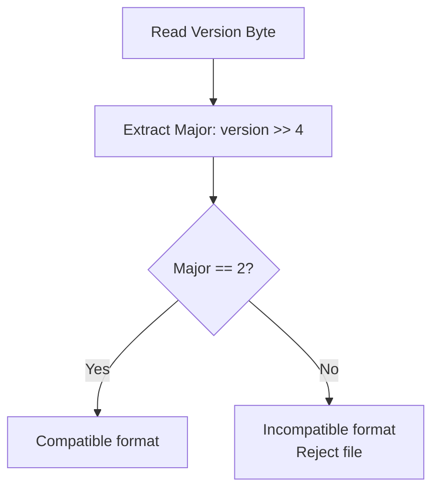
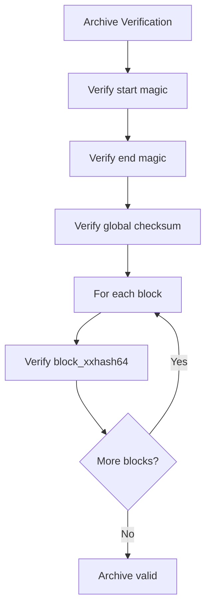

# Binary Format Specification

This document specifies the `.fqc` binary archive format used by fq-compressor-rust.

## File Layout Overview



## Magic Header

The file begins with a 9-byte magic header for format identification.

### Magic Header Layout

| Offset | Size | Field | Value | Description |
|--------|------|-------|-------|-------------|
| 0 | 8 | Magic Bytes | `0x89 FQ C 0D 0A 1A 0A` | Binary-safe magic number |
| 8 | 1 | Version | `0x20` (v2.0) | Format version byte |

### Magic Bytes Definition

```
Magic: [0x89, 'F', 'Q', 'C', 0x0D, 0x0A, 0x1A, 0x0A]
       [0x89, 0x46, 0x51, 0x43, 0x0D, 0x0A, 0x1A, 0x0A]
```

The magic bytes are designed to:
- Be recognizable as "FQC" in hex dumps
- Include carriage return and line feed for text/binary discrimination
- Include SUB (0x1A) character for DOS/Windows compatibility

### Version Encoding

```
Version byte = (Major << 4) | Minor
Version 2.0  = (2 << 4) | 0 = 0x20
```

## Global Header

The global header contains archive-wide metadata.

### Global Header Fields

| Offset | Size | Field | Type | Description |
|--------|------|-------|------|-------------|
| 0 | 4 | header_size | u32 LE | Total header size in bytes |
| 4 | 8 | flags | u64 LE | Archive flags bitfield |
| 12 | 1 | compression_algo | u8 | Compression algorithm ID |
| 13 | 1 | checksum_type | u8 | Checksum algorithm ID |
| 14 | 2 | reserved | u16 LE | Reserved (must be 0) |
| 16 | 8 | total_read_count | u64 LE | Total number of reads |
| 24 | 2 | filename_len | u16 LE | Original filename length |
| 26 | N | original_filename | bytes | Original filename (UTF-8) |
| 26+N | 8 | timestamp | u64 LE | Archive creation timestamp |

**Minimum size**: 34 bytes (with empty filename)

### Flag Bit Definitions

| Bit | Mask | Flag | Description |
|-----|------|------|-------------|
| 0 | 0x01 | IS_PAIRED | Paired-end archive |
| 1 | 0x02 | PRESERVE_ORDER | Keep original read order |
| 2 | 0x04 | LEGACY_LONG_READ_MODE | Legacy long-read flag |
| 3-4 | 0x18 | QUALITY_MODE | Quality handling mode |
| 5-6 | 0x60 | ID_MODE | ID handling mode |
| 7 | 0x80 | HAS_REORDER_MAP | Reorder map present |
| 8-9 | 0x300 | PE_LAYOUT | Paired-end layout |
| 10-11 | 0xC00 | READ_LENGTH_CLASS | Read length classification |
| 12 | 0x1000 | STREAMING_MODE | Streaming mode archive |

### Flag Enumerations

**QualityMode (bits 3-4)**:

| Value | Mode | Description |
|-------|------|-------------|
| 0 | None | Lossless quality preservation |
| 1 | Illumina8 | 8-level quality binning |
| 2 | Qvz | QVZ compression |
| 3 | Discard | Quality scores discarded |

**IdMode (bits 5-6)**:

| Value | Mode | Description |
|-------|------|-------------|
| 0 | Exact | Exact ID preservation |
| 1 | Hash | Hash-based ID encoding |
| 2 | Numeric | Numeric ID encoding |

**PeLayout (bits 8-9)**:

| Value | Layout | Description |
|-------|--------|-------------|
| 0 | Interleaved | R1/R2/R1/R2 interleaved |
| 1 | Consecutive | R1...R1 followed by R2...R2 |

**ReadLengthClass (bits 10-11)**:

| Value | Class | Range |
|-------|-------|-------|
| 0 | Short | ≤ 150 bp |
| 1 | Medium | 150-1000 bp |
| 2 | Long | > 1000 bp |

## Block Structure

Each block contains compressed streams for different FASTQ components.



### Block Header Fields

| Offset | Size | Field | Type | Description |
|--------|------|-------|------|-------------|
| 0 | 4 | header_size | u32 LE | Header size (104) |
| 4 | 4 | block_id | u32 LE | Block sequence number |
| 8 | 1 | checksum_type | u8 | Block checksum algorithm |
| 9 | 1 | codec_ids | u8 | ID stream codec |
| 10 | 1 | codec_seq | u8 | Sequence stream codec |
| 11 | 1 | codec_qual | u8 | Quality stream codec |
| 12 | 1 | codec_aux | u8 | Aux stream codec |
| 13 | 1 | reserved1 | u8 | Reserved (must be 0) |
| 14 | 2 | reserved2 | u16 LE | Reserved (must be 0) |
| 16 | 8 | block_xxhash64 | u64 LE | Block content checksum |
| 24 | 4 | uncompressed_count | u32 LE | Number of reads in block |
| 28 | 4 | uniform_read_length | u32 LE | Uniform length or 0 |
| 32 | 8 | compressed_size | u64 LE | Total compressed size |
| 40 | 8 | offset_ids | u64 LE | ID stream offset |
| 48 | 8 | offset_seq | u64 LE | Sequence stream offset |
| 56 | 8 | offset_qual | u64 LE | Quality stream offset |
| 64 | 8 | offset_aux | u64 LE | Aux stream offset |
| 72 | 8 | size_ids | u64 LE | ID stream size |
| 80 | 8 | size_seq | u64 LE | Sequence stream size |
| 88 | 8 | size_qual | u64 LE | Quality stream size |
| 96 | 8 | size_aux | u64 LE | Aux stream size |

**Fixed size**: 104 bytes

## Stream Types

Each block contains up to four independent compressed streams:

| Stream | Content | Typical Codec |
|--------|---------|---------------|
| ID | Read identifiers | Zstd |
| Seq | Base sequences | ABC or Zstd |
| Qual | Quality scores | Zstd or Raw |
| Aux | Auxiliary data | Zstd |

### Codec Byte Encoding

Each stream codec is encoded as a single byte:

| Byte | Codec Family | Description |
|------|--------------|-------------|
| 0 | Raw | Uncompressed raw bytes |
| 1 | Zstd | Zstd compression |
| 2 | Abc | Anchor-Based Compression |
| 3 | Reserved | Reserved for future use |

### Codec Detection



## Reorder Map

When reads are reordered for compression efficiency, the reorder map enables restoration of original order.

### Reorder Map Header

| Offset | Size | Field | Type | Description |
|--------|------|-------|------|-------------|
| 0 | 4 | header_size | u32 LE | Header size (32) |
| 4 | 4 | version | u32 LE | Map format version |
| 8 | 8 | total_reads | u64 LE | Total read count |
| 16 | 8 | forward_map_size | u64 LE | Forward map bytes |
| 24 | 8 | reverse_map_size | u64 LE | Reverse map bytes |

**Fixed size**: 32 bytes

### Map Data

Following the header:
- **Forward map**: `compressed_id → original_id` mapping
- **Reverse map**: `original_id → compressed_id` mapping

Both maps are compressed with Zstd.

## Block Index

The block index enables random access to specific blocks.

### Block Index Header

| Offset | Size | Field | Type | Description |
|--------|------|-------|------|-------------|
| 0 | 4 | header_size | u32 LE | Header size (16) |
| 4 | 4 | entry_size | u32 LE | Entry size (28) |
| 8 | 8 | num_blocks | u64 LE | Number of blocks |

**Fixed size**: 16 bytes

### Index Entry Structure

| Offset | Size | Field | Type | Description |
|--------|------|-------|------|-------------|
| 0 | 8 | offset | u64 LE | Block file offset |
| 8 | 8 | compressed_size | u64 LE | Block compressed size |
| 16 | 8 | archive_id_start | u64 LE | Starting read ID |
| 24 | 4 | read_count | u32 LE | Reads in this block |

**Entry size**: 28 bytes

### Index Usage



## File Footer

The file footer provides navigation to the index and validates file integrity.

### Footer Layout

| Offset | Size | Field | Type | Description |
|--------|------|-------|------|-------------|
| 0 | 8 | index_offset | u64 LE | Block index file offset |
| 8 | 8 | reorder_map_offset | u64 LE | Reorder map offset (0 if none) |
| 16 | 8 | global_checksum | u64 LE | Archive-wide checksum |
| 24 | 8 | magic_end | bytes | End magic: "FQC_EOF\0" |

**Fixed size**: 32 bytes

### End Magic

```
Magic End: ['F', 'Q', 'C', '_', 'E', 'O', 'F', 0x00]
           [0x46, 0x51, 0x43, 0x5F, 0x45, 0x4F, 0x46, 0x00]
```

## Complete File Structure



## Version Compatibility

### Version 2.0 (Current)

- Block-indexed format with random access
- Four independent stream types per block
- Optional reorder map
- Little-endian byte ordering throughout

### Compatibility Rules

1. **Major version must match**: Files with different major versions are incompatible
2. **Minor version is backward compatible**: Newer minor versions can read older files
3. **Reserved fields must be zero**: Non-zero reserved fields indicate format extension

### Version Check



## Checksum Verification

### Checksum Types

| Type ID | Algorithm | Size | Description |
|---------|-----------|------|-------------|
| 0 | None | 0 | No checksum |
| 1 | XxHash64 | 8 bytes | Fast 64-bit hash |
| 2 | CRC32 | 4 bytes | Standard CRC32 |

### Verification Points



## Byte Ordering

All multi-byte integers use **little-endian** byte ordering:

```
u32 value 0x12345678 stored as: [0x78, 0x56, 0x34, 0x12]
u64 value 0x123456789ABCDEF0 stored as: [0xF0, 0xDE, 0xBC, 0x9A, 0x78, 0x56, 0x34, 0x12]
```

This matches x86/x64 native ordering for optimal performance.
