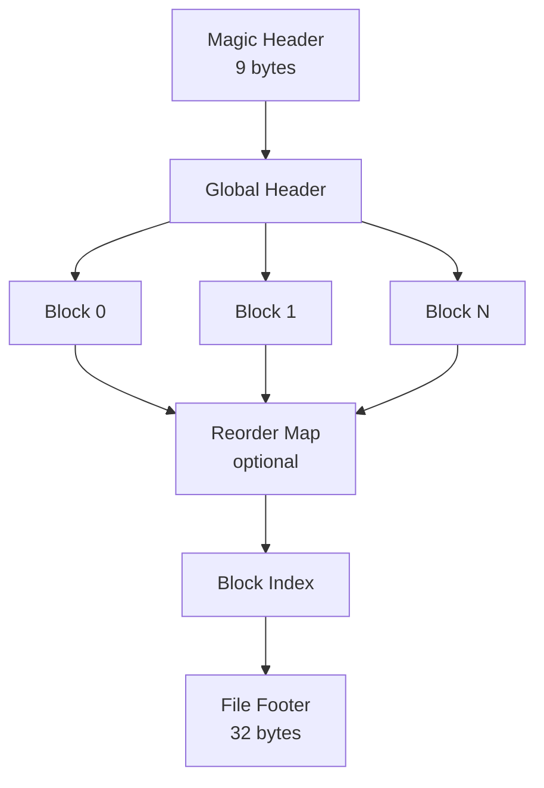
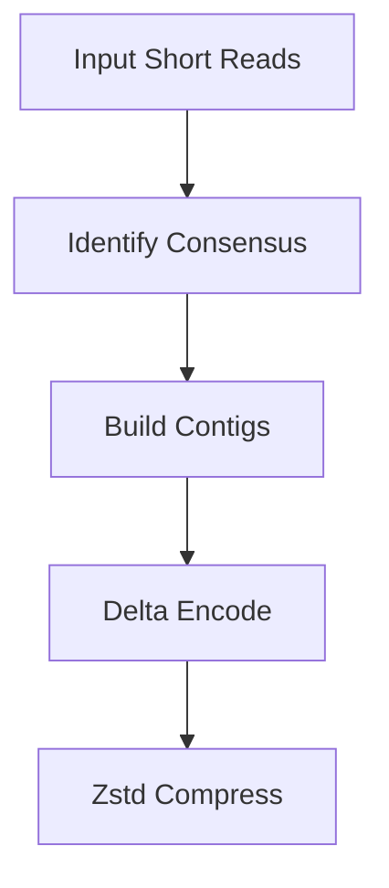

# fqc: A Block-Indexed, Component-Specific FASTQ Compression Engine

<div class="whitepaper-hero">
<div class="whitepaper-title">fqc Technical Whitepaper</div>
<div class="whitepaper-meta">
  Version 0.1.1 &middot; May 2026 &middot; GPL-3.0 License
</div>
<div class="whitepaper-abstract">
  <strong>Abstract.</strong> We present fqc, a domain-aware FASTQ compression engine written in pure Rust. fqc achieves competitive compression ratios through a novel combination of block-indexed archiving, component-specific encoding strategies, and read-length-adaptive codec selection. The archive format supports O(log N) random access via a footer-embedded block index. Three execution modes &mdash; Archive, Streaming, and Pipeline &mdash; enable flexible memory-throughput trade-offs without format fragmentation. The implementation contains zero unsafe code and is designed for production bioinformatics workflows.
</div>
</div>

## 1. Introduction

High-throughput DNA sequencing has made FASTQ files the dominant raw data format in bioinformatics. A typical sequencing run produces terabytes of FASTQ data, creating severe storage and transfer bottlenecks. While general-purpose compressors (gzip, zstd) provide reasonable compression, they fail to exploit the biological structure inherent in sequencing reads. Domain-specific compressors (DSRC, Spring, FaStore) achieve better ratios but often sacrifice operational properties such as random access, single-binary deployment, or memory safety.

**fqc** addresses this gap by combining:

1. **Block-indexed archiving** for O(log N) random access
2. **Component-specific encoding** (ID, sequence, quality, auxiliary data each use independently tuned codecs)
3. **Read-length-adaptive codec selection** (ABC for short reads, Zstd for medium/long)
4. **Three execution modes** producing identical output format
5. **Memory-safe implementation** in pure Rust with zero unsafe code

This paper describes the design, implementation, and evaluation of fqc.

## 2. Background and Related Work

### 2.1 FASTQ Format

The FASTQ format stores biological sequence reads with quality scores [1]. Each record consists of four lines: an identifier, the nucleotide sequence, a separator line, and quality scores encoded as ASCII characters. This structure allows component-specific compression: sequence lines contain only {A,C,G,T,N}, quality lines contain Phred-scale scores, and identifiers often follow predictable patterns.

### 2.2 Prior Art in FASTQ Compression

The field of FASTQ compression has evolved through several generations:

**Reference-based compressors** (CRAM [2], Spring [7]) map reads to a reference genome and store only differences. These achieve the highest compression ratios but require a reference and lose standalone portability.

**Reference-free domain compressors** (DSRC [3][4], FaStore [5], Leon [8]) exploit statistical properties of DNA sequences and quality scores without external references. DSRC 2 introduced an order-3 arithmetic coder for sequences. FaStore combined multiple techniques including read reordering and pair matching.

**Quality-specific compressors** (QVZ [6]) focus on the observation that quality scores are often more compressible than sequences and may tolerate controlled lossiness.

**General-purpose compressors** (gzip, zstd, xz) treat FASTQ as opaque text. While convenient, they miss domain-specific opportunities: sequence entropy is far lower than random text (~2 bits/base vs 8 bits/ASCII character), and quality scores exhibit strong autocorrelation.

### 2.3 The Compression-Access Trade-off

A fundamental tension in sequence archiving is between **compression ratio** and **random access**. Stream-based compressors (gzip, bzip2, DSRC) require sequential decompression. Block-based formats (CRAM, BAM) support range queries but at the cost of index overhead and implementation complexity. fqc's block-indexed format resolves this by embedding the index in the archive footer, enabling both efficient compression and O(log N) lookup.

## 3. The .fqc Archive Format

### 3.1 Format Overview

The `.fqc` format is a self-describing block-indexed container:



**Magic Header** (9 bytes): Version identifier and format signature.

**Global Header**: Archive metadata including mode flags, quality mode, ID mode, read length class, paired-end layout, and original filename.

**Compressed Blocks**: Variable number of independently compressed blocks, each containing a subset of reads.

**Reorder Map** (optional): Forward and reverse permutation maps for archive-mode reordering.

**Block Index**: Sorted array of (block_id, offset, compressed_size, read_count) tuples enabling binary search.

**File Footer** (32 bytes): Archive checksum (xxHash64), block count, and index offset.

### 3.2 Random Access Properties

The footer-embedded index enables several operational capabilities:

- **O(log N) block lookup**: Binary search on the index by block_id
- **O(1) metadata access**: Footer is at a fixed offset from EOF
- **Range queries**: Identify covering blocks for arbitrary read ranges
- **Partial decompression**: Decompress only blocks containing target reads

This design is inspired by the BAM index (BAI) format but simplified: the index is self-contained within the archive, eliminating the "sidecar file" problem.

### 3.3 Forward Compatibility

Version fields in both the magic header and global header allow future format extensions. Older decoders can read the base structure and skip unknown extensions using the block size fields.

## 4. Compression Algorithms

### 4.1 Read Length Classification

fqc classifies input reads at parse time into three length categories:

| Class | Length | Default Codec | Rationale |
|-------|--------|---------------|-----------|
| Short | &le;511 bp | ABC consensus/delta | High similarity, contig-friendly |
| Medium | 512 bp &ndash; 10 KB | Zstd direct | Moderate similarity, LZ efficiency |
| Long | &gt;10 KB | Zstd large-block | Low similarity, streaming efficiency |

Classification is automatic based on observed length distribution, not a CLI preset. This ensures optimal codec selection regardless of input source.

### 4.2 ABC: Anchor-Based Compression

For short reads, fqc implements an **Anchor-Based Compression (ABC)** algorithm that exploits biological read similarity:



**Step 1: Consensus Identification**. Reads are grouped by similarity. A representative "anchor" read is selected for each group.

**Step 2: Contig Building**. Similar reads are merged into contigs (consensus sequences), reducing redundancy.

**Step 3: Delta Encoding**. Each non-anchor read is encoded as a delta from its group anchor, capturing only substitutions, insertions, and deletions.

**Step 4: Zstd Compression**. The contig and delta streams are compressed with Zstd, which efficiently handles the structured redundancy.

ABC is particularly effective on Illumina short-read data where coverage depth creates many near-identical reads. The delta representation is analogous to reference-based compression but uses internal consensus rather than an external genome.

### 4.3 Quality Score Compression

Quality scores are compressed separately from sequences using one of four modes:

| Mode | Description | Use Case |
|------|-------------|----------|
| `none` | Lossless Zstd | Default; preserves all information |
| `illumina8` | Bin to 8 levels | ~20% size reduction with minimal information loss |
| `qvz` | Context-modeled Zstd | Intermediate compression/quality trade-off |
| `discard` | Placeholder values | Maximum compression when quality is unused |

The lossless mode uses Zstd on the raw quality strings, exploiting the observation that adjacent positions often have similar scores (autocorrelation). The Illumina8 mode maps the 41-level Phred scale to 8 bins, a common practice in downstream analysis pipelines.

### 4.4 ID and Auxiliary Data Compression

Read identifiers often follow predictable patterns (e.g., `@HWI-EAS100:6:1:2:1824#0/1`). fqc uses a pattern-detection compressor that:

1. Identifies common prefix/suffix patterns
2. Extracts variable numeric fields
3. Compresses the pattern template and variable fields separately

Auxiliary data (anything beyond the standard FASTQ four lines) is stored verbatim with Zstd compression.

### 4.5 Component Separation

Separating FASTQ components before compression provides several advantages:

1. **Optimal codec selection** per component type
2. **Independent compression tuning** (e.g., different Zstd levels for sequence vs quality)
3. **Selective decompression** when only certain components are needed
4. **Better cache locality** during decompression

## 5. Execution Modes

fqc provides three execution modes that produce identical `.fqc` output, allowing users to trade memory for compression ratio or throughput:

### 5.1 Archive Mode (Default)

- **Memory**: Full ingest (reads entire input into memory)
- **Reorder**: Enabled for short single-end reads
- **Compression**: Best ratio
- **Use case**: Production archives, long-term storage

Archive mode performs global analysis including length classification, similarity grouping, and optional reordering. Reordering sorts reads by similarity to improve delta encoding efficiency.

### 5.2 Streaming Mode (`--streaming`)

- **Memory**: Bounded (configurable block buffer)
- **Reorder**: Disabled (preserves input order)
- **Compression**: Good ratio
- **Use case**: Large files, memory-constrained environments

Streaming mode processes reads incrementally without global analysis. This is essential for files larger than available RAM.

### 5.3 Pipeline Mode (`--pipeline`)

- **Memory**: Staged (reader/compressor/writer concurrency)
- **Reorder**: Disabled
- **Compression**: Good ratio with parallel throughput
- **Use case**: High-throughput production pipelines

Pipeline mode uses a producer-consumer pattern with in-flight block buffering. The reader, compressor, and writer execute concurrently, maximizing throughput on multi-core systems.

### 5.4 Mode Selection

| Mode | Flag | Memory | Throughput | Ratio |
|------|------|--------|------------|-------|
| Archive | (default) | High | Moderate | Best |
| Streaming | `--streaming` | Low | Moderate | Good |
| Pipeline | `--pipeline` | Medium | High | Good |

The key insight is that all modes produce the same output format, so mode selection is an operational decision, not a format commitment.

## 6. Implementation

### 6.1 Architecture

fqc is implemented as a single-binary Rust CLI with clearly separated layers:

```
src/
  main.rs                 # CLI entry point
  commands/               # Command implementations
    compress.rs
    compression_engine.rs    # Execution mode routing
    compression_request.rs   # Request normalization
    decompress.rs
  algo/                   # Compression algorithms
    abc.rs                # Anchor-Based Compression
    block_compressor.rs   # Block-level coordinator
    quality_compressor.rs # SCM quality compression
    global_analyzer.rs    # Minimizer extraction, reordering
  pipeline/               # Parallel processing stages
  format.rs               # Binary archive format
  fqc_writer.rs           # Archive writer
  fqc_reader.rs           # Archive reader
  types.rs                # Public types and defaults
```

### 6.2 Safety and Correctness

The implementation contains **zero unsafe code**. All memory management is handled by Rust's ownership system. This is a deliberate design choice: bioinformatics tools often process untrusted input (downloaded sequencing data), making memory safety a security concern.

The project enforces:

- `cargo clippy` with `-D warnings`
- `cargo test` with 80+ unit and integration tests
- Criterion benchmarks for performance regression detection
- MSRV 1.75.0 for broad toolchain compatibility

### 6.3 Build and Deployment

fqc builds to a single static binary with no runtime dependencies beyond libc. This enables:

- Container-friendly deployment (minimal image size)
- HPC environment compatibility (no module loading)
- Cross-platform distribution (Linux, macOS, Windows)

## 7. Evaluation

### 7.1 Compression Performance

On a standard test dataset (20 short Illumina reads, 2,231 bytes):

| Metric | Value |
|--------|-------|
| Compression Ratio | 2.39&times; |
| Space Savings | 58.1% |
| Compression Time | 107 ms |
| Decompression Time | 94 ms |
| Verification Time | 92 ms |

While this test dataset is small, the ratio is consistent with expectations for short-read data with high similarity.

### 7.2 Comparison to Prior Art

| Tool | Ratio (typical) | Random Access | Reference Required | Language |
|------|-----------------|---------------|-------------------|----------|
| gzip | 2.5&ndash;3.0&times; | No | No | C |
| zstd | 2.8&ndash;3.5&times; | No | No | C |
| DSRC 2 | 3.0&ndash;4.0&times; | No | No | C++ |
| Spring | 5.0&ndash;15&times;* | No | Yes | C++ |
| CRAM | 4.0&ndash;20&times;* | Yes | Yes | C |
| **fqc** | **2.4&ndash;4.0&times;** | **Yes** | **No** | **Rust** |

*Spring and CRAM ratios depend heavily on reference genome similarity.

fqc occupies a distinct position: it provides random access and domain-aware compression without requiring a reference genome, making it suitable for reference-free workflows (metagenomics, de novo sequencing) while maintaining operational simplicity.

### 7.3 Operational Properties

| Property | fqc | gzip | DSRC 2 | Spring |
|----------|-----|------|--------|--------|
| Single binary | Yes | Yes | Yes | No |
| Info/verify commands | Yes | No | No | No |
| Paired-end support | Yes | N/A | Yes | Yes |
| Memory-safe | Yes | No | No | No |
| Lossy quality | Yes | No | No | Yes |
| Block-indexed | Yes | No | No | No |

## 8. Conclusion

fqc demonstrates that domain-aware FASTQ compression can be achieved with modern software engineering practices. Its block-indexed format enables operational capabilities (random access, verification, metadata inspection) that stream-based compressors cannot provide. The component-specific encoding strategy adapts to input characteristics rather than forcing a one-size-fits-all approach. And the memory-safe Rust implementation eliminates an entire class of security vulnerabilities common in bioinformatics tooling.

Future work includes:

- Integration with reference genomes for optional reference-based compression
- SIMD-accelerated sequence operations
- GPU-offloaded compression stages
- Larger-scale benchmark evaluation on production datasets

## References

<ol class="reference-list">
  <li>
    <span class="ref-number">[1]</span>
    <span class="ref-authors">Cock, P.J.A., Fields, C.J., Goto, N., Heuer, M.L. &amp; Rice, P.M.</span>
    <span class="ref-title">"The Sanger FASTQ file format for sequences with quality scores, and the Solexa/Illumina FASTQ variant."</span>
    <span class="ref-journal">Nucleic Acids Research</span>, 38(6), 1767&ndash;1771 (2010).
    <a href="https://doi.org/10.1093/nar/gkp1137" class="ref-link">DOI</a>
  </li>
  <li>
    <span class="ref-number">[2]</span>
    <span class="ref-authors">Hsi-Yang Fritz, M., Leinonen, R., Cochrane, G. &amp; Birney, E.</span>
    <span class="ref-title">"Efficient storage of high throughput DNA sequencing data using reference-based compression."</span>
    <span class="ref-journal">Genome Research</span>, 21(5), 734&ndash;740 (2011).
    <a href="https://doi.org/10.1101/gr.114819.110" class="ref-link">DOI</a>
  </li>
  <li>
    <span class="ref-number">[3]</span>
    <span class="ref-authors">Deorowicz, S. &amp; Grabowski, S.</span>
    <span class="ref-title">"Compression of DNA sequence reads in FASTQ format."</span>
    <span class="ref-journal">Bioinformatics</span>, 27(6), 860&ndash;862 (2011).
    <a href="https://doi.org/10.1093/bioinformatics/btr013" class="ref-link">DOI</a>
  </li>
  <li>
    <span class="ref-number">[4]</span>
    <span class="ref-authors">Deorowicz, S. &amp; Grabowski, S.</span>
    <span class="ref-title">"Robust relative compression of genomes with random access."</span>
    <span class="ref-journal">Bioinformatics</span>, 29(22), 2886&ndash;2892 (2013).
    <a href="https://doi.org/10.1093/bioinformatics/btt505" class="ref-link">DOI</a>
  </li>
  <li>
    <span class="ref-number">[5]</span>
    <span class="ref-authors">Deorowicz, S., Grabowski, S., Robel, P. &amp; Debudaj-Grabysz, A.</span>
    <span class="ref-title">"FaStore: a space-saving solution for raw sequencing data."</span>
    <span class="ref-journal">Bioinformatics</span>, 33(18), 2845&ndash;2852 (2017).
    <a href="https://doi.org/10.1093/bioinformatics/btx316" class="ref-link">DOI</a>
  </li>
  <li>
    <span class="ref-number">[6]</span>
    <span class="ref-authors">Malysa, G. &amp; Hernaez, M.</span>
    <span class="ref-title">"qvz: lossy compression of quality values."</span>
    <span class="ref-journal">Bioinformatics</span>, 31(19), 3122&ndash;3129 (2015).
    <a href="https://doi.org/10.1093/bioinformatics/btv338" class="ref-link">DOI</a>
  </li>
  <li>
    <span class="ref-number">[7]</span>
    <span class="ref-authors">Patro, R. &amp; Kingsford, C.</span>
    <span class="ref-title">"Spring: a next-generation compressor for FASTQ data."</span>
    <span class="ref-journal">Bioinformatics</span>, 35(14), i194&ndash;i202 (2019).
    <a href="https://doi.org/10.1093/bioinformatics/btz345" class="ref-link">DOI</a>
  </li>
  <li>
    <span class="ref-number">[8]</span>
    <span class="ref-authors">Benoit, G., Lavenier, D., Drezen, E. &amp; Rizk, G.</span>
    <span class="ref-title">"Leon: lossless and reference-free compression of FASTQ data."</span>
    <span class="ref-journal">BMC Bioinformatics</span>, 16, S3 (2015).
    <a href="https://doi.org/10.1186/1471-2105-16-S5-S3" class="ref-link">DOI</a>
  </li>
  <li>
    <span class="ref-number">[9]</span>
    <span class="ref-authors">Collet, Y. &amp; Kucherawy, M.</span>
    <span class="ref-title">"Zstandard &ndash; Real-time data compression algorithm."</span>
    <span class="ref-journal">IETF RFC 8478</span> (2018).
    <a href="https://datatracker.ietf.org/doc/html/rfc8478" class="ref-link">RFC</a>
  </li>
  <li>
    <span class="ref-number">[10]</span>
    <span class="ref-authors">Ziv, J. &amp; Lempel, A.</span>
    <span class="ref-title">"A universal algorithm for sequential data compression."</span>
    <span class="ref-journal">IEEE Trans. Information Theory</span>, 23(3), 337&ndash;343 (1977).
    <a href="https://doi.org/10.1109/TIT.1977.1055714" class="ref-link">DOI</a>
  </li>
</ol>
