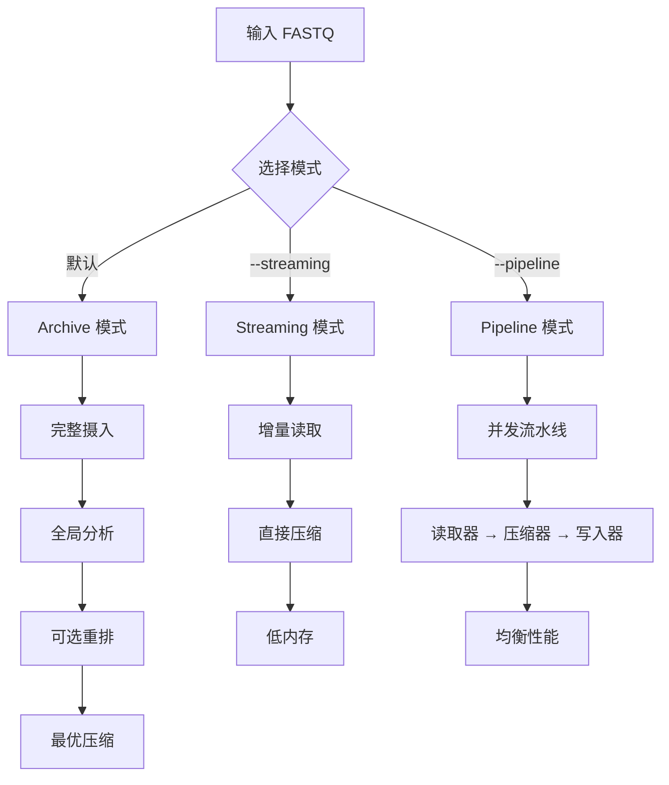
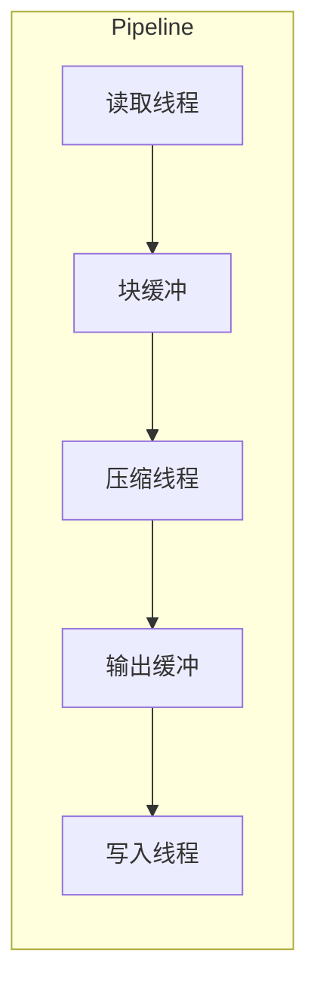

# 压缩模式

`fqc` 提供三种不同的执行模式，针对不同使用场景优化。

## 模式概览



## 对比表

| 特性 | Archive | Streaming | Pipeline |
|------|---------|-----------|----------|
| **标志** | (默认) | `--streaming` | `--pipeline` |
| **内存占用** | 高 | 低 | 中 |
| **重排** | 是 | 否 | 有限 |
| **压缩率** | 最佳 | 良好 | 良好 |
| **吞吐量** | 中 | 高 | 最高 |
| **适用场景** | 最佳压缩率 | 大文件、内存受限 | 并发处理 |

## Archive 模式（默认）

**适用于**：内存不受限时追求最大压缩率。

```bash
fqc compress -i reads.fastq -o reads.fqc
```

**特点**：
- 完整读段集加载到内存
- 全局分析优化块边界
- 可选读段重排改善局部性
- 最佳压缩率

**内存行为**：
- 随输入大小扩展
- 使用 `--memory-limit` 限制内存
- `--memory-limit 0` 启用自动有限预算（非无限内存）

## Streaming 模式

**适用于**：大文件或内存受限环境。

```bash
fqc compress -i reads.fastq -o reads.fqc --streaming
```

**特点**：
- 单遍增量处理
- 无全局重排
- 严格内存控制
- 快速处理

**内存行为**：
- 恒定内存占用
- 与输入大小无关
- 适合流式管道

## Pipeline 模式

**适用于**：并发处理，均衡性能。

```bash
fqc compress -i reads.fastq -o reads.fqc --pipeline
```

**特点**：
- 分段并发执行
- 读取器 → 压缩器 → 写入器流水线
- 块缓冲在途
- 高吞吐量

**架构**：



## 内存限制

`--memory-limit` 对三种压缩模式都可用。`0` 一律解析为有限预算：

- **decompress / verify**：`DecodeBudget`
- **compress archive**：摄入时估计峰值（含额外拷贝因子），超限失败并提示 `--streaming`
- **compress streaming**：不走全量摄入检查
- **compress pipeline**：与 archive 共用摄入峰值预算，超限同样失败；仍不是块级流式低内存路径

```bash
# 显式限制 MB（archive 超预算会失败）
fqc --memory-limit 1024 compress -i reads.fastq -o reads.fqc --streaming

# 自动有限预算（默认）
fqc --memory-limit 0 compress -i reads.fastq -o reads.fqc
```

## 建议

| 场景 | 推荐命令 |
|------|----------|
| 标准压缩 | `fqc compress -i in.fq -o out.fqc` |
| 大文件、内存有限 | `fqc compress -i in.fq -o out.fqc --streaming --memory-limit 1024` |
| 最大吞吐量 | `fqc compress -i in.fq -o out.fqc --pipeline` |
| 双端输入 | `fqc compress -i R1.fq -2 R2.fq -o out.fqc` |
