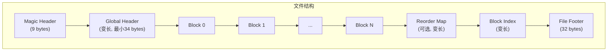
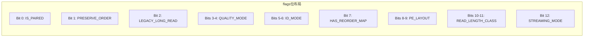
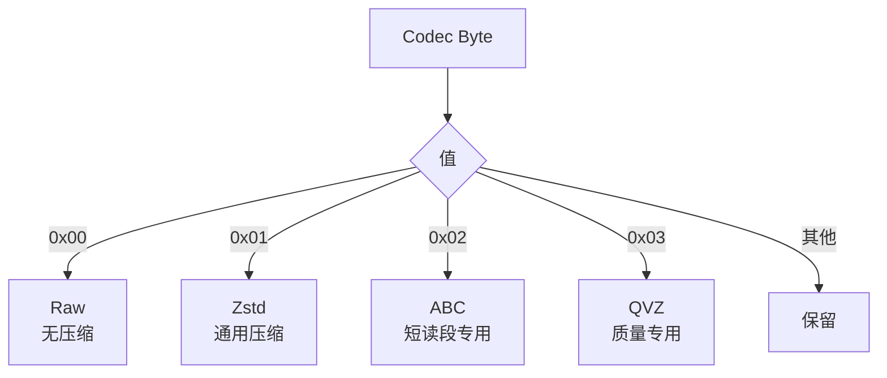
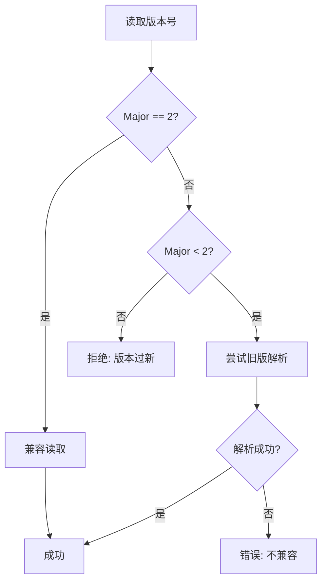

# 二进制格式规范

本文档定义 `.fqc` 归档格式的二进制结构，供实现者和工具开发者参考。

## 文件布局概览



## Magic Header

文件以固定魔数开头，用于快速识别文件类型。

### 字段布局

| 偏移 | 大小 | 字段 | 值 | 描述 |
|------|------|------|-----|------|
| 0 | 8 | Magic Bytes | `0x89 46 51 43 0D 0A 1A 0A` | 文件类型标识 |
| 8 | 1 | Version | `0x20` (v2.0) | 格式版本号 |

### 版本编码

版本号以单个字节编码：

```
Version = (Major << 4) | Minor

v2.0 = (2 << 4) | 0 = 0x20
```

## Global Header

全局头包含归档的元数据信息。

### 字段布局

| 偏移 | 大小 | 字段 | 类型 | 描述 |
|------|------|------|------|------|
| 0 | 4 | header_size | u32 LE | 头部总大小 |
| 4 | 8 | flags | u64 LE | 模式标志位 |
| 12 | 1 | compression_algo | u8 | 压缩算法 |
| 13 | 1 | checksum_type | u8 | 校验和类型 |
| 14 | 2 | reserved | u16 LE | 保留字段 (必须为 0) |
| 16 | 8 | total_read_count | u64 LE | 总读段数 |
| 24 | 2 | filename_len | u16 LE | 文件名长度 |
| 26 | N | original_filename | String | 原始文件名 |
| 26+N | 8 | timestamp | u64 LE | 时间戳 |

**最小大小**: 34 bytes

### 标志位定义



| 标志 | 位位置 | 描述 |
|------|--------|------|
| `IS_PAIRED` | 0 | 是否双端测序 |
| `PRESERVE_ORDER` | 1 | 是否保留原始顺序 |
| `LEGACY_LONG_READ_MODE` | 2 | 旧版长读段模式 |
| `QUALITY_MODE` | 3-4 | 质量模式 (0-3) |
| `ID_MODE` | 5-6 | ID 模式 (0-3) |
| `HAS_REORDER_MAP` | 7 | 是否包含重排映射 |
| `PE_LAYOUT` | 8-9 | 双端布局 (0-3) |
| `READ_LENGTH_CLASS` | 10-11 | 读长类别 (0-3) |
| `STREAMING_MODE` | 12 | 流式模式标志 |

## Block 结构

每个 Block 包含一个 Block Header 和多个压缩流。


### Block Header

**固定大小**: 104 bytes

| 偏移 | 大小 | 字段 | 类型 | 描述 |
|------|------|------|------|------|
| 0 | 4 | header_size | u32 LE | 头部大小 (104) |
| 4 | 4 | block_id | u32 LE | 块标识符 |
| 8 | 1 | checksum_type | u8 | 校验和类型 |
| 9 | 1 | codec_ids | u8 | ID 流编解码器 |
| 10 | 1 | codec_seq | u8 | 序列流编解码器 |
| 11 | 1 | codec_qual | u8 | 质量流编解码器 |
| 12 | 1 | codec_aux | u8 | 辅助流编解码器 |
| 13 | 1 | reserved1 | u8 | 保留 (必须为 0) |
| 14 | 2 | reserved2 | u16 LE | 保留 (必须为 0) |
| 16 | 8 | block_xxhash64 | u64 LE | 块校验和 |
| 24 | 4 | uncompressed_count | u32 LE | 未压缩读段数 |
| 28 | 4 | uniform_read_length | u32 LE | 统一读长 (0表示可变) |
| 32 | 8 | compressed_size | u64 LE | 压缩后总大小 |
| 40 | 8 | offset_ids | u64 LE | ID 流偏移 |
| 48 | 8 | offset_seq | u64 LE | 序列流偏移 |
| 56 | 8 | offset_qual | u64 LE | 质量流偏移 |
| 64 | 8 | offset_aux | u64 LE | 辅助流偏移 |
| 72 | 8 | size_ids | u64 LE | ID 流大小 |
| 80 | 8 | size_seq | u64 LE | 序列流大小 |
| 88 | 8 | size_qual | u64 LE | 质量流大小 |
| 96 | 8 | size_aux | u64 LE | 辅助流大小 |

### Stream 类型

| 流类型 | 描述 | 编码方式 |
|--------|------|----------|
| IDs | 读段标识符 | Raw / Zstd |
| Seq | 序列数据 | ABC / Zstd |
| Qual | 质量分数 | Raw / Zstd / QVZ |
| Aux | 辅助数据 | Raw / Zstd |

## Codec 编码表

编解码器以单字节标识：

| 值 | 编解码器族 | 描述 |
|----|------------|------|
| 0x00 | Raw | 未压缩原始数据 |
| 0x01 | Zstd | Zstandard 压缩 |
| 0x02 | ABC | 锚基压缩 |
| 0x03 | QVZ | QVZ 质量压缩 |
| 0x04-0xFF | Reserved | 保留供未来使用 |



## Reorder Map

重排映射存储读段重排信息，用于恢复原始顺序。

### Header (32 bytes)

| 偏移 | 大小 | 字段 | 类型 | 描述 |
|------|------|------|------|------|
| 0 | 4 | header_size | u32 LE | 头部大小 |
| 4 | 4 | version | u32 LE | 版本号 |
| 8 | 8 | total_reads | u64 LE | 总读段数 |
| 16 | 8 | forward_map_size | u64 LE | 正向映射大小 |
| 24 | 8 | reverse_map_size | u64 LE | 反向映射大小 |

## Block Index

块索引用于快速定位和随机访问。

### Header (16 bytes)

| 偏移 | 大小 | 字段 | 类型 | 描述 |
|------|------|------|------|------|
| 0 | 4 | header_size | u32 LE | 头部大小 |
| 4 | 4 | entry_size | u32 LE | 条目大小 |
| 8 | 8 | num_blocks | u64 LE | 块数量 |

### Index Entry (28 bytes each)

| 偏移 | 大小 | 字段 | 类型 | 描述 |
|------|------|------|------|------|
| 0 | 8 | offset | u64 LE | 块在文件中的偏移 |
| 8 | 8 | compressed_size | u64 LE | 压缩后大小 |
| 16 | 8 | archive_id_start | u64 LE | 起始读段ID |
| 24 | 4 | read_count | u32 LE | 读段数量 |

## File Footer

文件尾固定 32 bytes，位于文件末尾。

| 偏移 | 大小 | 字段 | 类型 | 描述 |
|------|------|------|------|------|
| 0 | 8 | index_offset | u64 LE | 块索引偏移 |
| 8 | 8 | reorder_map_offset | u64 LE | 重排映射偏移 (0表示无) |
| 16 | 8 | global_checksum | u64 LE | 全局校验和 |
| 24 | 8 | magic_end | [u8; 8] | 结束魔数 `FQC_EOF\0` |

### 结束魔数

```
MAGIC_END = [b'F', b'Q', b'C', b'_', b'E', b'O', b'F', 0x00]
```

## 版本兼容性



### 兼容性规则

- **主版本匹配**: 只有主版本号相同才保证完全兼容
- **前向兼容**: 读取器应拒绝比其支持版本更高的主版本
- **扩展容忍**: 所有头部字段预留扩展空间，读取器应跳过未知字段

### 版本历史

| 版本 | 变更描述 |
|------|----------|
| v2.0 | 当前格式，块索引架构 |
| v1.x | 旧版格式 (已弃用) |

## 校验和类型

| 值 | 类型 | 描述 |
|----|------|------|
| 0 | None | 无校验和 |
| 1 | XxHash64 | 64位 xxHash |
| 2-255 | Reserved | 保留 |

## 实现注意事项

1. **字节序**: 所有多字节字段使用小端序 (Little-Endian)
2. **对齐**: 结构体未对齐，按紧凑布局读取
3. **字符串**: 文件名以 UTF-8 编码，长度前缀存储
4. **保留字段**: 所有保留字段必须为零，读取时应验证

## 示例：最小有效归档

```
Offset  Size  Content
------  ----  -------
0       9     Magic Header (0x89 FQ C 0D 0A 1A 0A 0x20)
9       34    Global Header (最小配置)
43      104   Block Header
147     N     Compressed Block Data
147+N   32    File Footer
```

总最小大小: 179 + N bytes
