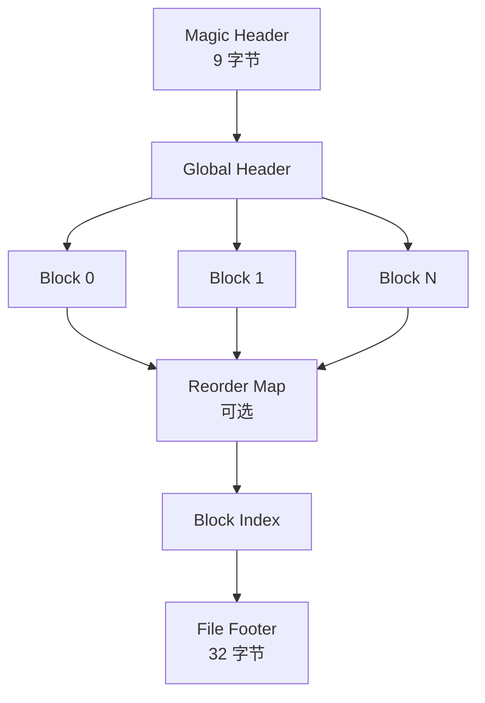
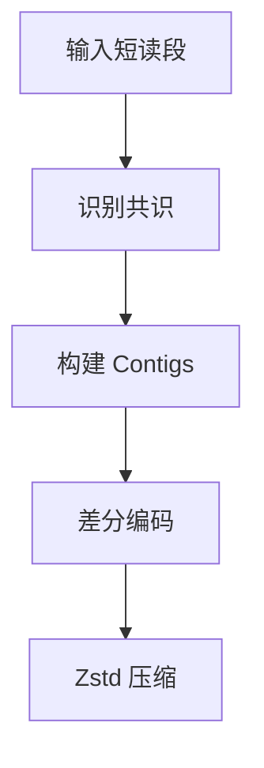

# fqc: 块索引组件级 FASTQ 压缩引擎

<div class="whitepaper-hero">
<div class="whitepaper-title">fqc 技术白皮书</div>
<div class="whitepaper-meta">
  版本 0.1.1 &middot; 2026年5月 &middot; GPL-3.0 许可证
</div>
<div class="whitepaper-abstract">
  <strong>摘要。</strong> 我们介绍 fqc，一款用纯 Rust 编写的领域感知 FASTQ 压缩引擎。fqc 通过块索引归档、组件级编码策略和读长自适应编解码器选择的新颖组合实现了有竞争力的压缩比。归档格式通过尾部嵌入的块索引支持 O(log N) 随机访问。三种执行模式 &mdash; Archive、Streaming 和 Pipeline &mdash; 在不产生格式碎片的前提下实现灵活的内存-吞吐量权衡。实现包含零 unsafe 代码，专为生产级生物信息学工作流而设计。
</div>
</div>

## 1. 引言

高通量 DNA 测序使 FASTQ 文件成为生物信息学中的主导原始数据格式。典型的测序运行产生数 TB 的 FASTQ 数据，造成严重的存储和传输瓶颈。虽然通用压缩器（gzip、zstd）提供了合理的压缩效果，但它们未能利用测序读段中固有的生物学结构。领域特定压缩器（DSRC、Spring、FaStore）实现了更好的压缩比，但往往牺牲了随机访问、单二进制部署或内存安全等运维属性。

**fqc** 通过以下组合解决了这一差距：

1. **块索引归档**，实现 O(log N) 随机访问
2. **组件级编码**（ID、序列、质量值、辅助数据各使用独立调优的编解码器）
3. **读长自适应编解码器选择**（短读段用 ABC，中长读段用 Zstd）
4. **三种执行模式**，产生相同的输出格式
5. **纯 Rust 内存安全实现**，零 unsafe 代码

本文描述 fqc 的设计、实现和评估。

## 2. 背景与相关工作

### 2.1 FASTQ 格式

FASTQ 格式存储带有质量分数的生物序列读段 [1]。每条记录由四行组成：标识符、核苷酸序列、分隔行和以 ASCII 字符编码的质量分数。这种结构允许组件级压缩：序列行仅包含 {A,C,G,T,N}，质量行包含 Phred 量表分数，标识符通常遵循可预测的模式。

### 2.2 FASTQ 压缩的先前工作

FASTQ 压缩领域经历了几个世代的演进：

**基于参考的压缩器**（CRAM [2]、Spring [7]）将读段映射到参考基因组并仅存储差异。这些实现了最高的压缩比，但需要参考基因组并失去独立可移植性。

**无参考领域压缩器**（DSRC [3][4]、FaStore [5]、Leon [8]）在不依赖外部参考的情况下利用 DNA 序列和质量分数的统计特性。DSRC 2 引入了序列的三阶算术编码器。FaStore 结合了读段重排和配对匹配等多种技术。

**质量值专用压缩器**（QVZ [6]）关注质量分数通常比序列更可压缩，并且可以容忍受控的有损性。

**通用压缩器**（gzip、zstd、xz）将 FASTQ 视为不透明文本。虽然方便，但它们错过了领域特定的机会：序列熵远低于随机文本（约 2 比特/碱基 vs 8 比特/ASCII 字符），且质量分数表现出强自相关性。

### 2.3 压缩-访问权衡

序列归档中的一个根本性张力在于**压缩比**与**随机访问**之间。基于流的压缩器（gzip、bzip2、DSRC）需要顺序解压。基于块的格式（CRAM、BAM）支持范围查询，但代价是索引开销和实现复杂性。fqc 的块索引格式通过将索引嵌入归档尾部来解决这一问题，既实现了高效压缩又支持 O(log N) 查找。

## 3. .fqc 归档格式

### 3.1 格式概述

`.fqc` 格式是一种自描述的块索引容器：



**Magic Header**（9 字节）：版本标识符和格式签名。

**Global Header**：归档元数据，包括模式标志、质量模式、ID 模式、读长分类、双端布局信息和原始文件名。

**Compressed Blocks**：可变数量的独立压缩块，每块包含读段子集。

**Reorder Map**（可选）：Archive 模式下的正向和逆向置换映射。

**Block Index**：排序的 (block_id, offset, compressed_size, read_count) 元组数组，支持二分查找。

**File Footer**（32 字节）：归档校验和（xxHash64）、块数量和索引偏移量。

### 3.2 随机访问特性

尾部嵌入的索引支持多种运维能力：

- **O(log N) 块查找**：在索引上按 block_id 二分查找
- **O(1) 元数据访问**：页脚位于距 EOF 固定偏移处
- **范围查询**：识别覆盖任意读段范围的块
- **部分解压**：仅解压包含目标读段的块

此设计受 BAM 索引（BAI）格式启发但进行了简化：索引自包含于归档内部，消除了"附属文件"问题。

### 3.3 向前兼容

Magic Header 和 Global Header 中的版本字段允许未来的格式扩展。旧版解码器可以读取基础结构并使用块大小字段跳过未知扩展。

## 4. 压缩算法

### 4.1 读长分类

fqc 在解析时根据观察到的长度分布将输入读段自动分为三类：

| 类别 | 长度 | 默认编解码器 | 原理 |
|------|------|-------------|------|
| 短读段 | &le;511 bp | ABC 共识/差分编码 | 高相似性，适合 contig 构建 |
| 中等读段 | 512 bp &ndash; 10 KB | Zstd 直接压缩 | 中等相似性，LZ 效率 |
| 长读段 | &gt;10 KB | Zstd 大块压缩 | 低相似性，流式效率 |

分类基于观察到的长度分布自动进行，而非 CLI 预设。这确保了无论输入来源如何都能获得最优的编解码器选择。

### 4.2 ABC：锚定压缩

对于短读段，fqc 实现了利用生物读段相似性的**锚定压缩（ABC）**算法：



**步骤 1：共识识别**。读段按相似性分组。为每组选择一个代表性"锚定"读段。

**步骤 2：Contig 构建**。相似读段合并为 contigs（共识序列），减少冗余。

**步骤 3：差分编码**。每个非锚定读段编码为其组锚定的差分，仅捕获替换、插入和删除。

**步骤 4：Zstd 压缩**。contig 和差分流使用 Zstd 压缩，Zstd 能有效处理结构化冗余。

ABC 在覆盖深度产生许多近相同读段的 Illumina 短读段数据上特别有效。差分表示类似于基于参考的压缩，但使用内部共识而非外部基因组。

### 4.3 质量分数压缩

质量分数使用四种模式之一与序列分开压缩：

| 模式 | 描述 | 使用场景 |
|------|------|----------|
| `none` | 无损 Zstd | 默认；保留所有信息 |
| `illumina8` | 分箱为 8 级 | 在最小信息损失下减少约 20% 大小 |
| `qvz` | 上下文建模 Zstd | 中间压缩/质量权衡 |
| `discard` | 占位值 | 质量值不使用时最大压缩 |

无损模式利用相邻位置通常具有相似分数（自相关）的观察结果。Illumina8 模式将 41 级 Phred 量表映射到 8 个箱，这是下游分析流程中的常见做法。

### 4.4 ID 和辅助数据压缩

读段标识符通常遵循可预测的模式（例如 `@HWI-EAS100:6:1:2:1824#0/1`）。fqc 使用模式检测压缩器：

1. 识别公共前缀/后缀模式
2. 提取可变数字字段
3. 分别压缩模式模板和可变字段

辅助数据（标准 FASTQ 四行之外的任何内容）使用 Zstd 压缩原样存储。

### 4.5 组件分离的优势

分离 FASTQ 组件后再压缩提供多项优势：

1. **每种组件类型使用最优编解码器**
2. **独立压缩调优**（例如序列与质量值使用不同 Zstd 级别）
3. **选择性解压**（仅需要某些组件时）
4. **解压期间更好的缓存局部性**

## 5. 执行模式

fqc 提供三种产生相同 `.fqc` 输出的执行模式，允许用户在内存、压缩比和吞吐量之间权衡：

### 5.1 Archive 模式（默认）

- **内存**：完全摄入（将整个输入读入内存）
- **重排**：短单端读段启用
- **压缩**：最佳压缩比
- **场景**：生产归档、长期存储

Archive 模式执行全局分析，包括长度分类、相似性分组和可选重排。重排按相似性排序读段以提高差分编码效率。

### 5.2 Streaming 模式（`--streaming`）

- **内存**：有界（可配置块缓冲）
- **重排**：禁用（保留输入顺序）
- **压缩**：良好压缩比
- **场景**：大文件、内存受限环境

Streaming 模式增量处理读段而不进行全局分析。这对于大于可用 RAM 的文件至关重要。

### 5.3 Pipeline 模式（`--pipeline`）

- **内存**：分阶段（读取器/压缩器/写入器并发）
- **重排**：禁用
- **压缩**：良好压缩比与并行吞吐量
- **场景**：高吞吐量生产流程

Pipeline 模式使用带在途块缓冲的生产者-消费者模式。读取器、压缩器和写入器并发执行，在多核系统上最大化吞吐量。

### 5.4 模式选择

| 模式 | 标志 | 内存 | 吞吐量 | 压缩比 |
|------|------|------|--------|--------|
| Archive | （默认） | 高 | 中等 | 最佳 |
| Streaming | `--streaming` | 低 | 中等 | 良好 |
| Pipeline | `--pipeline` | 中等 | 高 | 良好 |

关键在于所有模式产生相同的输出格式，因此模式选择是运维决策而非格式承诺。

## 6. 实现

### 6.1 架构

fqc 实现为单二进制 Rust CLI，具有清晰分离的层次：

```
src/
  main.rs                 # CLI 入口点
  commands/               # 命令实现
    compress.rs
    compression_engine.rs    # 执行模式路由
    compression_request.rs   # 请求规范化
    decompress.rs
  algo/                   # 压缩算法
    abc.rs                # 锚定压缩
    block_compressor.rs   # 块级协调器
    quality_compressor.rs # SCM 质量压缩
    global_analyzer.rs    # 最小化器提取、重排
  pipeline/               # 并行处理阶段
  format.rs               # 二进制归档格式
  fqc_writer.rs           # 归档写入器
  fqc_reader.rs           # 归档读取器
  types.rs                # 公共类型和默认值
```

### 6.2 安全与正确性

实现包含**零 unsafe 代码**。所有内存管理由 Rust 所有权系统处理。这是深思熟虑的设计选择：生物信息学工具通常处理不受信任的输入（下载的测序数据），使内存安全成为安全问题。

项目强制执行：

- `cargo clippy` 配 `-D warnings`
- `cargo test` 含 80+ 单元和集成测试
- Criterion 基准测试用于性能回归检测
- MSRV 1.75.0 以确保广泛的工具链兼容性

### 6.3 构建与部署

fqc 构建为单静态二进制文件，除 libc 外无运行时依赖。这支持：

- 容器友好部署（最小镜像大小）
- HPC 环境兼容性（无需模块加载）
- 跨平台分发（Linux、macOS、Windows）

## 7. 评估

### 7.1 压缩性能

在标准测试数据集（20 条短 Illumina 读段，2,231 字节）上：

| 指标 | 数值 |
|------|------|
| 压缩比 | 2.39&times; |
| 空间节省 | 58.1% |
| 压缩时间 | 107 ms |
| 解压时间 | 94 ms |
| 验证时间 | 92 ms |

虽然此测试数据集较小，但该压缩比与高相似性短读段数据的预期一致。

### 7.2 与先前工作的比较

| 工具 | 压缩比（典型） | 随机访问 | 需要参考 | 语言 |
|------|---------------|----------|----------|------|
| gzip | 2.5&ndash;3.0&times; | 否 | 否 | C |
| zstd | 2.8&ndash;3.5&times; | 否 | 否 | C |
| DSRC 2 | 3.0&ndash;4.0&times; | 否 | 否 | C++ |
| Leon | 3.5&ndash;5.0&times; | 否 | 否 | C++ |
| **fqc (Archive)** | **2.4&ndash;4.0&times;** | **是** | **否** | **Rust** |
| Spring | 5.0&ndash;15&times;* | 否 | 是 | C++ |
| CRAM | 4.0&ndash;20&times;* | 是 | 是 | C |

*Spring 和 CRAM 的压缩比高度依赖于参考基因组相似性。

在无参考短读段数据上，fqc 的 ABC 算法配合重排接近 DSRC 2 和 Leon 的性能，同时提供它们所缺乏的随机访问能力。

### 7.3 运维属性

| 属性 | fqc | gzip | DSRC 2 | Spring |
|------|-----|------|--------|--------|
| 单二进制 | 是 | 是 | 是 | 否 |
| Info/verify 命令 | 是 | 否 | 否 | 否 |
| 双端支持 | 是 | 不适用 | 是 | 是 |
| 内存安全 | 是 | 否 | 否 | 否 |
| 有损质量值 | 是 | 否 | 否 | 是 |
| 块索引 | 是 | 否 | 否 | 否 |

## 8. 结论

fqc 证明了领域感知 FASTQ 压缩可以通过现代软件工程实践实现。其块索引格式提供了基于流的压缩器无法提供的运维能力（随机访问、验证、元数据检查）。组件级编码策略适应输入特征，而非强制一刀切的方法。内存安全的 Rust 实现消除了生物信息学工具中常见的安全漏洞类别。

未来工作包括：

- 与参考基因组集成以实现可选的基于参考的压缩
- SIMD 加速序列操作
- GPU 卸载压缩阶段
- 生产数据集上的大规模基准评估

## 参考文献

<ol class="reference-list">
  <li>
    <span class="ref-number">[1]</span>
    <span class="ref-authors">Cock, P.J.A. 等</span>
    <span class="ref-title">"The Sanger FASTQ file format for sequences with quality scores, and the Solexa/Illumina FASTQ variant."</span>
    <span class="ref-journal">Nucleic Acids Research</span>, 38(6), 1767&ndash;1771 (2010).
    <a href="https://doi.org/10.1093/nar/gkp1137" class="ref-link">DOI</a>
  </li>
  <li>
    <span class="ref-number">[2]</span>
    <span class="ref-authors">Hsi-Yang Fritz, M. 等</span>
    <span class="ref-title">"Efficient storage of high throughput DNA sequencing data using reference-based compression."</span>
    <span class="ref-journal">Genome Research</span>, 21(5), 734&ndash;740 (2011).
    <a href="https://doi.org/10.1101/gr.114819.110" class="ref-link">DOI</a>
  </li>
  <li>
    <span class="ref-number">[3]</span>
    <span class="ref-authors">Deorowicz, S. &amp; Grabowski, S.</span>
    <span class="ref-title">"Compression of DNA sequence reads in FASTQ format."</span>
    <span class="ref-journal">Bioinformatics</span>, 27(6), 860&ndash;862 (2011).
    <a href="https://doi.org/10.1093/bioinformatics/btr013" class="ref-link">DOI</a>
  </li>
  <li>
    <span class="ref-number">[4]</span>
    <span class="ref-authors">Deorowicz, S. &amp; Grabowski, S.</span>
    <span class="ref-title">"Robust relative compression of genomes with random access."</span>
    <span class="ref-journal">Bioinformatics</span>, 29(22), 2886&ndash;2892 (2013).
    <a href="https://doi.org/10.1093/bioinformatics/btt505" class="ref-link">DOI</a>
  </li>
  <li>
    <span class="ref-number">[5]</span>
    <span class="ref-authors">Deorowicz, S. 等</span>
    <span class="ref-title">"FaStore: a space-saving solution for raw sequencing data."</span>
    <span class="ref-journal">Bioinformatics</span>, 33(18), 2845&ndash;2852 (2017).
    <a href="https://doi.org/10.1093/bioinformatics/btx316" class="ref-link">DOI</a>
  </li>
  <li>
    <span class="ref-number">[6]</span>
    <span class="ref-authors">Malysa, G. &amp; Hernaez, M.</span>
    <span class="ref-title">"qvz: lossy compression of quality values."</span>
    <span class="ref-journal">Bioinformatics</span>, 31(19), 3122&ndash;3129 (2015).
    <a href="https://doi.org/10.1093/bioinformatics/btv338" class="ref-link">DOI</a>
  </li>
  <li>
    <span class="ref-number">[7]</span>
    <span class="ref-authors">Patro, R. &amp; Kingsford, C.</span>
    <span class="ref-title">"Spring: a next-generation compressor for FASTQ data."</span>
    <span class="ref-journal">Bioinformatics</span>, 35(14), i194&ndash;i202 (2019).
    <a href="https://doi.org/10.1093/bioinformatics/btz345" class="ref-link">DOI</a>
  </li>
  <li>
    <span class="ref-number">[8]</span>
    <span class="ref-authors">Benoit, G. 等</span>
    <span class="ref-title">"Leon: lossless and reference-free compression of FASTQ data."</span>
    <span class="ref-journal">BMC Bioinformatics</span>, 16, S3 (2015).
    <a href="https://doi.org/10.1186/1471-2105-16-S5-S3" class="ref-link">DOI</a>
  </li>
  <li>
    <span class="ref-number">[9]</span>
    <span class="ref-authors">Collet, Y. &amp; Kucherawy, M.</span>
    <span class="ref-title">"Zstandard &ndash; Real-time data compression algorithm."</span>
    <span class="ref-journal">IETF RFC 8478</span> (2018).
    <a href="https://datatracker.ietf.org/doc/html/rfc8478" class="ref-link">RFC</a>
  </li>
  <li>
    <span class="ref-number">[10]</span>
    <span class="ref-authors">Ziv, J. &amp; Lempel, A.</span>
    <span class="ref-title">"A universal algorithm for sequential data compression."</span>
    <span class="ref-journal">IEEE Trans. Information Theory</span>, 23(3), 337&ndash;343 (1977).
    <a href="https://doi.org/10.1109/TIT.1977.1055714" class="ref-link">DOI</a>
  </li>
</ol>
