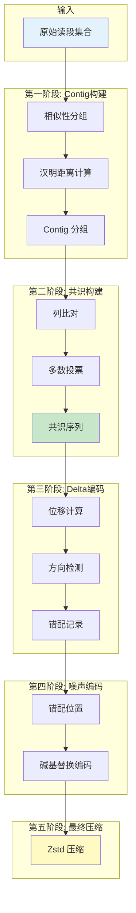
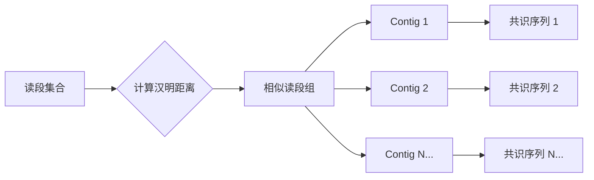
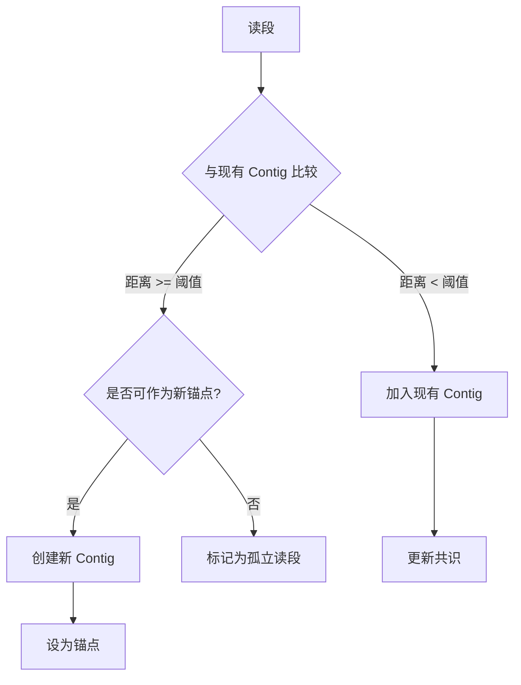
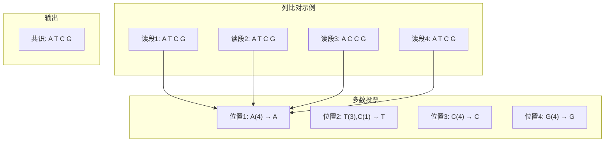
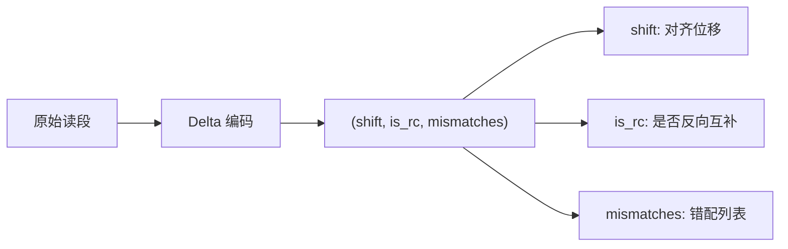
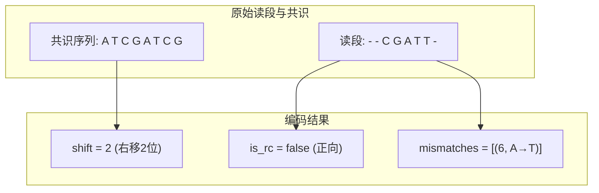
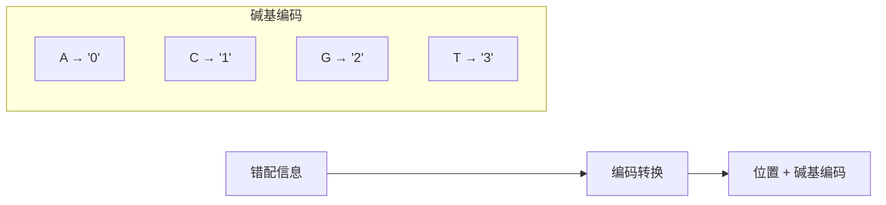
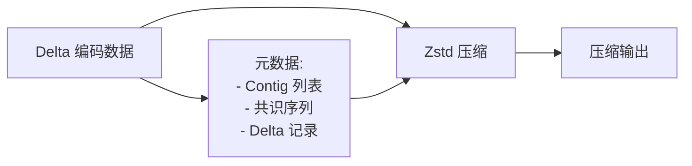
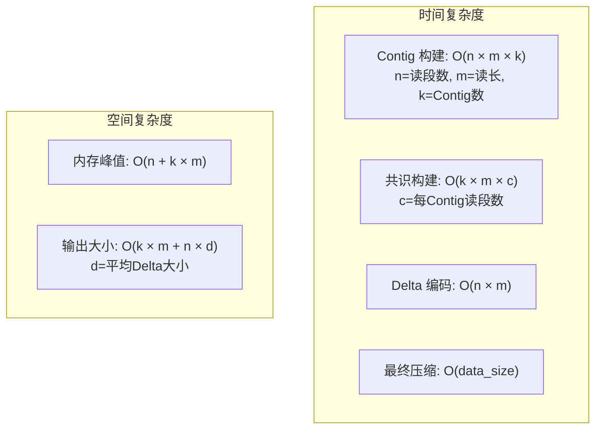
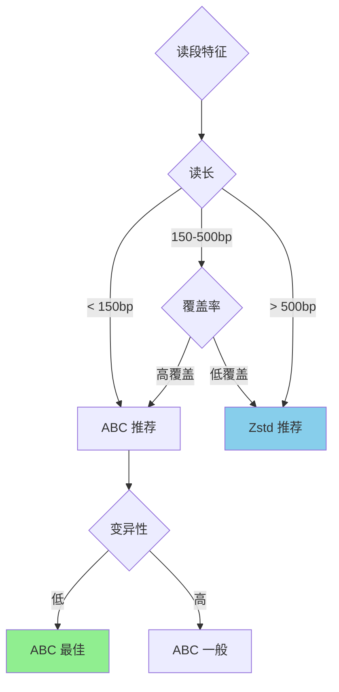

# ABC 算法深度解析

ABC（锚基压缩，Anchor-Based Compression）是一种专为短读段 FASTQ 数据设计的压缩算法。本文档详细介绍其工作原理和实现细节。

## 算法概述

ABC 算法的核心思想是将相似的读段分组，构建共识序列，然后以紧凑的方式编码每个读段相对于共识序列的差异。



## 阶段一：Contig 构建

Contig 构建阶段将相似的读段按汉明距离分组。



### 汉明距离计算

汉明距离衡量两个等长字符串之间的差异，定义为对应位置上不同字符的数量：

```
读段 A: ATCGATCGATCG
读段 B: ATCGTTCGATCG
差异位置:    ^
汉明距离: 1
```

### 分组策略



## 阶段二：共识序列构建

为每个 Contig 构建代表序列（共识序列）。



## 阶段三：Delta 编码

将每个读段编码为相对于共识序列的紧凑表示：



### 编码组件详解



| 字段 | 类型 | 描述 |
|------|------|------|
| `shift` | u8 | 读段相对于共识序列的位移量 |
| `is_rc` | bool | 读段是否为反向互补链 |
| `mismatches` | Vec | 错配位置和替换碱基列表 |

## 阶段四：噪声编码

错配以紧凑的 '0'-'3' 字符形式存储：



### 编码示例

```
错配列表: [(2, A→C), (5, G→T)]
编码结果: "213" (位置编码 + 碱基编码组合)
```

## 阶段五：Zstd 最终压缩

所有 Delta 编码数据使用 Zstd 进行最终压缩：



## 性能特征

### 压缩效率

| 场景 | 压缩率 | 适用性 |
|------|--------|--------|
| 高覆盖率短读段 | 10-50x | 最佳 |
| 中等覆盖度 | 5-15x | 良好 |
| 低覆盖度 | 2-5x | 一般 |
| 高变异性数据 | < 2x | 不推荐 |

### 计算复杂度



### 内存使用

| 组件 | 内存消耗 | 可调参数 |
|------|----------|----------|
| Contig 缓存 | 高 | 块大小 |
| 共识存储 | 低 | - |
| Delta 缓冲 | 中 | 批处理大小 |
| Zstd 字典 | 中 | 压缩级别 |

## 适用场景



## 实现细节

ABC 算法在 `src/algo/` 目录下实现，主要组件包括：

- `contig_builder.rs`：Contig 构建和分组逻辑
- `consensus.rs`：共识序列生成
- `delta_encoder.rs`：Delta 编码实现
- `noise_coder.rs`：噪声/错配压缩

详细的 API 文档请参考各模块的 Rust 文档注释。
