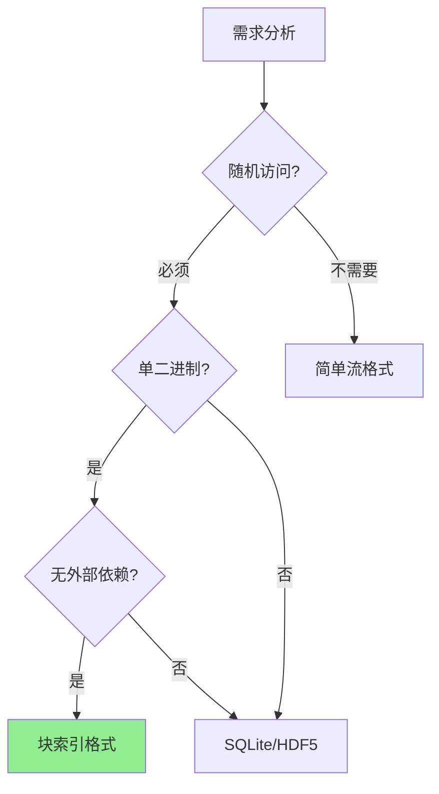
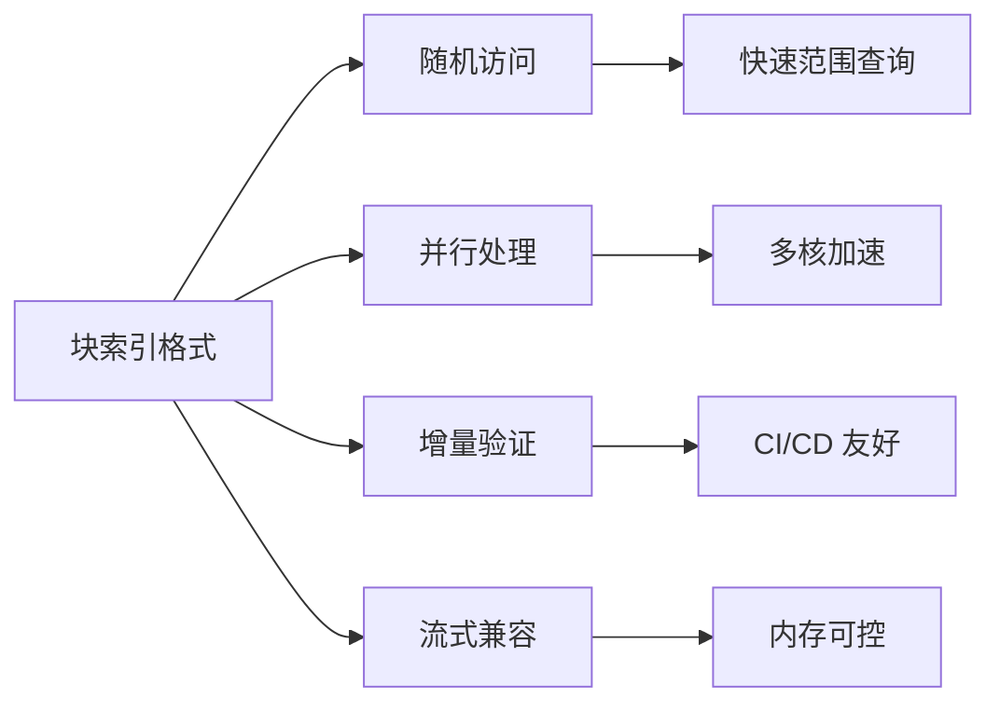
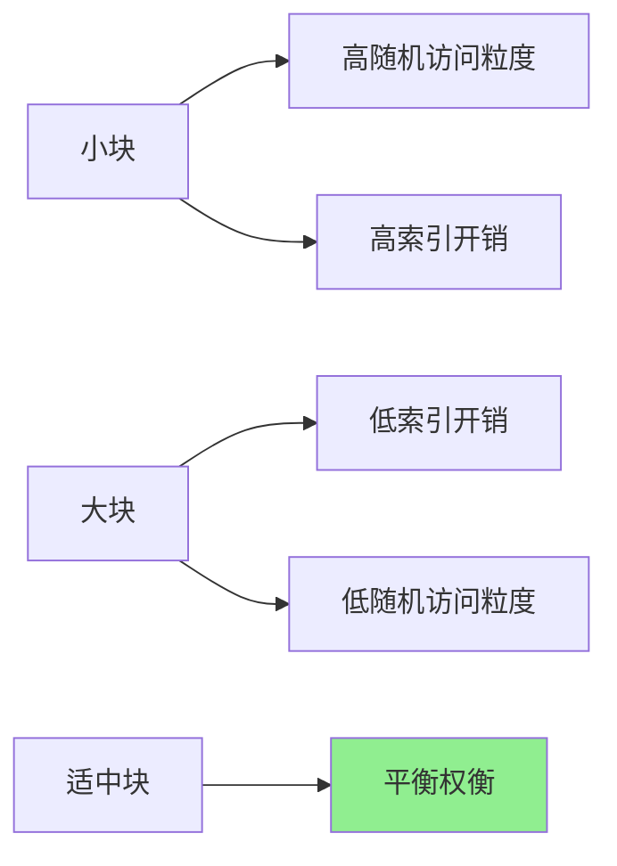

# ADR-001: 块索引格式

## 状态

已采纳

## 背景

FASTQ 压缩工具需要一个归档格式来存储压缩后的数据。我们考虑了以下选项：

### 选项一：简单拼接压缩流

将所有数据直接拼接成一个压缩流。

```
[压缩流数据]
```

**优点**:
- 实现简单
- 无格式开销

**缺点**:
- 无法随机访问
- 无法并行压缩/解压
- 无法验证部分数据

### 选项二：基于 SQLite 的存储

使用 SQLite 数据库存储压缩数据。

```
[SQLite 数据库文件]
├── metadata 表
├── blocks 表
└── index 表
```

**优点**:
- 成熟的查询能力
- 事务支持
- 工具生态丰富

**缺点**:
- 外部依赖
- 文件头较大
- 不适合流式处理
- 与生物信息学工作流不匹配

### 选项三：基于 HDF5 的存储

使用 HDF5 格式存储压缩数据。

```
[HDF5 文件]
├── /metadata
├── /blocks/
│   ├── block_0
│   ├── block_1
│   └── ...
└── /index
```

**优点**:
- 层次化组织
- 科学计算社区熟悉
- 支持分块压缩

**缺点**:
- C 库依赖
- 格式复杂
- 不适合命令行工具

### 选项四：块索引格式

自定义二进制格式，带块级索引。

```
[Magic Header]
[Global Header]
[Block 0]
[Block 1]
...
[Block N]
[Reorder Map] (可选)
[Block Index]
[File Footer]
```

## 决策

我们选择 **选项四：块索引格式**。

### 理由



1. **随机访问**: 块索引支持按范围解压，无需扫描整个文件
2. **单二进制分发**: CLI 工具无运行时依赖
3. **并行友好**: 块可独立压缩/解压
4. **流式兼容**: 支持流式和归档两种模式
5. **验证支持**: 可验证单个块而非整个文件

## 后果

### 正面影响



- `fqc info`、`fqc verify` 和范围解压可基于归档结构操作
- 支持多线程压缩和解压
- 可验证单个块的完整性
- 适合管道和流式工作流

### 负面影响

- 格式实现复杂度较高
- 每块有固定头部开销
- 需要维护格式版本兼容性

### 风险与缓解

| 风险 | 缓解措施 |
|------|----------|
| 格式演进困难 | 版本字段预留扩展空间 |
| 工具互操作性 | 完善的格式规范文档 |
| 损坏恢复难 | 块级校验和支持部分恢复 |

## 设计细节

### 块大小选择

默认块大小权衡了以下因素：



### 索引结构

```
IndexEntry {
    offset: u64,           // 块在文件中的偏移
    compressed_size: u64,  // 压缩后大小
    archive_id_start: u64, // 起始读段 ID
    read_count: u32,       // 读段数量
}
```

索引位于文件末尾，支持快速二分查找定位目标块。

## 参考

- [二进制格式规范](../../reference/format-spec.md)
- [性能路线图](../performance-roadmap.md)
