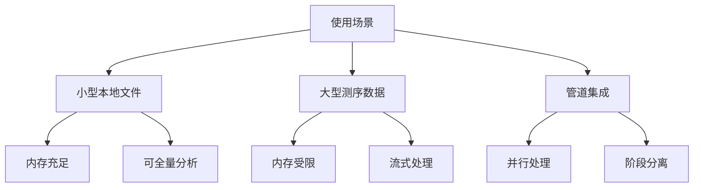
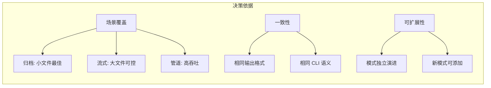
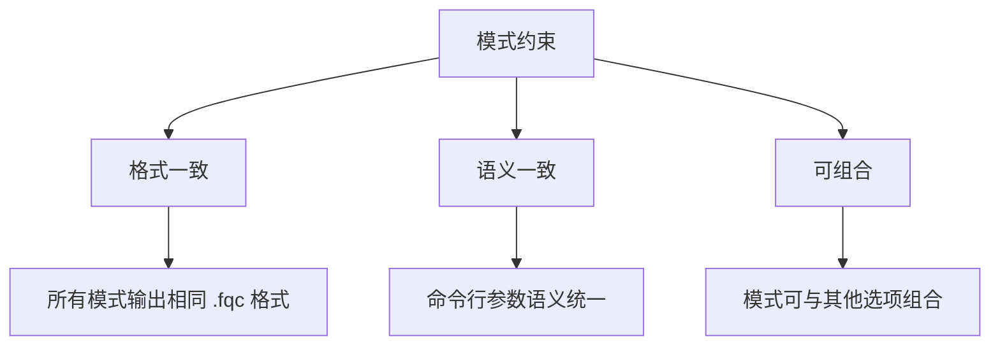

# ADR-002: 三种执行模式

## 状态

已采纳

## 背景

FASTQ 压缩工具需要支持多种使用场景，从处理小型本地文件到流式处理大型测序数据，再到集成到复杂的数据处理管道中。我们需要确定执行模式的设计策略。

### 使用场景分析



### 考虑的选项

#### 选项一：单一模式

仅提供一种执行模式，通过参数调整行为。

**优点**:
- 简单直观
- 无需选择

**缺点**:
- 无法同时优化内存和性能
- 大文件处理受限

#### 选项二：双模式

提供归档和流式两种模式。

**优点**:
- 覆盖主要场景
- 实现适中

**缺点**:
- 管道集成场景支持不足
- 并行优化受限

#### 选项三：三模式

提供归档、流式和管道三种模式。

**优点**:
- 覆盖所有主要场景
- 各模式可针对性优化
- 清晰的使用指导

**缺点**:
- 实现复杂度较高
- 需要维护多套路径

## 决策

我们选择 **选项三：三模式设计**。

### 模式定义

```mermaid
flowchart TB
    subgraph 归档模式[归档模式 (默认)]
        A1[全量读取] --> A2[全局分析]
        A2 --> A3[可选重排]
        A3 --> A4[压缩输出]
    end
    
    subgraph 流式模式[流式模式 (--streaming)]
        S1[增量读取] --> S2[流式处理]
        S2 --> S3[禁用重排]
        S3 --> S4[增量输出]
    end
    
    subgraph 管道模式[管道模式 (--pipeline)]
        P1[读取器线程] --> P2[压缩器线程]
        P2 --> P3[写入器线程]
        P3 --> P4[并行输出]
    end
    
```

### 归档模式 (Archive Mode)

**适用场景**: 内存充足、需要最佳压缩率

```
fqc compress -i input.fastq -o output.fqc
```

**特点**:
- 全局数据可见，支持最优重排
- 压缩率最高
- 内存占用与输入大小相关
- 单线程压缩处理

### 流式模式 (Streaming Mode)

**适用场景**: 大文件、内存受限环境

```
fqc compress -i input.fastq -o output.fqc --streaming
```

**特点**:
- 单遍处理，增量读取
- 禁用全局重排
- 内存占用固定且可控
- 适合管道数据流

### 管道模式 (Pipeline Mode)

**适用场景**: 多核系统、追求吞吐量

```
fqc compress -i input.fastq -o output.fqc --pipeline
```

**特点**:
- 读取、压缩、写入并行
- 飞行中块缓冲
- 吞吐量优化
- 利用多核 CPU

## 理由



1. **场景覆盖**: 三种模式覆盖了从交互式使用到大规模数据处理的全部场景
2. **输出一致性**: 所有模式产生相同的 `.fqc` 格式
3. **语义一致**: CLI 参数和行为在各模式间保持一致
4. **优化隔离**: 每个模式可独立优化，不相互干扰

## 后果

### 正面影响

| 影响 | 描述 |
|------|------|
| 内存可控 | 流式模式支持严格的内存限制 |
| 性能可调 | 管道模式充分利用多核 |
| 压缩最优 | 归档模式支持全局优化 |
| 使用清晰 | 每种场景有明确推荐模式 |

### 负面影响

| 影响 | 缓解措施 |
|------|----------|
| 实现复杂 | 共享基础设施抽象 |
| 测试覆盖 | 每模式独立测试 + 跨模式集成测试 |
| 文档负担 | 模式对比表格和使用指南 |

### 设计约束



## 实现

模式选择在 `CompressionEngine` 中实现：

```rust
// src/commands/compression_engine.rs
pub enum ExecutionMode {
    Archive,    // 默认
    Streaming,  // --streaming
    Pipeline,   // --pipeline
}
```

每种模式有独立的执行路径，但共享：
- FASTQ 解析器
- 压缩算法
- 归档写入器
- 类型定义

## 参考

- [架构概览](../index.md)
- [性能路线图](../performance-roadmap.md)
