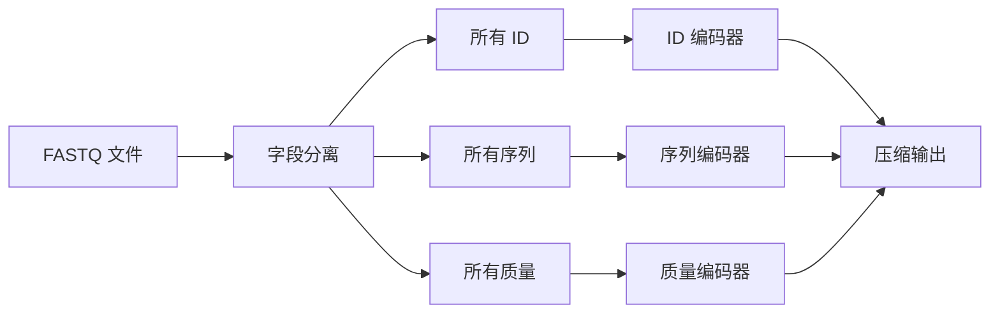
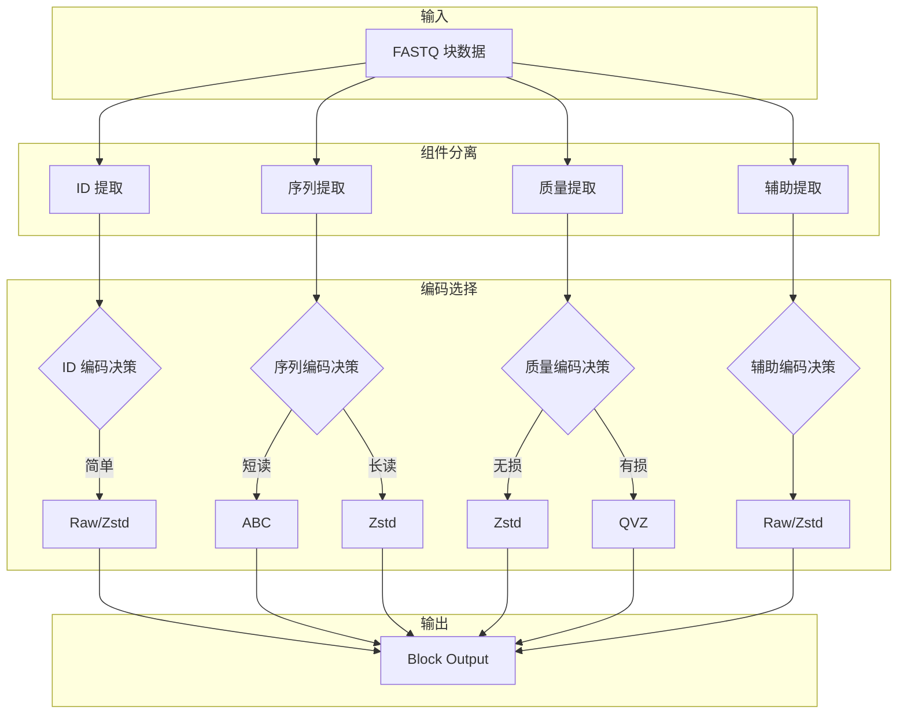
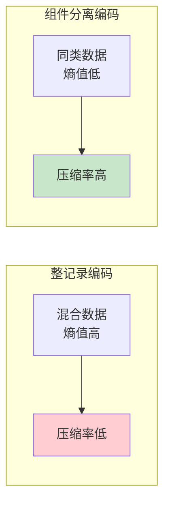
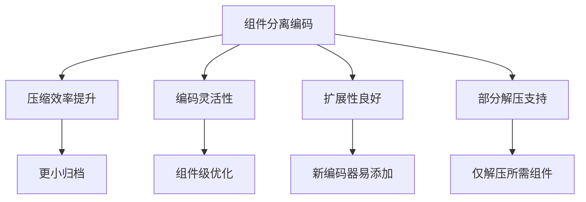

# ADR-003: 组件分离编码

## 状态

已采纳

## 背景

FASTQ 格式的每条记录由四个组件组成：

```
@SEQ_ID                    <- ID 组件
ACGTACGTACGT               <- 序列组件
+                          <- 分隔符
IIIIIIIIIIII               <- 质量组件
```

我们需要决定如何组织这些组件在压缩归档中的存储方式。

### 考虑的选项

#### 选项一：整记录编码

将完整记录作为单元编码。


**优点**:
- 实现简单
- 记录边界清晰

**缺点**:
- 无法针对组件特性优化
- 序列相似性无法利用
- 质量值压缩效率低

#### 选项二：字段级编码

将所有记录的同一字段集中存储（列式存储）。



**优点**:
- 同类数据集中，压缩效率高
- 可针对字段特性选择编码
- 支持部分解压

**缺点**:
- 需要重建记录
- 实现较复杂

#### 选项三：块级组件分离

在块级别分离组件，每个块内组件独立编码。


**优点**:
- 块级局部性保持
- 组件可独立编码
- 支持块级随机访问
- 平衡了压缩效率和实现复杂度

**缺点**:
- 块内需维护组件对齐
- 头部开销增加

## 决策

我们选择 **选项三：块级组件分离编码**。

### 设计细节



### 流类型定义

| 流 | 内容 | 典型编码 | 描述 |
|----|------|----------|------|
| IDs | 读段标识符 | Raw/Zstd | 字符串，通常有模式 |
| Seq | 碱基序列 | ABC/Zstd | 核心数据，相似性高 |
| Qual | 质量分数 | Zstd/QVZ | ASCII 编码，可分箱 |
| Aux | 辅助数据 | Raw/Zstd | 可选，格式扩展 |

### 编码决策逻辑

```mermaid
flowchart TD
    A[组件流] --> B{组件类型}
    
    B -->|ID| C{有模式?}
    C -->|是| D[Zstd 字典]
    C -->|否| E[Raw]
    
    B -->|序列| F{读长类别}
    F -->|短读| G{块大小}
    G -->|小| H[ABC]
    G -->|大| I[Zstd]
    F -->|长读| I
    
    B -->|质量| J{质量模式}
    J -->|无损| K[Zstd]
    J -->|分箱| L[Illumina8]
    J -->|丢弃| M[空]
    
    B -->|辅助| N{有数据?}
    N -->|是| O[Zstd]
    N -->|否| P[空]
```



## 理由

### 压缩效率分析



1. **数据局部性**: 相似数据聚集，提高压缩效率
2. **编码针对性**: 每个组件可选择最优编码器
3. **灵活性**: 支持不同压缩级别和模式
4. **扩展性**: 新组件类型可无缝添加

### 具体收益

| 组件 | 混合编码 | 分离编码 | 收益 |
|------|----------|----------|------|
| ID | 通用压缩 | 模式感知压缩 | ~20% |
| 序列 | 通用压缩 | ABC 专用 | ~50-80% |
| 质量 | 通用压缩 | QVZ 分箱 | ~30-60% |

## 后果

### 正面影响



### 负面影响

| 影响 | 缓解措施 |
|------|----------|
| 块头开销 | 固定 104 bytes，大块时可忽略 |
| 对齐管理 | 块头记录各流偏移和大小 |
| 实现复杂 | 清晰的抽象和模块边界 |

### 块头设计

```
BlockHeader {
    offset_ids: u64,    // ID 流偏移
    offset_seq: u64,    // 序列流偏移
    offset_qual: u64,   // 质量流偏移
    offset_aux: u64,    // 辅助流偏移
    size_ids: u64,      // ID 流大小
    size_seq: u64,      // 序列流大小
    size_qual: u64,     // 质量流大小
    size_aux: u64,      // 辅助流大小
    codec_ids: u8,      // ID 编解码器
    codec_seq: u8,      // 序列编解码器
    codec_qual: u8,     // 质量编解码器
    codec_aux: u8,      // 辅助编解码器
}
```

## 实现

组件分离在块写入和读取过程中实现：

```rust
// 块写入流程
fn write_block(records: &[Record]) -> Block {
    let ids = extract_ids(records);
    let seqs = extract_seqs(records);
    let quals = extract_quals(records);
    
    let encoded_ids = encode_ids(ids);
    let encoded_seqs = encode_seqs(seqs);
    let encoded_quals = encode_quals(quals);
    
    Block { encoded_ids, encoded_seqs, encoded_quals }
}
```

## 参考

- [二进制格式规范](../../reference/format-spec.md)
- [ABC 算法深度解析](../../algorithms/abc-deep-dive.md)
- [算法概述](../../algorithms/index.md)
