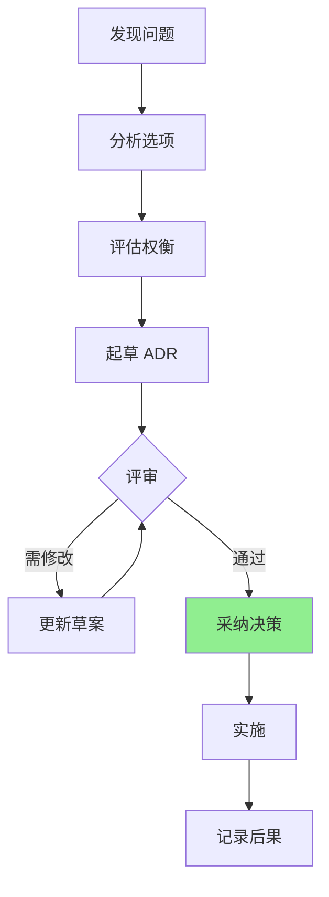

# 架构决策索引

本节记录 `fqc` 项目的重要架构决策记录 (Architecture Decision Records, ADR)。

## 什么是 ADR？

架构决策记录是一种记录重要架构决策及其背景和后果的轻量级文档模式。每个 ADR 描述：

- **背景**: 决策的背景和问题陈述
- **决策**: 所做的决定及其理由
- **后果**: 决策带来的影响和权衡

## 决策列表

| 编号 | 标题 | 状态 | 日期 |
|------|------|------|------|
| [ADR-001](./001-block-indexed-format.md) | 块索引格式 | 已采纳 | 2026-04 |
| [ADR-002](./002-three-execution-modes.md) | 三种执行模式 | 已采纳 | 2026-04 |
| [ADR-003](./003-component-encoding.md) | 组件分离编码 | 已采纳 | 2026-04 |

## 决策流程



## ADR 模板

新的架构决策应遵循以下模板：

```markdown
# ADR-NNN: 决策标题

## 状态

[提议 | 评审中 | 已采纳 | 已废弃 | 已替代]

## 背景

描述决策的背景和问题。

## 决策

描述所做的决定及其理由。

## 替代方案

列出考虑过的其他选项。

## 后果

### 正面影响
- ...

### 负面影响
- ...

### 风险
- ...
```

## 相关文档

- [架构概览](../index.md)
- [性能路线图](../performance-roadmap.md)
- [二进制格式规范](../../reference/format-spec.md)
