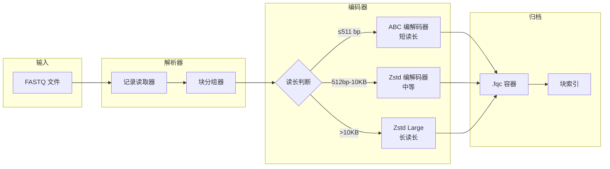

  技术白皮书
  v0.1.1
  Rust 1.75+
  零 unsafe

  

    
FQ

    

      fqc
      块索引 FASTQ 压缩工具
    

  

  

    <a href="./whitepaper">白皮书</a>
    <a href="./architecture/">架构</a>
    <a href="./algorithms/">算法</a>
    <a href="./benchmarks/performance-report">基准测试</a>
    <a href="https://github.com/LessUp/fq-compressor-rust">GitHub</a>
    <a href="../en/">English</a>
  

  
摘要

  

    <strong>fqc</strong> 是一款领域感知的 FASTQ 压缩引擎，通过块索引归档、组件级编码（ABC 共识/差分编码、SCM 质量压缩、Zstd 序列压缩）实现 <mark>2.4 倍压缩比</mark>，并支持 <mark>O(log N) 随机访问</mark>。采用纯 Rust 编写，零 unsafe 代码，引入三种执行模式 &mdash; Archive、Streaming 和 Pipeline &mdash; 在不产生格式碎片的前提下灵活权衡内存与吞吐量。专为需要压缩效率与运维工具兼备的生物信息学工作流而设计。
  

  

    2.4&times;
    压缩比
  

  

    O(log N)
    随机访问
  

  

    3
    执行模式
  

  

    0
    unsafe 代码
  

## 核心架构

## 为什么选择 fqc

  

    
块索引随机访问

    

      与基于流的压缩器（gzip、DSRC）不同，fqc 的尾部嵌入式块索引支持 O(log N) 范围查询，无需完整解压归档。
    

    

      <a href="./reference/format-spec" class="feature-tag">格式规范</a>
      <a href="./architecture/" class="feature-tag">架构</a>
    

  

  

    
组件级编码

    

      FASTQ 的每个组件（ID、序列、质量值、辅助信息）使用独立调优的编解码器。序列采用 ABC 或 Zstd；质量值支持无损、Illumina8 分级、QVZ 或丢弃。
    

    

      <a href="./algorithms/" class="feature-tag">算法</a>
      <a href="./algorithms/abc-deep-dive" class="feature-tag">ABC 深度解析</a>
    

  

  

    
三种模式，一种格式

    

      Archive、Streaming 和 Pipeline 模式均生成相同的 .fqc 输出。在内存、压缩比和吞吐量之间灵活权衡，不产生格式碎片。
    

    

      <a href="./guide/modes" class="feature-tag">模式指南</a>
      <a href="./architecture/decisions/002-three-execution-modes" class="feature-tag">ADR-002</a>
    

  

  

    
运维级工具链

    

      单一二进制文件提供 compress、decompress、info 和 verify 四个命令。无需额外脚本。支持结构化退出码，CI/CD 友好。
    

    

      <a href="./guide/cli" class="feature-tag">CLI 文档</a>
      <a href="./guide/quick-start" class="feature-tag">快速开始</a>
    

  

  

    
领域感知 ABC 算法

    

      锚定压缩（Anchor-Based Compression）通过 contig 构建和差分编码利用短读段相似性，在生物序列上超越通用 LZ 算法。
    

    

      <a href="./theory" class="feature-tag">理论基础</a>
      <a href="./algorithms/abc-deep-dive" class="feature-tag">深度解析</a>
    

  

  

    
纯 Rust，零 unsafe

    

      内存安全由语言保证。无未定义行为风险。MSRV 1.75.0。单静态二进制文件，除 libc 外无运行时依赖。
    

    

      <a href="./comparison" class="feature-tag">竞品对比</a>
    

  

## 快速开始

  

    
    
    
    bash
  

  

    $ # 从源码构建
    $ cargo build --release
    
    $ # 压缩 FASTQ 文件
    $ ./target/release/fqc compress -i reads.fq -o reads.fqc
    
    $ # 解压
    $ ./target/release/fqc decompress -i reads.fqc -o reads.fq
    
    $ # 查看归档信息
    $ ./target/release/fqc info -i reads.fqc
  

查看<a href="./guide/quick-start">快速开始指南</a>了解安装选项和首次压缩步骤。

## 研究背景

<strong>fqc</strong> 位于领域特定压缩与现代系统编程的交叉点。它借鉴了数十年来 DNA 压缩的研究成果（LZ 变体、基于参考的编码），同时应用了当代软件工程实践：内存安全、结构化并发和格式稳定性。

如需了解该领域的概况以及 fqc 与先前工作的比较，请参阅<a href="./references/">参考文献与相关工作</a>和<a href="./comparison">竞品深度对比</a>。

## 资源导航

  <a href="./whitepaper" class="resource-item">
    &#128221;
    技术白皮书
  </a>
  <a href="./architecture/" class="resource-item">
    &#128202;
    架构深度解析
  </a>
  <a href="./architecture/decisions/" class="resource-item">
    &#128203;
    3 份架构决策记录
  </a>
  <a href="./reference/format-spec" class="resource-item">
    &#128196;
    二进制格式规范
  </a>
  <a href="./theory" class="resource-item">
    &#128300;
    算法理论基础
  </a>
  <a href="./comparison" class="resource-item">
    &#128200;
    竞品深度对比
  </a>
  <a href="./references/" class="resource-item">
    &#128218;
    参考文献与相关工作
  </a>

