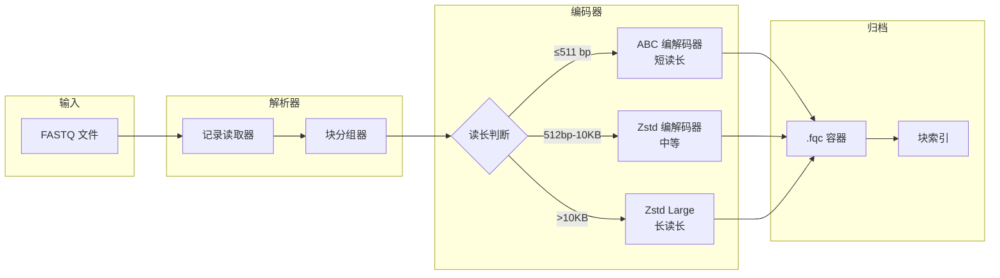

  技术白皮书
  v0.1.1
  Rust 1.75+

  

    
FQ

    

      fqc
      块索引 FASTQ 压缩工具
    

  

  

    <a href="./architecture/">架构</a>
    <a href="./algorithms/">算法</a>
    <a href="./benchmarks/performance-report">基准测试</a>
    <a href="https://github.com/LessUp/fq-compressor-rust">GitHub</a>
    <a href="../en/">English</a>
  

  
摘要

  

    fqc 是一款领域感知的 FASTQ 压缩工具，通过块索引归档、组件级编码（ABC、SCM、Zstd）实现 <mark>2.4× 压缩比</mark>，支持 <mark>O(log N) 随机访问</mark>。采用纯 Rust 编写，零 unsafe 代码，支持三种执行模式（Archive、Streaming、Pipeline）灵活权衡内存与吞吐量。专为需要压缩效率与运维工具兼备的生物信息学工作流而设计。
  

  

    2.4×
    压缩比
  

  

    O(log N)
    随机访问
  

  

    3
    执行模式
  

  

    0
    unsafe 代码
  

## 核心架构

## 技术亮点

  

    
架构与设计

    

      分层系统架构，包含 CLI、I/O、格式、算法和流水线五层。三份架构决策记录记录了关键设计选择。
    

    

      <a href="./architecture/" class="feature-tag">概述</a>
      <a href="./architecture/decisions/" class="feature-tag">ADR</a>
      <a href="./architecture/performance-roadmap" class="feature-tag">路线图</a>
    

  

  

    
算法

    

      ABC（锚定压缩）用于短读段，含 contig 构建和 delta 编码。SCM 算术编码用于质量值。按组件自适应选择编解码器。
    

    

      <a href="./algorithms/" class="feature-tag">概述</a>
      <a href="./algorithms/abc-deep-dive" class="feature-tag">ABC 深度解析</a>
    

  

  

    
二进制格式

    

      自定义 <code>.fqc</code> 容器，含 magic header、块级校验和（xxHash64）、尾部索引实现 O(log N) 随机访问，以及前向兼容版本控制。
    

    

      <a href="./reference/format-spec" class="feature-tag">格式规范</a>
    

  

  

    
执行模式

    

      Archive 模式全局重排获取最佳压缩比，Streaming 模式限制内存使用，Pipeline 模式分阶段吞吐。三种模式输出相同的 <code>.fqc</code> 文件。
    

    

      <a href="./guide/modes" class="feature-tag">模式指南</a>
      <a href="./architecture/performance-roadmap" class="feature-tag">性能</a>
    

  

  

    
基准测试

    

      测试数据 2.39x 压缩比，亚 100ms 操作。基于 Criterion 的解析器吞吐量和完整归档工作流基准测试。
    

    

      <a href="./benchmarks/performance-report" class="feature-tag">报告</a>
    

  

  

    
CLI 参考

    

      四个命令：compress、decompress、info、verify。支持双端测序、压缩输入检测、内存预算管理。
    

    

      <a href="./guide/cli" class="feature-tag">CLI 文档</a>
      <a href="./guide/quick-start" class="feature-tag">快速开始</a>
    

  

## 快速开始

  

    
    
    
    bash
  

  

    $ # 从源码构建
    $ cargo build --release
    
    $ # 压缩 FASTQ 文件
    $ ./target/release/fqc compress -i reads.fq -o reads.fqc
    
    $ # 解压
    $ ./target/release/fqc decompress -i reads.fqc -o reads.fq
  

查看<a href="./guide/quick-start">快速开始指南</a>了解安装选项和首次压缩步骤。

## 资源

  <a href="./architecture/" class="resource-item">
    📊
    29 个交互式图表
  </a>
  <a href="./architecture/decisions/" class="resource-item">
    📋
    3 份架构决策记录
  </a>
  <a href="./reference/format-spec" class="resource-item">
    📄
    二进制格式规范
  </a>
  <a href="./references/" class="resource-item">
    📚
    参考文献与相关工作
  </a>

